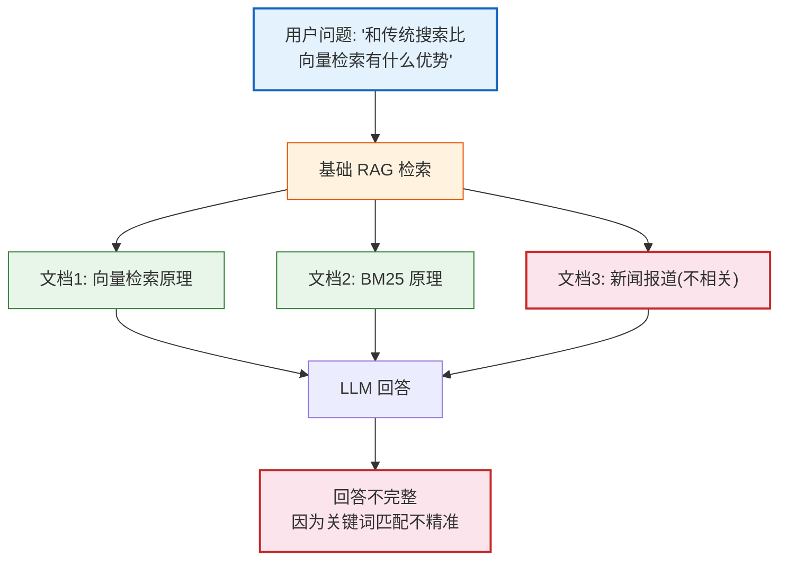
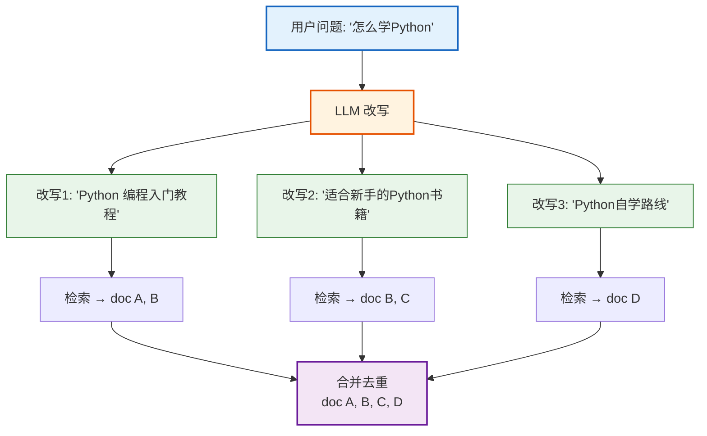
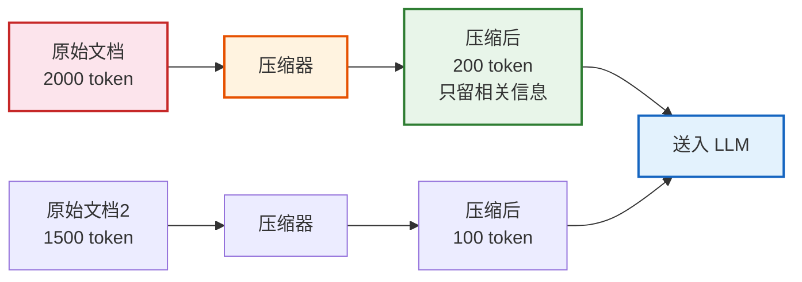
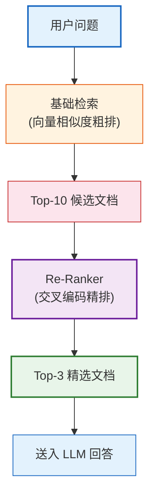
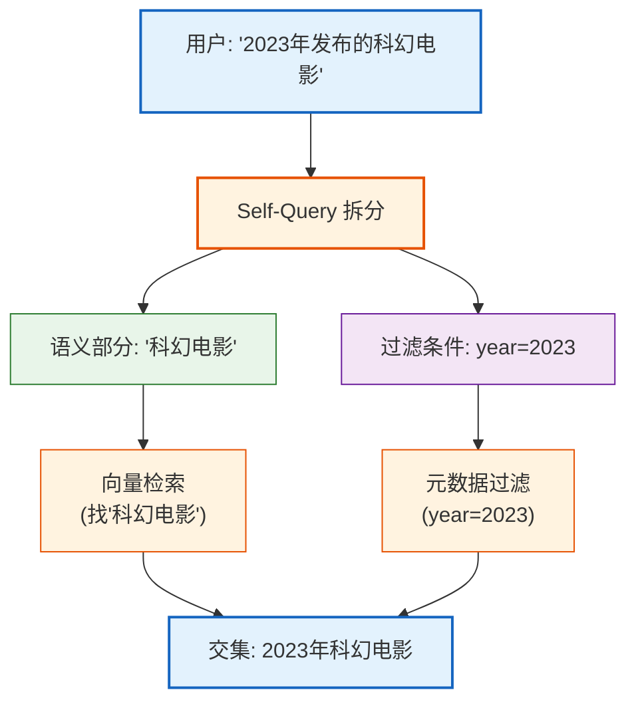
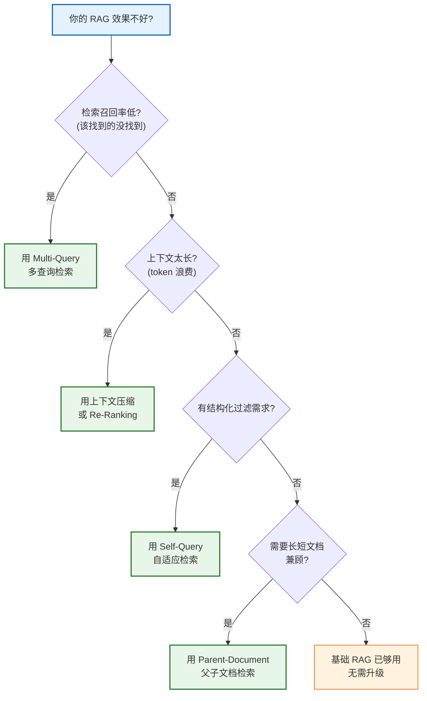

# 第12课：高级 RAG 技术——让检索更精准

> **学习目标**：理解基础 RAG 的局限，学会多查询检索、上下文压缩、重排序、自适应检索、父子文档等高级 RAG 策略，掌握何时用哪种策略。

> **配套知识库**：`知识库/08_高级RAG与检索策略技术手册.md`

---

## 本课导航

| 小节 | 主题 | 预计时间 |
|------|------|---------|
| 1 | 基础 RAG 的局限 | 10 分钟 |
| 2 | 多查询检索 | 15 分钟 |
| 3 | 上下文压缩 | 10 分钟 |
| 4 | 重排序 | 15 分钟 |
| 5 | 自适应检索 | 10 分钟 |
| 6 | 策略选择 | 10 分钟 |

---

## 1. 基础 RAG 的局限

### 问题场景



> **图解说明**：基础 RAG 的问题——用户一个查询可能涉及多个子问题（向量检索的优势 vs 传统搜索的劣势），但基础 RAG 只用原始查询检索，可能遗漏关键文档或引入不相关文档。

### 基础 RAG 的四大问题

| 问题 | 表现 | 原因 |
|------|------|------|
| 查询不精准 | 检索不到关键文档 | 用户问题太短/模糊 |
| 上下文太长 | Token 浪费 + LLM 分心 | 所有文档全塞进去 |
| 排序不佳 | 最重要的文档排后面 | 纯靠向量相似度 |
| 缺乏自适应 | 不同问题用同一策略 | 没有路由 |

---

## 2. 多查询检索（Multi-Query）

### 生活类比

用户问"怎么学 Python"，你可以换三种方式问图书馆管理员：
1. "Python 编程入门教程"
2. "适合新手的 Python 书籍"
3. "Python 自学路线规划"

——多查几次，查到的更全面。



> **图解说明**：多查询检索用 LLM 把用户一个问题改写成多个不同角度的查询，分别检索，合并去重。像派多个人去图书馆找同一主题的书——每人找的角度不同，合在一起更全。

### 代码

```python
from langchain.retrievers.multi_query import MultiQueryRetriever
from langchain_openai import ChatOpenAI

retriever = MultiQueryRetriever(
    retriever=base_retriever,
    llm=ChatOpenAI(model="gpt-4o-mini"),
)

# 自动生成 3 个改写查询，分别检索，合并去重
docs = retriever.invoke("怎么学 Python")
# 返回比基础检索更多、更全的文档
```

---

## 3. 上下文压缩（Contextual Compression）

### 生活类比

你问"汉堡的热量"，基础 RAG 返回了一整本"快餐百科"。上下文压缩就像**划重点**——只提取关于热量的那几句话。



> **图解说明**：上下文压缩在检索后加了一步——用小模型对每个文档提取与问题相关的段落，只把精华部分送入大模型。原始 2000 token 压缩到 200 token，大幅降低成本。

### 代码

```python
from langchain.retrievers import ContextualCompressionRetriever
from langchain_openai import ChatOpenAI
from langchain.retrievers.document_compressors import LLMChainExtractor

# 用小模型做压缩
compressor = LLMChainExtractor.from_llm(
    ChatOpenAI(model="gpt-4o-mini")
)

# 包装基础检索器
compression_retriever = ContextualCompressionRetriever(
    base_retriever=base_retriever,
    base_compressor=compressor,
)

docs = compression_retriever.invoke("汉堡的热量是多少")
# 返回精简后的片段，而非整篇文档
```

---

## 4. 重排序（Re-Ranking）

### 生活类比

基础检索像百度搜索第一页——粗排。重排序像**人工精选**——从第一页 10 条中挑出最相关的 3 条。



> **图解说明**：重排序是两阶段策略——先用向量检索粗排得到 Top-10 候选，再用交叉编码模型精排，选出最相关的 Top-3。粗排快但粗，精排慢但准。

### 代码

```python
from langchain.retrievers import ContextualCompressionRetriever
from langchain_cohere import CohereRerank

# 使用 Cohere Rerank 模型
reranker = CohereRerank(top_n=3)

rerank_retriever = ContextualCompressionRetriever(
    base_retriever=base_retriever,
    base_compressor=reranker,
)

docs = rerank_retriever.invoke("什么是量子纠缠")
# 返回重排序后的 Top-3 最相关文档
```

---

## 5. 自适应检索（Self-Query）

### 生活类比

用户问"2023年发布的科幻电影"——这个查询有两部分：
- 语义部分："科幻电影" → 向量检索
- 过滤条件："2023年发布" → 元数据过滤

Self-Query 像一个**聪明的图书管理员**——能听懂你的要求，自动把"语义描述"和"筛选条件"分开。



> **图解说明**：Self-Query 用 LLM 把用户查询拆成两部分——语义描述走向量检索，结构化条件走元数据过滤，最后取交集。这样检索既精准又高效。

### 代码

```python
from langchain.retrievers.self_query import SelfQueryRetriever
from langchain_openai import ChatOpenAI

# 定义元数据字段
metadata_field_info = [
    {"name": "year", "description": "发布年份", "type": "integer"},
    {"name": "genre", "description": "电影类型", "type": "string"},
]

self_query_retriever = SelfQueryRetriever.from_llm(
    llm=ChatOpenAI(model="gpt-4o-mini"),
    vectorstore=vectorstore,
    document_contents="电影信息",
    metadata_field_info=metadata_field_info,
)

docs = self_query_retriever.invoke("2023年发布的科幻电影")
```

---

## 6. 策略选择决策树



> **图解说明**：这张决策树帮你选对策略——先判断问题出在哪（召回率低/上下文太长/结构化过滤/长短文档），再对症下药。不要盲目堆砌所有策略。

### 策略对比总结

| 策略 | 解决什么问题 | 代价 | 推荐场景 |
|------|------------|------|---------|
| Multi-Query | 召回率低 | 多次 LLM 调用 | 问题复杂、多角度 |
| 上下文压缩 | Token 浪费 | 额外 LLM 调用 | 文档长、信息密度低 |
| Re-Ranking | 排序不佳 | 额外 API 费用 | 召回多但精度不够 |
| Self-Query | 结构化过滤 | LLM 拆分开销 | 有元数据（日期/类别） |
| Parent-Document | 长短文档矛盾 | 存储翻倍 | 同时有长文和短文 |

---

## 本课小结

| 你学到了什么 | 一句话总结 |
|-------------|-----------|
| 基础 RAG 局限 | 查询不精准/上下文太长/排序不佳/缺乏自适应 |
| 多查询检索 | LLM 改写多个查询，合并去重 |
| 上下文压缩 | 小模型提取精华，减少 Token |
| 重排序 | 两阶段——粗排+精排 |
| 自适应检索 | 语义+结构化条件拆分 |
| 策略选择 | 先诊断问题，再选策略 |

### 配套知识库

- 📖 `知识库/08_高级RAG与检索策略技术手册.md`

### 下一课

➡️ **第13课：综合实战——从零构建 AI 知识助手**——把所学全部串联，构建一个完整项目。
