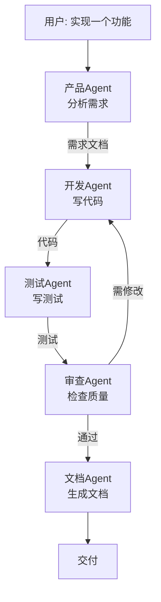
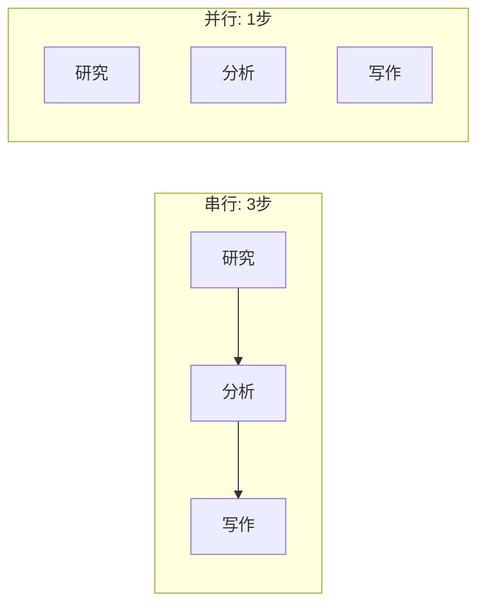
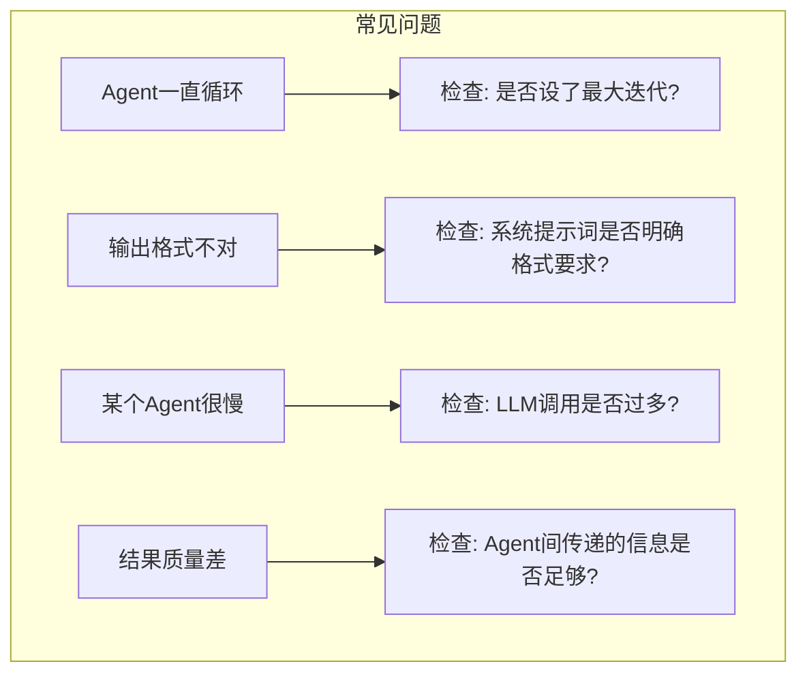
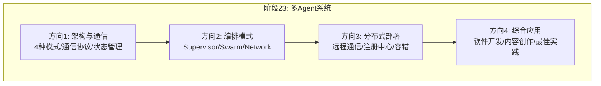

# 第130课：多 Agent 协作综合实战与最佳实践

> **阶段 23 | 第4课 | 方向四：多 Agent 协作综合应用与最佳实践**
> 面向零基础初学者，串联阶段23所有知识点

---

## 本课目标

学完本课，你将：
- 看到一个完整的多 Agent 应用案例
- 掌握多 Agent 系统的性能优化方法
- 了解调试和监控的最佳实践
- 获得一份最佳实践清单

---

## 1 综合案例：多 Agent 软件开发助手

### 场景描述

我们要构建一个"AI开发团队"，包含：
1. **产品 Agent**：分析需求
2. **开发 Agent**：写代码
3. **测试 Agent**：写测试
4. **审查 Agent**：审查质量
5. **文档 Agent**：生成文档



### 完整代码

```python
from langgraph.graph import StateGraph, END, START
from langchain_openai import ChatOpenAI
from langchain_core.messages import HumanMessage, SystemMessage
from typing import TypedDict, Annotated
from langgraph.graph.message import add_messages

llm = ChatOpenAI(model="gpt-4o-mini", temperature=0)

class DevState(TypedDict):
    messages: Annotated[list, add_messages]
    request: str       # 用户需求
    spec: str           # 需求规格
    code: str           # 代码
    tests: str          # 测试
    review: str         # 审查意见
    docs: str           # 文档
    step: str           # 当前步骤
    iteration: int      # 迭代次数

def product_agent(state: DevState):
    """产品Agent: 分析需求"""
    resp = llm.invoke([
        SystemMessage(content="你是产品经理。分析需求并输出简洁规格。"),
        HumanMessage(content=f"需求: {state['request']}")
    ])
    return {"spec": resp.content, "step": "dev"}

def dev_agent(state: DevState):
    """开发Agent: 写代码"""
    feedback = state.get("review", "")
    prompt = f"规格: {state['spec']}"
    if feedback:
        prompt += f"\n修改意见: {feedback}"
    resp = llm.invoke([
        SystemMessage(content="你是开发者。输出Python代码。"),
        HumanMessage(content=prompt)
    ])
    return {"code": resp.content, "step": "test"}

def test_agent(state: DevState):
    """测试Agent: 写测试"""
    resp = llm.invoke([
        SystemMessage(content="你是测试工程师。为代码写pytest测试。"),
        HumanMessage(content=f"代码:\n{state['code']}")
    ])
    return {"tests": resp.content, "step": "review"}

def review_agent(state: DevState):
    """审查Agent: 检查质量"""
    iteration = state.get("iteration", 0) + 1
    resp = llm.invoke([
        SystemMessage(content="""你是代码审查员。检查代码质量。
如果通过回复: APPROVED
如果需修改回复: NEEDS_FIX: 具体问题"""),
        HumanMessage(content=f"代码:\n{state['code']}\n测试:\n{state['tests']}")
    ])
    content = resp.content
    if "APPROVED" in content or iteration >= 3:
        return {"review": "", "step": "docs", "iteration": iteration}
    return {"review": content, "step": "dev", "iteration": iteration}

def docs_agent(state: DevState):
    """文档Agent: 生成文档"""
    resp = llm.invoke([
        SystemMessage(content="你是文档工程师。生成README。"),
        HumanMessage(content=f"代码:\n{state['code']}\n规格:\n{state['spec']}")
    ])
    return {"docs": resp.content, "step": "done"}

def route_dev(state: DevState):
    mapping = {"dev": "developer", "test": "tester",
               "review": "reviewer", "docs": "documenter", "done": END}
    return mapping.get(state.get("step", "dev"), "developer")

# 组装
g = StateGraph(DevState)
g.add_node("product", product_agent)
g.add_node("developer", dev_agent)
g.add_node("tester", test_agent)
g.add_node("reviewer", review_agent)
g.add_node("documenter", docs_agent)
g.set_entry_point("product")
g.add_conditional_edges("product", route_dev)
g.add_conditional_edges("developer", route_dev)
g.add_conditional_edges("tester", route_dev)
g.add_conditional_edges("reviewer", route_dev)
g.add_edge("documenter", END)

app = g.compile()

# 运行
result = app.invoke({
    "messages": [],
    "request": "实现一个待办事项管理器",
    "spec": "", "code": "", "tests": "",
    "review": "", "docs": "", "step": "dev", "iteration": 0
})
print(result["docs"])
```

---

## 2 性能优化

### 2.1 并行执行



当多个 Agent 之间没有依赖时，可以并行执行：

```python
# 研究和市场分析可以同时进行
g = StateGraph(State)
g.add_node("research", research_agent)
g.add_node("market", market_agent)  # 与research无依赖
g.add_node("combine", combine_agent)

# 两个Agent都执行完后才进入combine
g.set_entry_point("research")
g.add_edge("research", "combine")
g.set_entry_point("market")
g.add_edge("market", "combine")
g.add_edge("combine", END)
```

### 2.2 缓存结果

```python
# 简单的缓存装饰器
_cache = {}

def cached_agent(agent_name, agent_fn):
    """带缓存的Agent"""
    def wrapper(state):
        # 用输入内容生成缓存key
        key = f"{agent_name}:{str(state)[:100]}"
        if key in _cache:
            return _cache[key]
        result = agent_fn(state)
        _cache[key] = result
        return result
    return wrapper
```

### 2.3 优化技巧速查

| 技巧 | 效果 | 难度 |
|------|------|------|
| 并行无依赖的Agent | 节省30-50%时间 | 中 |
| 缓存重复结果 | 节省20-40%成本 | 低 |
| Agent间传摘要不传全文 | 减少30% Token | 低 |
| 用小模型做路由 | 减少50%路由成本 | 低 |
| 设置最大迭代次数 | 防止无限循环 | 低 |

---

## 3 调试技巧

### 3.1 流式调试

```python
# 看每个Agent的输出
for event in app.stream({
    "messages": [],
    "request": "实现计算器",
    "spec": "", "code": "", "tests": "",
    "review": "", "docs": "", "step": "dev", "iteration": 0
}):
    for node_name, output in event.items():
        print(f"\n--- {node_name} ---")
        for key, value in output.items():
            if isinstance(value, str):
                print(f"  {key}: {value[:80]}...")
```

### 3.2 LangSmith 追踪

```python
import os
os.environ["LANGCHAIN_TRACING_V2"] = "true"
os.environ["LANGCHAIN_PROJECT"] = "multi-agent-dev"

# 之后的每次调用都会被LangSmith记录
# 可以在 smith.langchain.com 查看完整调用链
```

### 3.3 常见问题排查



---

## 4 最佳实践清单

### 设计阶段

- [ ] 明确每个 Agent 的职责边界
- [ ] 选择合适的编排模式（Supervisor/Swarm/Network）
- [ ] 设计清晰的共享状态结构
- [ ] 定义 Agent 间的消息格式

### 开发阶段

- [ ] 每个 Agent 的系统提示词包含角色、输入、输出、约束
- [ ] 设置最大迭代次数（建议3-5次）
- [ ] 验证每个 Agent 的输出格式
- [ ] 添加异常处理和降级方案

### 部署阶段

- [ ] Agent 间通信设置超时
- [ ] 实现健康检查
- [ ] 配置故障转移
- [ ] 设置成本上限

### 运维阶段

- [ ] 监控每个 Agent 的调用次数和延迟
- [ ] 追踪总成本并优化
- [ ] 定期审查输出质量
- [ ] 收集失败案例改进提示词

---

## 5 阶段23知识回顾



### 关键知识点

| 方向 | 核心概念 |
|------|---------|
| 架构与通信 | 四种模式、A2A协议、共享状态、MCP通信 |
| 编排模式 | Supervisor路由、Swarm移交、Network自由调用 |
| 分布式部署 | HTTP/gRPC/MQ通信、注册发现、健康检查、故障转移 |
| 综合应用 | 并行化、缓存、调试追踪、成本控制、安全治理 |

---

## 本课小结

本课通过一个完整的多 Agent 软件开发案例，串联了阶段 23 的所有知识点：

- 5 个 Agent 协作完成需求→编码→测试→审查→文档
- 性能优化：并行执行、缓存、Token 优化
- 调试方法：流式调试、LangSmith 追踪
- 最佳实践：从设计到运维的完整清单

恭喜你完成阶段 23 的学习！你现在已经掌握了多 Agent 系统的核心架构、编排模式、分布式部署和最佳实践。

---

## 课后练习

1. **动手实战**：基于本课的开发团队案例，增加一个"部署Agent"，在文档生成后自动生成部署脚本
2. **优化挑战**：将研究Agent和市场Agent改为并行执行，观察速度提升
3. **综合思考**：如果要做一个"AI客服系统"，你会用哪种编排模式？需要哪些Agent？

---

> **全系列进度**：本课为阶段23最后一课，全系列已达130课。感谢一路学习！
