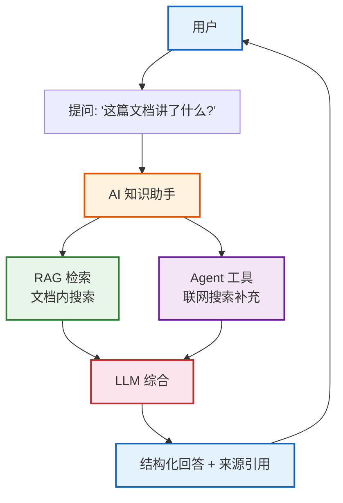
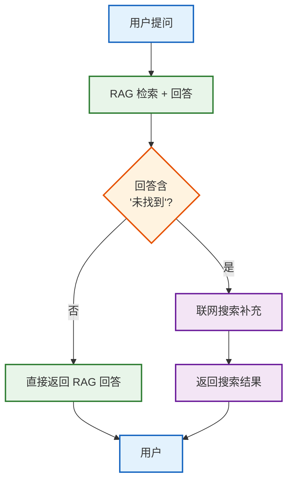
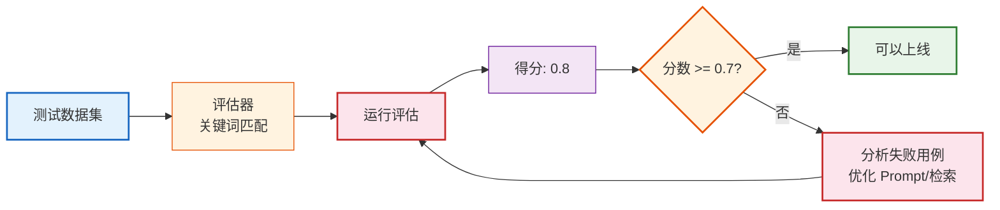
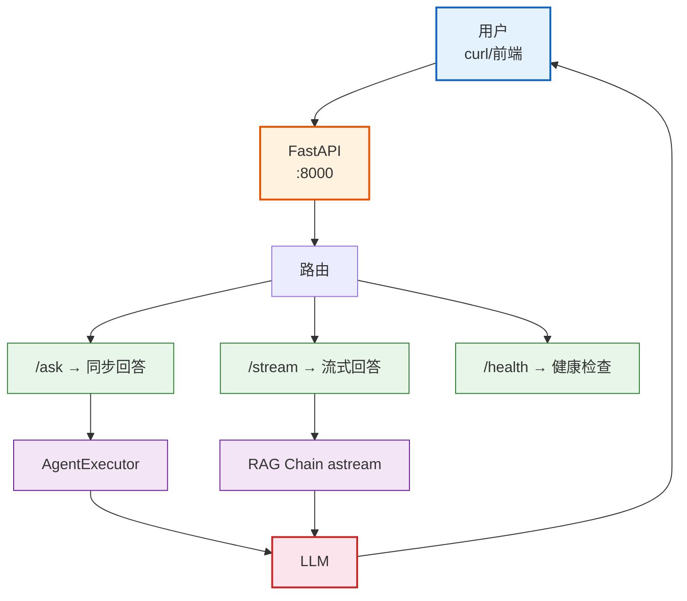

# 第13课：综合实战——从零构建 AI 知识助手

> **学习目标**：把前 12 课所学全部串联，从零构建一个完整的 AI 知识助手项目，涵盖环境搭建、RAG、Agent、评估、部署全流程。

> **配套知识库**：`知识库/09_评估测试与成本优化技术参考.md`

---

## 本课导航

| 小节 | 主题 | 预计时间 |
|------|------|---------|
| 1 | 项目概述 | 10 分钟 |
| 2 | 环境搭建 | 15 分钟 |
| 3 | 文档处理与索引 | 15 分钟 |
| 4 | RAG 问答核心 | 15 分钟 |
| 5 | Agent 工具增强 | 15 分钟 |
| 6 | 评估与优化 | 10 分钟 |
| 7 | 部署上线 | 10 分钟 |

---

## 1. 项目概述

### 我们要做什么

构建一个 **AI 知识助手**——用户上传 PDF 文档，AI 阅读理解后回答问题，还能调用搜索引擎补充外部信息。



> **图解说明**：AI 知识助手的工作流程——用户提问后，系统同时从本地文档库检索（RAG）和联网搜索（Agent），综合两方面信息让 LLM 给出带来源引用的结构化回答。

### 技术栈

| 组件 | 技术选型 | 作用 |
|------|---------|------|
| LLM | GPT-4o-mini | 主力模型 |
| Embedding | text-embedding-3-small | 向量化 |
| 向量库 | Chroma | 本地存储 |
| 框架 | LangChain + LangGraph | 编排 |
| 评估 | LangSmith | 质量监控 |
| 部署 | FastAPI | Web 服务 |

---

## 2. 环境搭建

### 目录结构

```
ai-knowledge-assistant/
├── data/                  # 文档存放
│   └── sample.pdf
├── src/
│   ├── ingestion.py       # 文档处理
│   ├── retrieval.py       # 检索
│   ├── agent.py           # Agent 工具
│   ├── chain.py           # 主链
│   └── evaluate.py        # 评估
├── app.py                 # FastAPI 服务
├── requirements.txt
└── .env
```

### 安装依赖

```bash
pip install langchain langchain-openai langchain-community \
    langchain-chroma chromadb pypdf fastapi uvicorn python-dotenv
```

### 环境变量

```bash
# .env
OPENAI_API_KEY=sk-xxx
LANGSMITH_API_KEY=ls-xxx
LANGSMITH_TRACING=true
LANGSMITH_PROJECT=knowledge-assistant
```

---

## 3. 文档处理与索引

### ingestion.py

```python
from langchain_community.document_loaders import PyPDFLoader
from langchain.text_splitter import RecursiveCharacterTextSplitter
from langchain_openai import OpenAIEmbeddings
from langchain_chroma import Chroma
import os

# 1. 加载文档
loader = PyPDFLoader("data/sample.pdf")
docs = loader.load()
print(f"加载 {len(docs)} 页")

# 2. 分块
splitter = RecursiveCharacterTextSplitter(
    chunk_size=500,
    chunk_overlap=50,
)
chunks = splitter.split_documents(docs)
print(f"分块 {len(chunks)} 块")

# 3. 向量化 + 存储
embeddings = OpenAIEmbeddings(model="text-embedding-3-small")
vectorstore = Chroma.from_documents(
    chunks,
    embeddings,
    persist_directory="./chroma_db",
)
print(f"索引完成，共 {len(chunks)} 块")
```


> **图解说明**：文档处理四步流水线——加载 PDF → 分块（每块 500 字，重叠 50 字防止截断关键信息）→ 向量化 → 存入 Chroma。一次处理，后续反复检索。

---

## 4. RAG 问答核心

### retrieval.py

```python
from langchain_chroma import Chroma
from langchain_openai import OpenAIEmbeddings

embeddings = OpenAIEmbeddings(model="text-embedding-3-small")
vectorstore = Chroma(
    persist_directory="./chroma_db",
    embedding_function=embeddings,
)

# 基础检索器
retriever = vectorstore.as_retriever(
    search_type="similarity",
    search_kwargs={"k": 4},
)
```

### chain.py

```python
from langchain_openai import ChatOpenAI
from langchain_core.prompts import ChatPromptTemplate
from langchain_core.output_parsers import StrOutputParser
from langchain_core.runnables import RunnablePassthrough
from langchain_community.tools import DuckDuckGoSearchRun

# LLM
llm = ChatOpenAI(model="gpt-4o-mini", temperature=0)

# 搜索工具
search = DuckDuckGoSearchRun()

# RAG Prompt
rag_prompt = ChatPromptTemplate.from_messages([
    ("system", """你是文档知识助手。根据以下上下文回答用户问题。
如果上下文中有答案，请引用来源。
如果上下文没有答案，说"文档中未找到相关信息"。

文档上下文：
{context}"""),
    ("human", "{question}"),
])

def format_docs(docs):
    return "\n\n".join(f"[{i}] {d.page_content}" for i, d in enumerate(docs))

# RAG 链
rag_chain = (
    {"context": retriever | format_docs, "question": RunnablePassthrough()}
    | rag_prompt
    | llm
    | StrOutputParser()
)

# 带搜索的链——文档找不到时联网搜索
def answer_with_fallback(question: str) -> str:
    # 先走 RAG
    rag_answer = rag_chain.invoke(question)
    if "未找到" in rag_answer:
        # RAG 找不到 → 用搜索引擎补充
        search_result = search.invoke(question)
        return f"文档中未找到，以下是网络搜索结果:\n{search_result}"
    return rag_answer
```



> **图解说明**：问答核心采用双路径策略——先走 RAG（从本地文档检索），如果 RAG 回答"未找到"，再启动联网搜索补充。这样既保证本地文档的准确性，又不会因为文档没有而完全无法回答。

---

## 5. Agent 工具增强

### agent.py

```python
from langchain.agents import create_tool_calling_agent, AgentExecutor
from langchain_core.tools import Tool

# 工具1: 文档检索
doc_search = Tool(
    name="doc_search",
    func=lambda q: rag_chain.invoke(q),
    description="在已上传的文档中搜索信息",
)

# 工具2: 网络搜索
web_search = Tool(
    name="web_search",
    func=search.invoke,
    description="在互联网上搜索最新信息",
)

# 工具3: 文档摘要
def summarize_doc(query):
    docs = retriever.get_relevant_documents(query)
    return "\n".join(d.page_content[:200] for d in docs)

doc_summary = Tool(
    name="doc_summary",
    func=summarize_doc,
    description="获取文档相关部分的摘要",
)

# 创建 Agent
agent_prompt = ChatPromptTemplate.from_messages([
    ("system", "你是 AI 知识助手。你可以使用工具帮助用户。"),
    ("human", "{input}"),
    ("placeholder", "{agent_scratchpad}"),
])

agent = create_tool_calling_agent(
    llm=llm,
    tools=[doc_search, web_search, doc_summary],
    prompt=agent_prompt,
)

agent_executor = AgentExecutor(
    agent=agent,
    tools=[doc_search, web_search, doc_summary],
    verbose=True,
)
```

---

## 6. 评估与优化

### evaluate.py

```python
from langsmith import Client
from langsmith.evaluation import evaluate

client = Client()

# 创建测试数据集
dataset = client.create_dataset("knowledge_assistant_test")

test_cases = [
    {"question": "文档的核心观点是什么?", "answer_contains": "核心"},
    {"question": "文档中提到了哪些方法?", "answer_contains": "方法"},
    {"question": "总结文档内容", "answer_contains": "总结"},
]
for tc in test_cases:
    client.create_example(
        inputs={"question": tc["question"]},
        outputs={"expected_keyword": tc["answer_contains"]},
        dataset_id=dataset.id,
    )

# 评估器
def keyword_evaluator(run, example):
    answer = run.outputs.get("output", "")
    keyword = example.outputs.get("expected_keyword", "")
    score = 1 if keyword in answer else 0
    return {"key": "keyword_match", "score": score}

# 运行评估
results = evaluate(
    lambda x: agent_executor.invoke({"input": x["question"]}),
    data="knowledge_assistant_test",
    evaluators=[keyword_evaluator],
    experiment_prefix="v1",
)
```



> **图解说明**：评估闭环——用测试数据集自动跑评估，得分低于 0.7 就分析失败用例、优化 Prompt 或检索策略，再重新评估，直到达标才上线。

---

## 7. 部署上线

### app.py

```python
from fastapi import FastAPI
from fastapi.responses import StreamingResponse
from pydantic import BaseModel
import uvicorn

app = FastAPI(title="AI 知识助手")

class Question(BaseModel):
    question: str

@app.post("/ask")
async def ask(q: Question):
    result = await agent_executor.ainvoke({"input": q.question})
    return {"answer": result["output"]}

@app.post("/stream")
async def stream(q: Question):
    async def generate():
        async for event in rag_chain.astream_events(
            {"question": q.question}, version="v2"
        ):
            if event["event"] == "on_chat_model_stream":
                yield f"data: {event['data']['chunk'].content}\n\n"
    return StreamingResponse(generate(), media_type="text/event-stream")

@app.get("/health")
async def health():
    return {"status": "ok"}

if __name__ == "__main__":
    uvicorn.run(app, host="0.0.0.0", port=8000)
```

### 启动与测试

```bash
# 启动服务
python app.py

# 测试
curl -X POST http://localhost:8000/ask \
    -H "Content-Type: application/json" \
    -d '{"question": "文档的核心观点是什么?"}'

# 流式测试
curl -X POST http://localhost:8000/stream \
    -H "Content-Type: application/json" \
    -d '{"question": "总结文档"}' --no-buffer
```



> **图解说明**：部署架构——FastAPI 提供 3 个端点：/ask 同步回答（等完整结果返回）、/stream 流式回答（逐 token 返回，体验好）、/health 健康检查（监控用）。Agent 和 RAG 两种模式都可用。

---

## 本课小结

### 你构建了什么

一个完整的 AI 知识助手——从文档处理到部署上线，全流程覆盖。

### 项目架构回顾

| 层 | 组件 | 技术 |
|----|------|------|
| 数据层 | 文档处理 | PyPDFLoader + TextSplitter |
| 检索层 | 向量检索 | Chroma + Embeddings |
| 逻辑层 | RAG + Agent | LangChain + Tools |
| 评估层 | 质量监控 | LangSmith |
| 服务层 | Web API | FastAPI |
| 交互层 | 同步 + 流式 | REST + SSE |

### 学到的技能点汇总

| 课程 | 技能 | 在本课的应用 |
|------|------|------------|
| 01-02 | LLM + LangChain | 核心 LLM 调用 |
| 03 | Prompt 工程 | RAG Prompt 设计 |
| 04 | 记忆机制 | Agent 上下文管理 |
| 05 | 输出解析 | 结构化回答 |
| 06 | Agent 工具 | 文档搜索 + 网络搜索 |
| 07 | RAG | 文档检索问答 |
| 08 | LangGraph | 工作流编排 |
| 09 | 多 Agent | 工具调用 Agent |
| 10 | 部署 | FastAPI 服务 |
| 11 | LCEL | 管道链 |
| 12 | 高级 RAG | 检索策略 |

### 后续进阶方向

1. **接入 LangGraph**——把 Agent 改造成图结构，支持更复杂的工作流
2. **添加高级 RAG**——Multi-Query + Re-Ranking 提升检索精度
3. **前端界面**——用 Gradio 或 Streamlit 搭建聊天 UI
4. **成本优化**——语义缓存 + 模型分级路由
5. **用户反馈闭环**——收集用户点赞/点踩，持续优化

### 配套知识库

- 📖 `知识库/09_评估测试与成本优化技术参考.md`

### 课程结束

🎉 恭喜你完成了全部 13 节课！你现在具备了从零搭建 LangChain/LangGraph 应用的完整能力。继续实践，持续学习！
