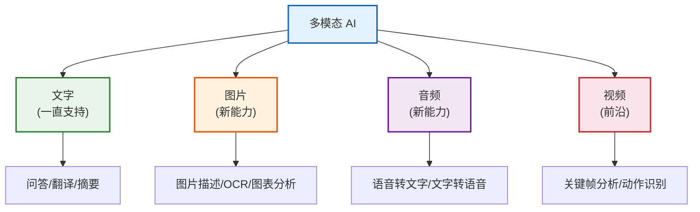
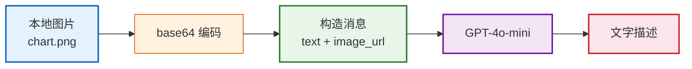
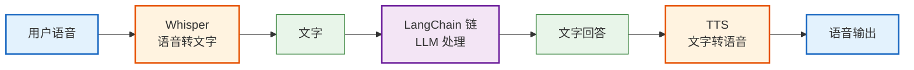
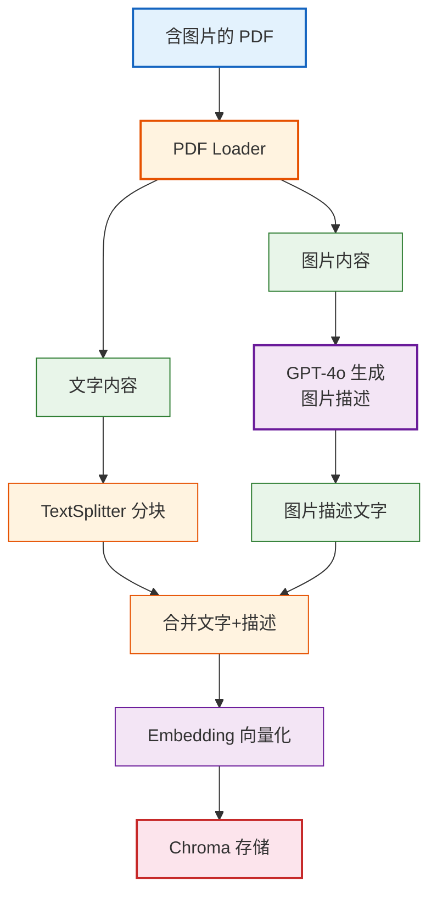
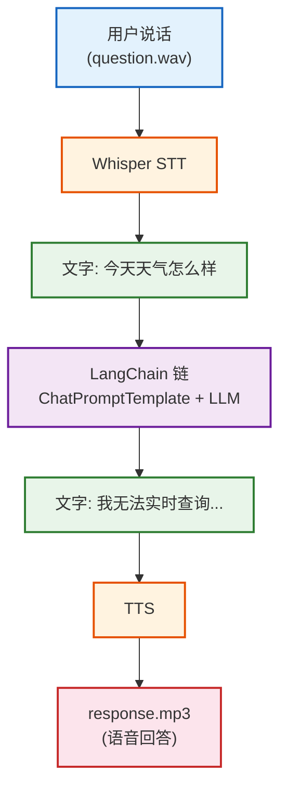

# 第14课：多模态 AI——处理图片和音频

> **学习目标**：理解多模态 AI 的概念，学会用 LangChain 处理图片（理解/描述/问答）和音频（语音转文字/文字转语音），构建多模态 RAG 和语音助手。

> **配套知识库**：`知识库/11_多模态与高级模型集成技术手册.md`

---

## 本课导航

| 小节 | 主题 | 预计时间 |
|------|------|---------|
| 1 | 什么是多模态 | 10 分钟 |
| 2 | 图片理解 | 15 分钟 |
| 3 | 多图片对比 | 10 分钟 |
| 4 | 音频处理 | 15 分钟 |
| 5 | 多模态 RAG | 10 分钟 |
| 6 | 语音助手项目 | 10 分钟 |

---

## 1. 什么是多模态

### 生活类比

以前的 AI 像**只能读文字的盲人**——你给它文字，它处理文字。
多模态 AI 像**有眼有耳的翻译官**——能看图片、能听音频、还能读文字。



> **图解说明**：多模态 AI 能同时处理文字、图片、音频、视频四种"模态"（信息形式）。文字一直支持，图片和音频是近年新增能力，视频还在发展中。

### 支持多模态的模型

| 模型 | 图片 | 音频 | 价格 | 推荐场景 |
|------|------|------|------|---------|
| GPT-4o-mini | ✅ | ✅ | 便宜 | 日常多模态 |
| GPT-4o | ✅ | ✅ | 中等 | 复杂图片理解 |
| Gemini 1.5 | ✅ | ✅ | 便宜 | 长文档+图片 |

---

## 2. 图片理解

### 2.1 让 AI 看图说话

```python
from langchain_openai import ChatOpenAI
from langchain_core.messages import HumanMessage
import base64

llm = ChatOpenAI(model="gpt-4o-mini")

# 本地图片 → Base64 → 发给 AI
def ask_image(image_path: str, question: str) -> str:
    with open(image_path, "rb") as f:
        b64 = base64.b64encode(f.read()).decode()

    message = HumanMessage(content=[
        {"type": "text", "text": question},
        {"type": "image_url", "image_url": {"url": f"data:image/png;base64,{b64}"}},
    ])
    response = llm.invoke([message])
    return response.content

# 使用
print(ask_image("chart.png", "这张图表展示了什么趋势?"))
# 输出: "这张折线图展示了2020-2024年某产品的销售增长趋势..."
```



> **图解说明**：图片处理流程——本地图片 → Base64 编码（转成文字表示）→ 构造 content 消息（文字+图片两部分）→ 发给 GPT-4o-mini → 获取文字描述。关键步骤是 Base64 编码。

### 2.2 用 URL 直接传图片

```python
# 更简单的方式——直接用 URL
message = HumanMessage(content=[
    {"type": "text", "text": "描述这张图片"},
    {"type": "image_url", "image_url": {"url": "https://example.com/photo.jpg"}},
])
response = llm.invoke([message])
```

---

## 3. 多图片对比

### 生活类比

给 AI 两张销售图表，让它比较——就像给分析师两张报表，问"哪个季度更好"。

```python
def compare_images(img1_path: str, img2_path: str, question: str) -> str:
    b64_1 = encode_image(img1_path)
    b64_2 = encode_image(img2_path)

    message = HumanMessage(content=[
        {"type": "text", "text": f"第一张图和第二张图对比。问题: {question}"},
        {"type": "image_url", "image_url": {"url": f"data:image/png;base64,{b64_1}"}},
        {"type": "image_url", "image_url": {"url": f"data:image/png;base64,{b64_2}"}},
    ])
    return llm.invoke([message]).content

print(compare_images("q1_chart.png", "q2_chart.png", "哪个季度增长更快?"))
# 输出: "Q2 的增长率(25%)高于 Q1(15%)..."
```

---

## 4. 音频处理

### 4.1 语音转文字

```python
import openai

def transcribe(audio_path: str) -> str:
    """语音转文字"""
    with open(audio_path, "rb") as f:
        result = openai.Audio.transcribe(
            model="whisper-1",
            file=f,
            language="zh",  # 指定语言更准
        )
    return result.text

# 使用
text = transcribe("meeting.wav")
print(text)
# 输出: "今天的会议讨论了产品路线图..."
```

### 4.2 文字转语音

```python
def speak(text: str, output_path: str = "output.mp3"):
    """文字转语音"""
    response = openai.Audio.speech(
        model="tts-1",
        voice="nova",  # 可选: alloy/echo/fable/onyx/nova/shimmer
        input=text,
    )
    response.stream_to_file(output_path)

speak("你好，欢迎使用语音助手!")
# 生成 output.mp3 文件
```



> **图解说明**：完整语音助手流程——用户说话 → Whisper 转文字 → LangChain 处理 → TTS 转回语音 → 播放。这就是 ChatGPT 语音模式的基本原理。

---

## 5. 多模态 RAG

### 问题场景

你有一份**图文并茂的报告**（PDF 里有图表+文字），想做问答。传统 RAG 只能处理文字，图表内容丢失了。

### 解决方案



> **图解说明**：多模态 RAG 的关键——把 PDF 中的每张图片用 GPT-4o 生成文字描述，然后将描述和原文一起分块、向量化、存储。这样检索时就能"看懂"图片内容。

### 代码

```python
from langchain_community.document_loaders import PyPDFLoader

# 1. 加载 PDF
loader = PyPDFLoader("report.pdf")
docs = loader.load()

# 2. 对每页的图片生成描述
for doc in docs:
    images = doc.metadata.get("images", [])
    for img_b64 in images:
        description = ask_image_from_b64(img_b64, "描述这张图片的关键信息")
        doc.page_content += f"\n[图片: {description}]"

# 3. 正常 RAG 流程
splits = splitter.split_documents(docs)
vectorstore = Chroma.from_documents(splits, embeddings)
# 后续检索问答不变
```

---

## 6. 语音助手项目

### 完整代码

```python
import openai
from langchain_openai import ChatOpenAI
from langchain_core.prompts import ChatPromptTemplate
from langchain_core.output_parsers import StrOutputParser

llm = ChatOpenAI(model="gpt-4o-mini", temperature=0.7)
chain = (
    ChatPromptTemplate.from_messages([
        ("system", "你是语音助手，用简洁口语化的中文回答，每次不超过3句话。"),
        ("human", "{input}"),
    ])
    | llm | StrOutputParser()
)

def voice_assistant(audio_path: str) -> str:
    """完整语音助手: 语音输入 → 文字 → LLM → 语音输出"""
    # 1. 语音转文字
    with open(audio_path, "rb") as f:
        text = openai.Audio.transcribe(model="whisper-1", file=f, language="zh").text
    print(f"你说: {text}")

    # 2. LLM 回答
    answer = chain.invoke({"input": text})
    print(f"助手: {answer}")

    # 3. 文字转语音
    response = openai.Audio.speech(model="tts-1", voice="nova", input=answer)
    response.stream_to_file("response.mp3")
    print("语音已生成: response.mp3")
    return answer

# 使用
voice_assistant("question.wav")
# 你说: 今天天气怎么样
# 助手: 我无法实时查询天气，建议你查看手机天气应用。
# 语音已生成: response.mp3
```



> **图解说明**：语音助手完整流程——用户说话(wav文件) → Whisper 转文字 → LangChain 处理 → TTS 转语音 → 播放。每一步都是独立 API，用 Python 串联。

---

## 本课小结

| 你学到了什么 | 一句话总结 |
|-------------|-----------|
| 多模态概念 | AI 能同时处理文字+图片+音频 |
| 图片理解 | 图片→Base64→发给GPT-4o |
| 多图片对比 | content 中放多张 image_url |
| 音频处理 | Whisper 转文字 + TTS 转语音 |
| 多模态 RAG | 图片先用 LLM 生成描述再向量化 |
| 语音助手 | STT→LLM→TTS 三步串联 |

### 配套知识库

- 📖 `知识库/11_多模态与高级模型集成技术手册.md`

### 下一课

➡️ **第15课：安全防护——让 AI 应用更安全**——学会防御 Prompt 注入、PII 脱敏、内容审核。
