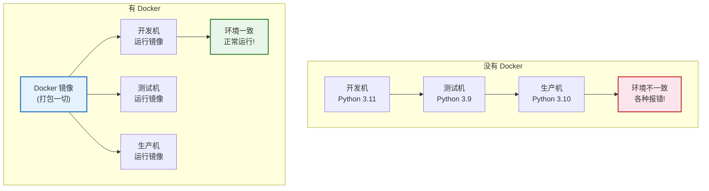
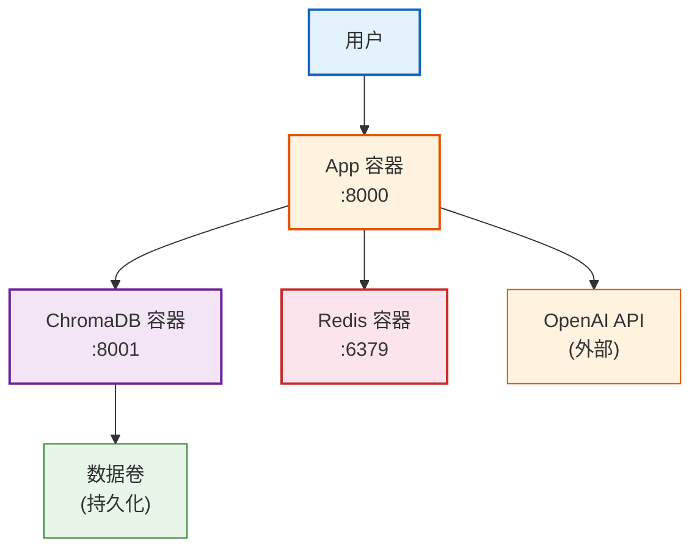
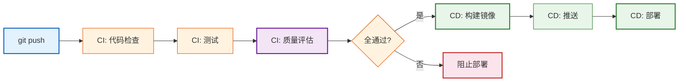
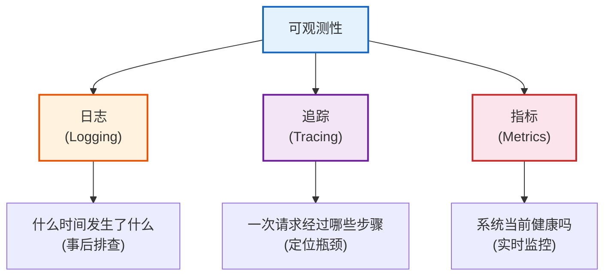
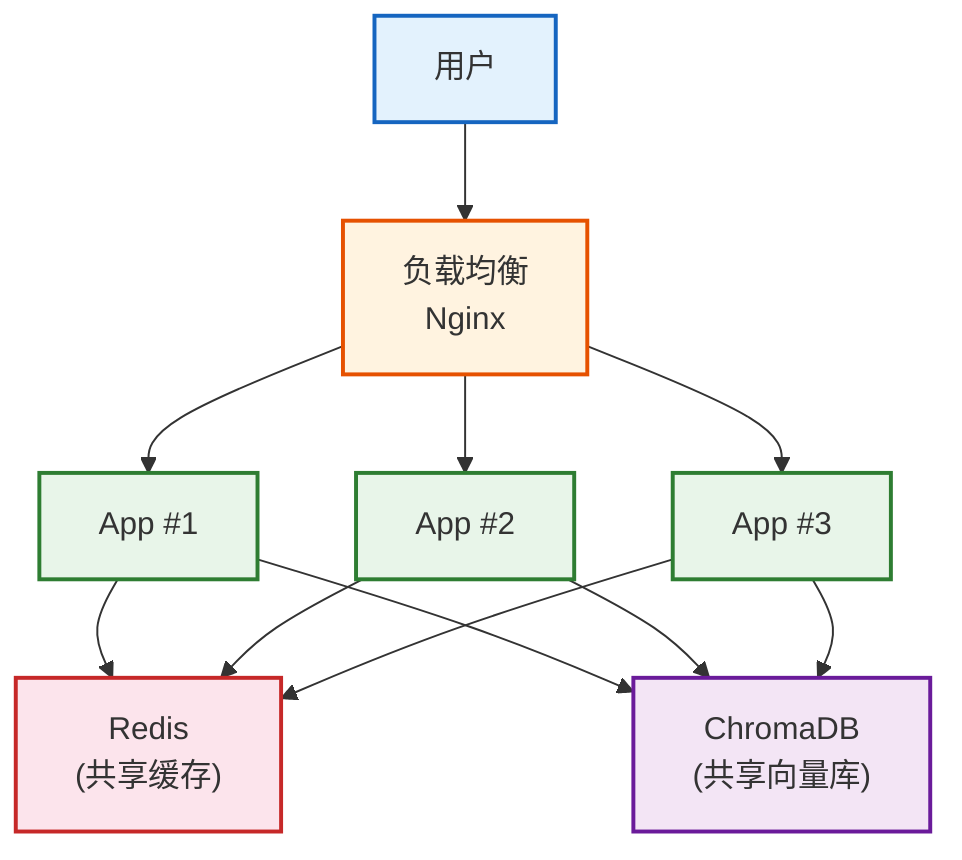

# 第16课：生产部署进阶——Docker 与监控

> **学习目标**：学会用 Docker 容器化 LangChain 应用、配置 CI/CD 流水线、搭建日志/追踪/指标三位一体的可观测性体系，实现高可用。

> **配套知识库**：`知识库/12_生产部署模式与可观测性技术参考.md`

---

## 本课导航

| 小节 | 主题 | 预计时间 |
|------|------|---------|
| 1 | Docker 容器化 | 15 分钟 |
| 2 | docker-compose 编排 | 10 分钟 |
| 3 | CI/CD 流水线 | 10 分钟 |
| 4 | 可观测性三件套 | 15 分钟 |
| 5 | 高可用部署 | 10 分钟 |

---

## 1. Docker 容器化

### 生活类比

Docker 像**集装箱**——把你的应用、依赖、配置全部打包进一个标准箱子里。不管搬到哪台机器上，打开就能用，不用再装环境。



> **图解说明**：Docker 解决的核心问题——环境一致性。没有 Docker 时，开发/测试/生产机器的 Python 版本、依赖包版本不同导致各种报错。Docker 把应用和所有依赖打包成一个镜像，在任何机器上运行结果都一致。

### Dockerfile

```dockerfile
# Dockerfile
FROM python:3.11-slim

WORKDIR /app

# 安装系统依赖
RUN apt-get update && apt-get install -y gcc curl \
    && rm -rf /var/lib/apt/lists/*

# 安装 Python 依赖
COPY requirements.txt .
RUN pip install --no-cache-dir -r requirements.txt

# 复制代码
COPY . .

# 健康检查
HEALTHCHECK --interval=30s --timeout=5s --retries=3 \
    CMD curl -f http://localhost:8000/health || exit 1

# 启动
CMD ["uvicorn", "app:app", "--host", "0.0.0.0", "--port", "8000", "--workers", "4"]
```

### 构建和运行

```bash
# 构建镜像
docker build -t my-langchain-app:latest .

# 运行容器
docker run -d --name app -p 8000:8000 --env-file .env my-langchain-app:latest

# 测试
curl http://localhost:8000/health
# {"status": "ok"}
```

---

## 2. docker-compose 编排

### 多容器编排

```yaml
# docker-compose.yml
version: '3.9'
services:
  app:
    build: .
    ports:
      - "8000:8000"
    env_file: .env
    depends_on: [chroma, redis]
    restart: always

  chroma:
    image: chromadb/chroma:latest
    ports:
      - "8001:8001"
    volumes:
      - chroma-data:/chroma/chroma

  redis:
    image: redis:7-alpine
    ports:
      - "6379:6379"

volumes:
  chroma-data:
```



> **图解说明**：docker-compose 把三个容器编排在一起——App 容器（主应用）+ ChromaDB 容器（向量库）+ Redis 容器（缓存）。一条命令 `docker-compose up` 就能启动整个系统。数据卷保证 ChromaDB 重启不丢数据。

```bash
# 启动所有服务
docker-compose up -d

# 查看状态
docker-compose ps

# 查看日志
docker-compose logs app

# 停止
docker-compose down
```

---

## 3. CI/CD 流水线

### 流程



> **图解说明**：CI/CD 流水线——代码推送后自动执行代码检查→单元测试→LangSmith 质量评估。全部通过才构建 Docker 镜像并部署到生产。任一步骤失败都阻止部署。这样保证只有通过验证的代码才能上线。

### GitHub Actions 配置

```yaml
# .github/workflows/deploy.yml
name: Deploy
on:
  push:
    branches: [main]

jobs:
  test:
    runs-on: ubuntu-latest
    steps:
      - uses: actions/checkout@v4
      - uses: actions/setup-python@v5
        with: { python-version: '3.11' }
      - run: pip install -r requirements.txt
      - run: pytest tests/ -v
      - name: LangSmith 评估
        run: python evaluate.py
        env:
          OPENAI_API_KEY: ${{ secrets.OPENAI_API_KEY }}

  deploy:
    needs: test
    runs-on: ubuntu-latest
    steps:
      - uses: actions/checkout@v4
      - run: docker build -t myapp:${{ github.sha }} .
      - run: docker push registry.example.com/myapp:latest
```

---

## 4. 可观测性三件套

### 可观测性概述



> **图解说明**：可观测性三件套——日志（记录发生了什么，用于事后排查）、追踪（记录一次请求经过了哪些步骤，用于定位瓶颈）、指标（系统当前健康状态的数值，用于实时监控告警）。三者互补，缺一不可。

### 4.1 结构化日志

```python
import logging, json
from datetime import datetime

class StructuredFormatter(logging.Formatter):
    def format(self, record):
        return json.dumps({
            "timestamp": datetime.now().isoformat(),
            "level": record.levelname,
            "message": record.getMessage(),
            "module": record.module,
        }, ensure_ascii=False)

logger = logging.getLogger("app")
handler = logging.StreamHandler()
handler.setFormatter(StructuredFormatter())
logger.addHandler(handler)
logger.setLevel(logging.INFO)

logger.info("用户请求", extra={"user_id": "u1", "model": "gpt-4o-mini"})
# {"timestamp": "...", "level": "INFO", "message": "用户请求", ...}
```

### 4.2 LangSmith 追踪

```python
import os
os.environ["LANGSMITH_TRACING"] = "true"
os.environ["LANGSMITH_PROJECT"] = "production"

# 每次调用自动记录完整追踪到 LangSmith
result = chain.invoke({"question": "什么是RAG"})
# 在 smith.langchain.com 查看:
# - 每步的输入输出
# - 每步耗时
# - Token 消耗
# - 错误信息
```

### 4.3 Prometheus 指标

```python
from prometheus_client import Counter, Histogram, make_asgi_app

REQUESTS = Counter("app_requests_total", "总请求数", ["status"])
LATENCY = Histogram("app_latency_seconds", "延迟(秒)")

@app.middleware("http")
async def metrics_middleware(request, call_next):
    start = time.time()
    response = await call_next(request)
    LATENCY.observe(time.time() - start)
    REQUESTS.labels(status=response.status_code).inc()
    return response

app.mount("/metrics", make_asgi_app())
# Prometheus 抓取 /metrics 端点
```

### 关键监控告警阈值

| 指标 | 正常 | 告警 | 严重 |
|------|------|------|------|
| 错误率 | < 1% | > 5% | > 10% |
| P50延迟 | < 1s | > 2s | > 5s |
| P99延迟 | < 5s | > 10s | > 30s |
| Token/天 | 按预算 | 预算80% | 预算95% |

---

## 5. 高可用部署

### 5.1 多实例+负载均衡



> **图解说明**：高可用架构——负载均衡把流量分发给多个 App 实例，任一实例挂了不影响服务。所有实例共享 Redis 缓存和 ChromaDB 向量库，保证数据一致。

### 5.2 Redis 缓存

```python
import redis, json

redis_client = redis.Redis(host='redis', port=6379)

def cached_invoke(chain, question: str, ttl=3600):
    """带 Redis 缓存的调用"""
    key = f"qa:{hash(question)}"
    cached = redis_client.get(key)
    if cached:
        return json.loads(cached)  # 缓存命中，不消耗 Token
    result = chain.invoke(question)
    redis_client.setex(key, ttl, json.dumps(result))
    return result
```

### 5.3 队列异步处理

```python
# 长任务用队列异步处理——用户提交后轮询结果
@app.post("/ask/async")
async def ask_async(question: str):
    task = process_question.delay(question)  # Celery 异步
    return {"task_id": task.id}

@app.get("/result/{task_id}")
async def get_result(task_id: str):
    result = process_question.AsyncResult(task_id)
    if result.ready():
        return {"status": "done", "result": result.result}
    return {"status": "processing"}
```

---

## 本课小结

| 你学到了什么 | 一句话总结 |
|-------------|-----------|
| Docker 容器化 | Dockerfile + docker-compose 打包部署 |
| CI/CD | push→测试→评估→构建→部署全自动 |
| 可观测性 | 日志+追踪+指标三位一体 |
| 高可用 | 多实例+负载均衡+缓存 |
| 异步处理 | 队列模式处理长任务 |

### 生产检查速查

| 检查项 | 工具/方式 |
|--------|---------|
| Docker 镜像 | `docker build` + `docker-compose up` |
| 健康检查 | `/health` 端点 |
| 日志 | 结构化 JSON 日志 |
| 追踪 | LangSmith 自动追踪 |
| 指标 | Prometheus `/metrics` |
| 缓存 | Redis 缓存层 |
| 异步 | Celery 队列 |
| 多实例 | docker-compose scale |

### 配套知识库

- 📖 `知识库/12_生产部署模式与可观测性技术参考.md`
- 📖 `知识库/05_API集成与部署技术参考.md`（基础部署）

### 下一课

➡️ **第17课：最佳实践——写出专业级代码**——学会避免反模式，写出可维护的生产级代码。
