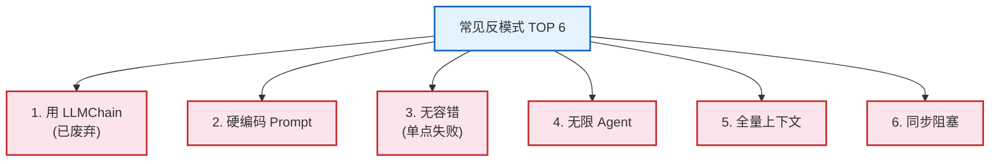
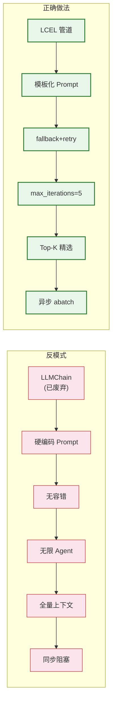
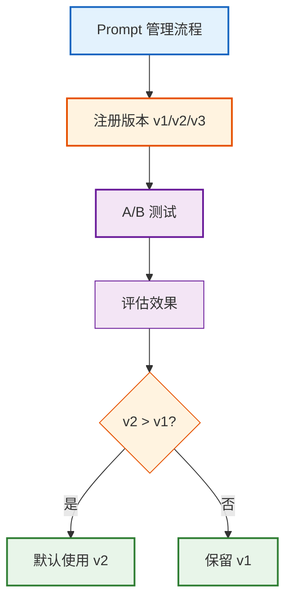
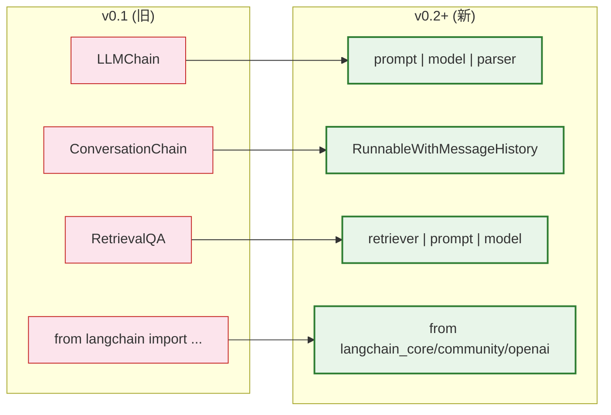

# 第17课：最佳实践——写出专业级代码

> **学习目标**：掌握 LangChain 开发的最佳实践，识别并避免常见反模式，学会配置管理、Prompt 管理、代码审查，从"能用"升级到"专业"。

> **配套知识库**：`知识库/13_最佳实践与反模式手册.md`

---

## 本课导航

| 小节 | 主题 | 预计时间 |
|------|------|---------|
| 1 | 反模式避坑 | 15 分钟 |
| 2 | 配置管理 | 10 分钟 |
| 3 | Prompt 管理 | 10 分钟 |
| 4 | 代码审查清单 | 10 分钟 |
| 5 | v0.1 迁移 | 10 分钟 |

---

## 1. 反模式避坑

### 六大反模式



> **图解说明**：LangChain 开发最常踩的六个坑——用已废弃的 LLMChain、Prompt 硬编码、无容错导致单点失败、Agent 不限迭代烧钱、全量上下文导致 token 爆炸、不用异步导致性能差。每个都有对应的正确做法。

### 反模式 vs 正确做法

```python
# ❌ 反模式1: 用 LLMChain (已废弃)
from langchain.chains import LLMChain
chain = LLMChain(llm=llm, prompt=prompt)

# ✅ 正确: 用 LCEL 管道
chain = prompt | llm | StrOutputParser()

# ❌ 反模式2: 硬编码 Prompt
llm.invoke("你是助手。请回答: " + user_input)

# ✅ 正确: 用模板
prompt = ChatPromptTemplate.from_messages([
    ("system", "你是助手。"),
    ("human", "{question}"),
])
chain = prompt | llm | StrOutputParser()

# ❌ 反模式3: 无容错
result = chain.invoke(question)  # API 挂了就全盘崩溃

# ✅ 正确: fallback + retry
safe_model = model.with_fallbacks([
    ChatOpenAI(model="gpt-4o-mini"),
]).with_retry(stop_after_attempt=3)

# ❌ 反模式4: Agent 不限迭代
executor = AgentExecutor(agent=agent, tools=tools)
# 可能死循环烧钱

# ✅ 正确: 限制迭代
executor = AgentExecutor(
    agent=agent, tools=tools,
    max_iterations=5,
    handle_parsing_errors=True,
)

# ❌ 反模式5: 全量上下文
docs = retriever.invoke(question)
# 把所有文档全塞给 LLM → token 爆炸

# ✅ 正确: 只传 Top-K
docs = retriever.invoke(question)[:3]  # 只取最相关的3个

# ❌ 反模式6: 同步阻塞
for q in questions:
    chain.invoke(q)  # 一个一个串行 → 慢

# ✅ 正确: 异步并发
results = await chain.abatch(questions)  # 并发 → 快
```



> **图解说明**：六大反模式与正确做法的对比——红色是常见错误，绿色是专业写法。把六个反模式都改成正确做法，你的代码就从"能跑"升级到"专业级"。

---

## 2. 配置管理

### 生活类比

配置管理像**家里的配电箱**——所有开关集中在一个面板上，不得到处找。

```python
# ❌ 反模式: 魔法数字散落各处
llm = ChatOpenAI(model="gpt-4o-mini", temperature=0.0)
splitter = RecursiveCharacterTextSplitter(chunk_size=500, chunk_overlap=50)
retriever = vectorstore.as_retriever(search_kwargs={"k": 4})

# ✅ 正确: 集中配置
from pydantic_settings import BaseSettings

class Settings(BaseSettings):
    # 模型
    model_name: str = "gpt-4o-mini"
    temperature: float = 0.0
    max_retries: int = 3

    # 分块
    chunk_size: int = 500
    chunk_overlap: int = 50

    # 检索
    retrieval_k: int = 4

    # 缓存
    cache_ttl: int = 3600

    class Config:
        env_file = ".env"

settings = Settings()

# 使用——所有配置来自一处
llm = ChatOpenAI(
    model=settings.model_name,
    temperature=settings.temperature,
).with_retry(stop_after_attempt=settings.max_retries)

splitter = RecursiveCharacterTextSplitter(
    chunk_size=settings.chunk_size,
    chunk_overlap=settings.chunk_overlap,
)
```

---

## 3. Prompt 管理

### Prompt 版本管理

```python
# ✅ 正确: Prompt 版本注册表
class PromptRegistry:
    _registry = {}

    @classmethod
    def register(cls, name, version, prompt_text):
        cls._registry[f"{name}:{version}"] = prompt_text

    @classmethod
    def get(cls, name, version="v1"):
        return cls._registry[f"{name}:{version}"]

# 注册版本
PromptRegistry.register("qa", "v1", "你是问答助手。回答用户问题。")
PromptRegistry.register("qa", "v2", "你是专业文档问答助手。引用来源。不编造。")

# 使用——可随时切换版本
system_prompt = PromptRegistry.get("qa", "v2")
```



> **图解说明**：Prompt 版本管理——注册不同版本的 Prompt，通过 A/B 测试评估效果，选择最优版本作为默认。这样 Prompt 变更有据可查，不会因为改了一个词导致效果下降而不知道为什么。

---

## 4. 代码审查清单

```python
# 每次提交前的自查清单
REVIEW_CHECKLIST = {
    "架构": [
        "✅ 使用 LCEL 管道，不用 LLMChain",
        "✅ 配置通过 Settings 集中管理",
        "✅ 分层清晰：API→Chain→Data→Model",
    ],
    "Prompt": [
        "✅ 使用 ChatPromptTemplate 模板化",
        "✅ System Prompt 有安全边界",
        "✅ Prompt 版本可管理",
    ],
    "RAG": [
        "✅ 分块策略匹配文档类型",
        "✅ 返回结果带来源引用",
        "✅ 只传 Top-K（不全量）",
    ],
    "Agent": [
        "✅ 工具描述清晰",
        "✅ max_iterations 已限制",
        "✅ handle_parsing_errors=True",
    ],
    "容错": [
        "✅ with_fallbacks 配置备用模型",
        "✅ with_retry 配置重试",
        "✅ 超时已设置",
    ],
    "性能": [
        "✅ 使用异步 ainvoke/abatch",
        "✅ 配置了 LLM 缓存",
    ],
    "安全": [
        "✅ API 有认证",
        "✅ 速率限制已配置",
        "✅ 输入有 PII 脱敏",
    ],
}
```

---

## 5. v0.1 迁移

### 迁移对照表



> **图解说明**：LangChain v0.1→v0.2+ 的主要变化——旧版的各种 Chain 类（LLMChain/ConversationChain/RetrievalQA）全部替换为 LCEL 管道符语法。导入路径从 `langchain` 大包改为 `langchain_core`/`langchain_community`/`langchain_openai` 等子包。

### 迁移示例

```python
# ❌ v0.1 旧版
from langchain.chains import LLMChain, RetrievalQA
chain = LLMChain(llm=llm, prompt=prompt)

# ✅ v0.2+ 新版
from langchain_core.prompts import ChatPromptTemplate
from langchain_core.output_parsers import StrOutputParser
chain = prompt | llm | StrOutputParser()
```

---

## 本课小结

| 你学到了什么 | 一句话总结 |
|-------------|-----------|
| 反模式 | 6 个坑：旧Chain/硬编码/无容错/无限Agent/全量上下文/同步 |
| 配置管理 | 用 pydantic-settings 集中管理 |
| Prompt 管理 | 版本注册+A/B 测试 |
| 代码审查 | 7 个维度逐项检查 |
| v0.1 迁移 | LLMChain → LCEL 管道 |

### 专业级代码模板

```python
# === 生产级 LangChain 应用模板 ===
from pydantic_settings import BaseSettings

class Settings(BaseSettings):
    model_name: str = "gpt-4o-mini"
    temperature: float = 0.0
    max_retries: int = 3
    chunk_size: int = 500
    retrieval_k: int = 3
    class Config: env_file = ".env"

settings = Settings()

# 模型(带容错)
llm = ChatOpenAI(
    model=settings.model_name,
    temperature=settings.temperature,
).with_fallbacks([
    ChatOpenAI(model="gpt-4o-mini"),
]).with_retry(stop_after_attempt=settings.max_retries)

# RAG 链(带缓存)
chain = (
    {"context": retriever | format_docs,
     "question": RunnablePassthrough()}
    | ChatPromptTemplate.from_messages([
        ("system", SYSTEM_PROMPT),
        ("human", "{question}"),
    ])
    | llm | StrOutputParser()
)

# 异步+流式
async def ask(question: str):
    async for chunk in chain.astream(question):
        yield chunk
```

### 配套知识库

- 📖 `知识库/13_最佳实践与反模式手册.md`

### 课程结束

🎉 恭喜你完成了全部 17 节课！你现在具备了从零搭建到生产部署 LangChain/LangGraph 应用的完整能力。继续实践，持续精进！
