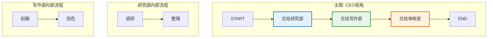
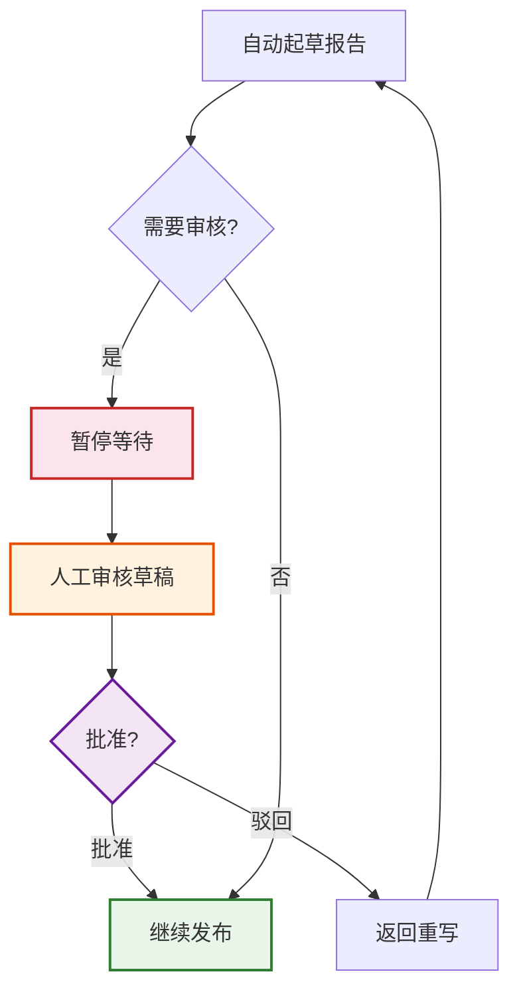
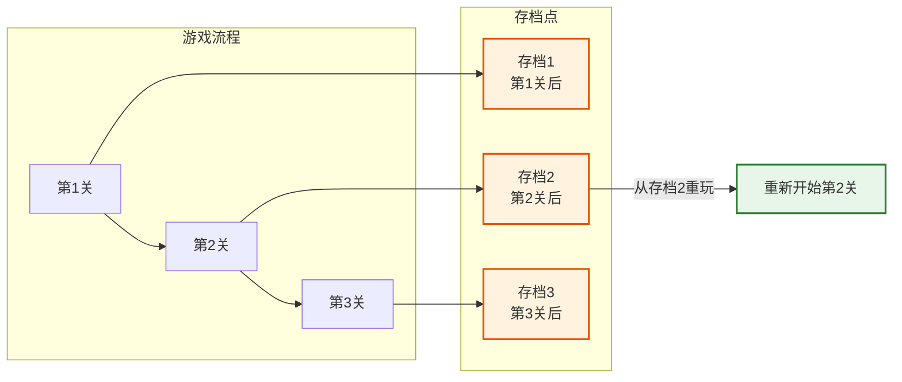
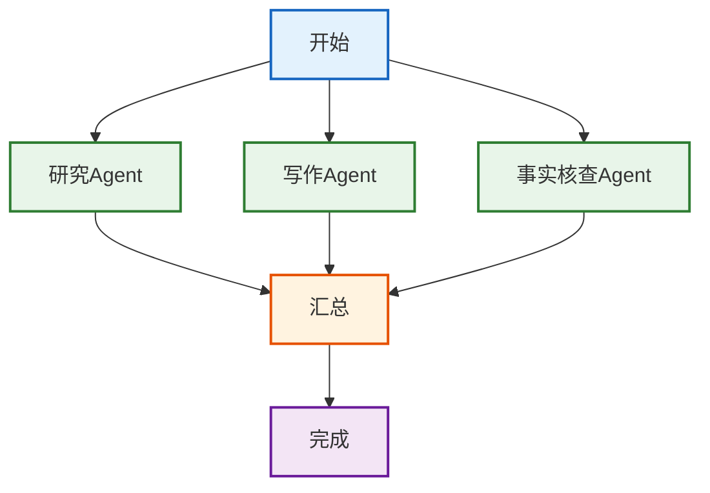

# 第18课：LangGraph 进阶——子图与人在回路

> **学习目标**：掌握 LangGraph 的高级特性——子图模块化、人在回路审批、检查点持久化、并行执行和动态路由，能构建复杂可控的工作流。

> **配套知识库**：`知识库/14_LangGraph高级模式技术手册.md`

---

## 本课导航

| 小节 | 主题 | 预计时间 |
|------|------|---------|
| 1 | 子图——把复杂图拆成模块 | 15 分钟 |
| 2 | 人在回路——让 AI 学会等批准 | 15 分钟 |
| 3 | 检查点——保存进度可以回放 | 10 分钟 |
| 4 | 并行执行——同时做多件事 | 10 分钟 |

---

## 1. 子图——把复杂图拆成模块

### 生活类比

子图就像**公司组织架构**——CEO（主图）不需要知道每个部门内部怎么运作，只需要知道把任务交给"研发部"还是"市场部"（子图），各部门内部有自己的工作流程。



> **图解说明**：主图像 CEO 的视角——只管把任务交给不同"部门"（子图节点），不关心部门内部怎么做。每个子图有自己的内部流程，互相独立。

### 核心代码

```python
from langgraph.graph import StateGraph, START, END

# 子图状态
class ResearchState(TypedDict):
    topic: str
    results: list

def search(state: ResearchState) -> dict:
    return {"results": [f"搜索: {state['topic']}"]}

def analyze(state: ResearchState) -> dict:
    return {"results": state["results"] + ["分析完成"]}

# 构建子图
sub = StateGraph(ResearchState)
sub.add_node("search", search)
sub.add_node("analyze", analyze)
sub.add_edge(START, "search")
sub.add_edge("search", "analyze")
sub.add_edge("analyze", END)
sub_app = sub.compile()

# 主图调用子图
def call_research(state: MainState) -> dict:
    # 主图状态 → 子图状态
    sub_input = {"topic": state["topic"], "results": []}
    result = sub_app.invoke(sub_input)
    # 子图状态 → 主图状态
    return {"research_results": result["results"]}
```

### 要点

| 概念 | 一句话 |
|------|--------|
| 子图 | 独立编译的图，被主图调用 |
| 状态映射 | 主图↔子图字段显式对应 |
| 复用 | 同一子图可被多个主图调用 |

---

## 2. 人在回路——让 AI 学会等批准

### 生活类比

人在回路就像**银行转账的短信验证**——系统自动处理大部分流程，但关键操作需要你发短信确认后才执行。



> **图解说明**：人在回路流程——AI 起草报告后，遇到需要审核的节点就暂停。人工检查后批准则继续发布，驳回则返回重写。关键步骤有人把关。

### 核心代码

```python
from langgraph.checkpoint.memory import MemorySaver

# 编译时设置中断点
app = graph.compile(
    checkpointer=MemorySaver(),
    interrupt_before=["publish"],  # 发布前暂停
)

# 第一次执行: 到 publish 前暂停
config = {"configurable": {"thread_id": "user-1"}}
result = app.invoke({"draft": ""}, config=config)
# draft 节点已完成, publish 未执行

# 查看当前状态
state = app.get_state(config)
print(state.values)  # {"draft": "草稿内容"}

# 人工审核后恢复
result = app.invoke(None, config=config)  # None = 继续
# publish 节点执行完成
```

### 要点

| 概念 | 一句话 |
|------|--------|
| interrupt_before | 进入节点前暂停 |
| interrupt_after | 节点执行后暂停 |
| 恢复 | 传 None 继续 |
| thread_id | 区分不同会话 |

---

## 3. 检查点——保存进度可以回放

### 生活类比

检查点就像**游戏的存档**——打到一个关卡自动存档，后面打输了可以从存档重来，不用从头开始。



> **图解说明**：检查点像游戏存档——每个节点执行后自动存档。可以从任意存档点回放——修改某个节点的代码后从该点重跑，不用从头开始。这对调试非常方便。

### 要点

| 后端 | 适用 | 特点 |
|------|------|------|
| MemorySaver | 开发 | 内存中，重启丢失 |
| SqliteSaver | 本地 | 文件持久化 |
| PostgresSaver | 生产 | 高可用 |

```python
# 查看状态历史
history = list(app.get_state_history(config))
for state in history:
    print(f"Step: {state.next}, Values: {state.values}")

# 从历史检查点回放
target = history[2]  # 第3个检查点
app.stream(None, {**config, "configurable": {
    "thread_id": "new",
    "checkpoint_id": target.config["configurable"]["checkpoint_id"],
}})
```

---

## 4. 并行执行——同时做多件事

### 生活类比

并行执行就像**做饭**——你同时烧水、切菜、热油，而不是等水烧开了再切菜。三个任务同时做，总时间大大缩短。



> **图解说明**：并行执行——三个 Agent 同时工作（研究、写作、核查），各自独立完成后汇总结果。比串行一个一个做快 3 倍。

### 核心代码

```python
import operator
from typing import Annotated

class State(TypedDict):
    topic: str
    results: Annotated[list, operator.add]  # 自动合并

# 三个并行节点
def research(s): return {"results": ["研究结果"]}
def writing(s): return {"results": ["写作结果"]}
def factcheck(s): return {"results": ["核查结果"]}

# 汇总节点
def aggregate(s): return {"results": [f"汇总: {s['results']}"]}

graph = StateGraph(State)
graph.add_node("research", research)
graph.add_node("writing", writing)
graph.add_node("factcheck", factcheck)
graph.add_node("aggregate", aggregate)

# 扇出: START → 三个节点
graph.add_edge(START, "research")
graph.add_edge(START, "writing")
graph.add_edge(START, "factcheck")

# 扇入: 三个节点 → aggregate
graph.add_edge("research", "aggregate")
graph.add_edge("writing", "aggregate")
graph.add_edge("factcheck", "aggregate")
graph.add_edge("aggregate", END)
```

### 要点

| 概念 | 一句话 |
|------|--------|
| 扇出 | 从 START 到多个节点 |
| 扇入 | 多个节点到同一节点 |
| 结果合并 | 用 Annotated[list, operator.add] |
| 并发执行 | 互不依赖的节点自动并行 |

---

## 本课小结

| 你学到了什么 | 一句话总结 |
|-------------|-----------|
| 子图 | 把复杂图拆成可复用模块 |
| 人在回路 | interrupt_before 让 AI 等批准 |
| 检查点 | 自动存档，可回放可恢复 |
| 并行执行 | 扇出扇入 + Annotated 合并 |

### 下一课

👉 **第19课：向量数据库——如何选择适合的向量库**——从 Chroma 到 Milvus，学会根据场景选型。
