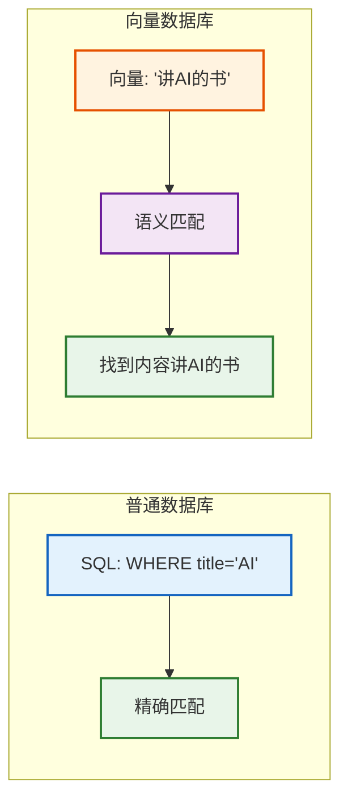
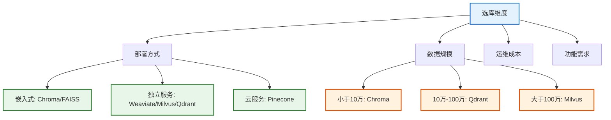
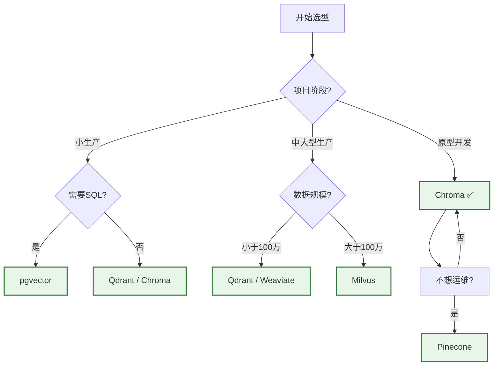

# 第19课：向量数据库——如何选择适合的向量库

> **学习目标**：理解向量数据库的作用，掌握 7 大向量库的核心差异，学会根据项目需求做出正确的选型决策。

> **配套知识库**：`知识库/15_向量数据库选型与对比技术参考.md`

---

## 本课导航

| 小节 | 主题 | 预计时间 |
|------|------|---------|
| 1 | 向量库是什么 | 10 分钟 |
| 2 | 7 大向量库速览 | 15 分钟 |
| 3 | 选型决策树 | 10 分钟 |
| 4 | 从 Chroma 到 Milvus 的迁移 | 10 分钟 |

---

## 1. 向量库是什么

### 生活类比

向量数据库就像**图书馆的智能书架**——普通数据库按书名/编号找书（精确匹配），向量库按"意思"找书（语义匹配）。你说"讲 AI 的书"，它不找书名含"AI"的，而是找内容讲 AI 的。



> **图解说明**：普通数据库做精确匹配（WHERE title='AI'），向量数据库做语义匹配——把"讲AI的书"转成向量，找到内容最接近的文档。即使文档标题不含"AI"，只要内容讲了 AI 就能找到。

---

## 2. 7 大向量库速览

### 速查表

| 向量库 | 像什么 | 最适合 | 一句话评价 |
|--------|--------|--------|-----------|
| Chroma | U盘 | 原型开发 | 零配置即开即用 |
| FAISS | 赛车引擎 | 极速搜索 | 最快但功能少 |
| Pinecone | 云盘 | 不想运维 | 全托管但收费 |
| Weaviate | 多功能工具箱 | 中型项目 | 功能全 |
| pgvector | 扩展配件 | 已有PG | SQL + 向量 |
| Milvus | 工业级服务器 | 大规模 | 最适合生产 |
| Qdrant | 中型服务器 | 中小型 | 性价比高 |

### 详细对比



> **图解说明**：选库从四个维度考虑——部署方式（嵌入式/独立服务/云服务）、数据规模（小/中/大）、运维成本、功能需求。不同维度组合指向不同推荐。

---

## 3. 选型决策树

### 决策流程



> **图解说明**：选型决策树——先看项目阶段，原型选 Chroma、小生产看是否需要 SQL（需要选 pgvector）、中大型看数据规模（中选 Qdrant、大选 Milvus）。如果完全不想运维，选 Pinecone 云服务。

### 各库代码示例

```python
# === Chroma (最简单) ===
from langchain_chroma import Chroma
vs = Chroma.from_documents(docs, embeddings, persist_directory="./db")

# === FAISS (最快) ===
from langchain_community.vectorstores import FAISS
vs = FAISS.from_documents(docs, embeddings)
vs.save_local("faiss_index")

# === Pinecone (云服务) ===
from langchain_pinecone import PineconeVectorStore
vs = PineconeVectorStore.from_documents(docs, index_name="idx", embedding=embeddings)

# === Qdrant (Docker部署) ===
from langchain_qdrant import QdrantVectorStore
vs = QdrantVectorStore.from_documents(
    docs, embeddings, url="http://localhost:6333", collection_name="docs"
)

# === Milvus (大规模) ===
from langchain_milvus import Milvus
vs = Milvus.from_documents(
    docs, embeddings, connection_args={"uri": "http://localhost:19530"}
)
```

---

## 4. 从 Chroma 到 Milvus 的迁移

### 迁移流程


> **图解说明**：迁移流程——从 Chroma 读出全部文档→写入 Milvus→验证数据完整性→切换检索器→更新配置。关键是嵌入模型不变，否则需要全量重新向量化。

### 迁移代码

```python
from langchain_chroma import Chroma
from langchain_milvus import Milvus

# 1. 从 Chroma 读出
old = Chroma(persist_directory="./chroma_db", embedding_function=embeddings)
all_docs = old.similarity_search("", k=10000)  # 全量读取

# 2. 写入 Milvus
new = Milvus.from_documents(
    all_docs, embeddings,
    connection_args={"uri": "http://localhost:19530"},
    collection_name="migrated",
)

# 3. 验证
test = new.similarity_search("测试", k=5)
assert len(test) == 5
print("迁移完成，验证通过")
```

### 迁移注意事项

| 注意 | 说明 |
|------|------|
| 嵌入模型不变 | 换模型必须全量重新向量化 |
| 元数据保留 | 确认 metadata 字段完整迁移 |
| 性能验证 | 迁移后做基准测试 |
| 回退方案 | 保留旧索引直到新索引稳定 |

---

## 本课小结

| 你学到了什么 | 一句话总结 |
|-------------|-----------|
| 向量库作用 | 按语义（而非精确匹配）找文档 |
| 7大库速览 | Chroma易/FAISS快/Pinecone云/Milvus强 |
| 选型决策 | 原型Chroma→小型Qdrant→大型Milvus |
| 迁移流程 | 读出→写入→验证→切换 |

### 下一课

👉 **第20课：RAG 架构模式——从简单到高级**——学会 Naive/Advanced/Modular/GraphRAG 等架构选型。
