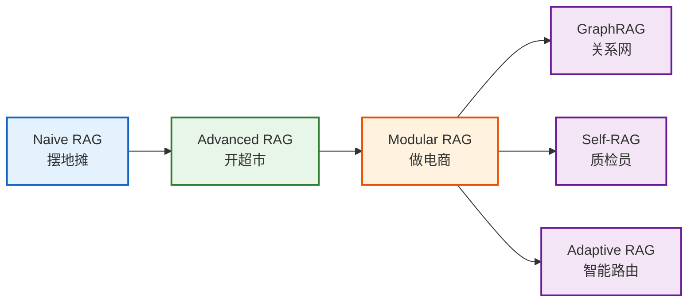
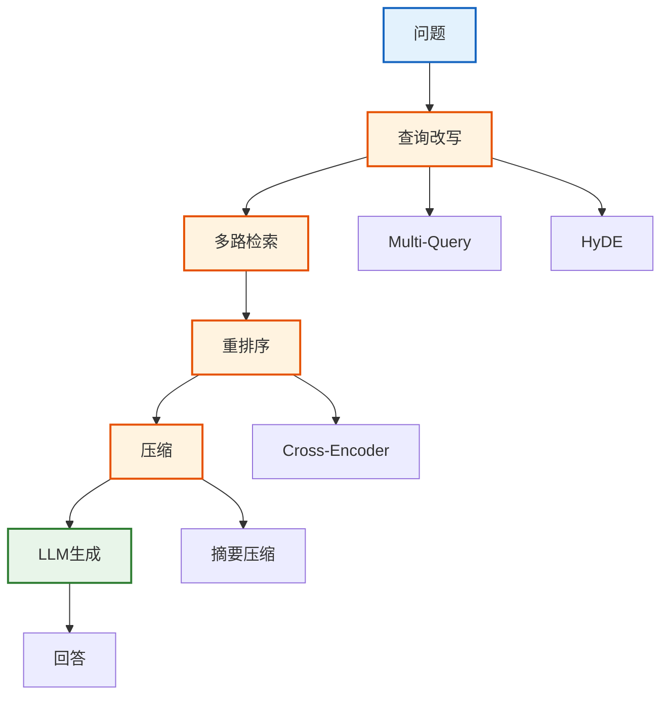
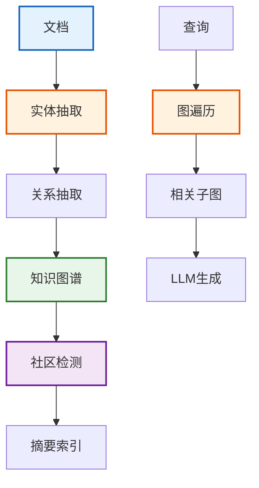
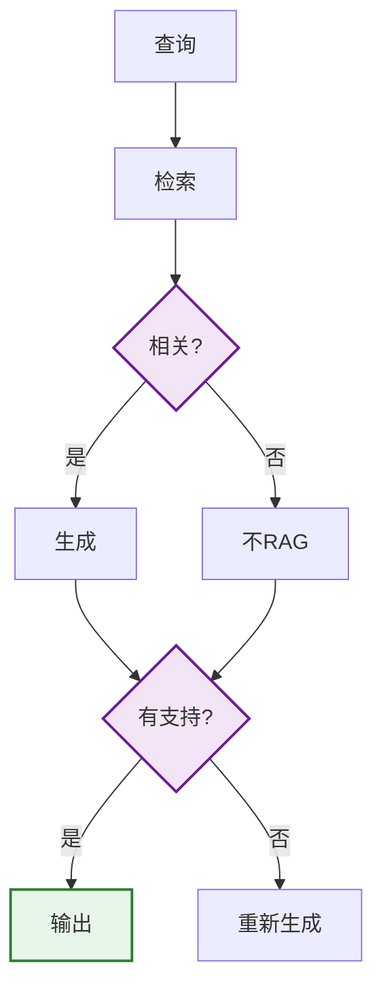
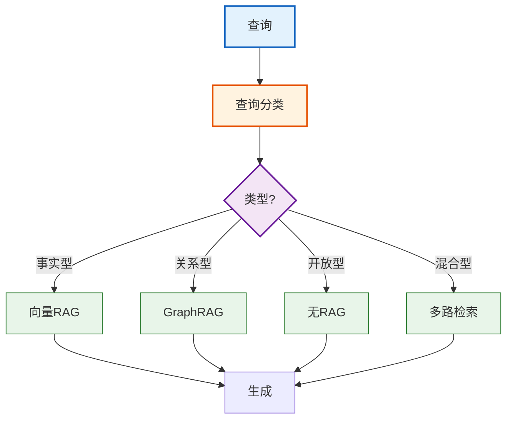
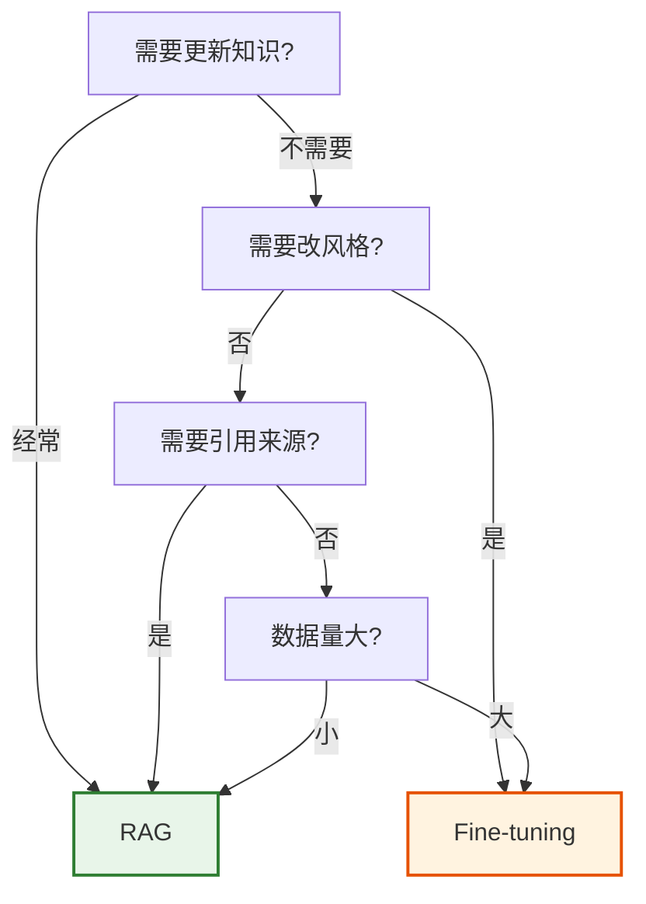

# 第20课：RAG 架构模式——从简单到高级

> **学习目标**：理解 RAG 架构的演进路线，掌握 Naive/Advanced/Modular/GraphRAG/Self-RAG/Adaptive RAG 六大架构的核心思想和适用场景。

> **配套知识库**：`知识库/16_RAG架构模式技术手册.md`

---

## 本课导航

| 小节 | 主题 | 预计时间 |
|------|------|---------|
| 1 | RAG 演进路线 | 10 分钟 |
| 2 | Naive → Advanced 升级 | 15 分钟 |
| 3 | GraphRAG 与 Self-RAG | 15 分钟 |
| 4 | Adaptive RAG 自适应 | 10 分钟 |

---

## 1. RAG 演进路线

### 生活类比

RAG 架构的演进就像**从摆地摊到开超市到做电商**——摆地摊最简单（Naive），超市有分区陈列和库存管理（Advanced），电商有智能推荐和多仓调度（Modular+），越来越精细。



> **图解说明**：RAG 架构演进——Naive（朴素，摆地摊式简单检索+生成）→ Advanced（高级，加查询改写和重排序）→ Modular（模块化，可插拔组件）→ 再衍生出 GraphRAG（图谱）、Self-RAG（自评估）、Adaptive RAG（自适应路由）。

### 架构对比速查

| 架构 | 核心改进 | 适用场景 |
|------|---------|---------|
| Naive RAG | 无优化 | 原型/简单问答 |
| Advanced RAG | 查询改写+重排序 | 通用生产 |
| Modular RAG | 可插拔模块 | 灵活定制 |
| GraphRAG | 知识图谱检索 | 关系推理 |
| Self-RAG | 自评估质量 | 高精度需求 |
| Adaptive RAG | 动态选策略 | 多场景适配 |

---

## 2. Naive → Advanced 升级

### Naive RAG


> **图解说明**：Naive RAG——问题转向量→检索 Top-K→拼接上下文→LLM 生成回答。最简单但无质量控制。

### Advanced RAG



> **图解说明**：Advanced RAG 在 Naive 基础上加了三个优化——查询改写（让问题更精确）、重排序（让结果更相关）、压缩（减少 token 消耗）。

### 核心代码对比

```python
# === Naive RAG ===
naive_rag = (
    {"context": retriever | format_docs, "question": RunnablePassthrough()}
    | prompt | llm | StrOutputParser()
)

# === Advanced RAG ===
from langchain.retrievers import MultiQueryRetriever
from langchain.retrievers.document_compressors import CrossEncoderReranker

# 查询改写
mq_retriever = MultiQueryRetriever.from_llm(retriever=retriever, llm=llm)
# 重排序
reranker = CrossEncoderReranker(model=cross_encoder, top_n=3)
# 组装
advanced_rag = (
    {"context": mq_retriever | reranker | format_docs, "question": RunnablePassthrough()}
    | prompt | llm | StrOutputParser()
)
```

### 升级效果

| 优化 | 效果 | 代价 |
|------|------|------|
| Multi-Query | 召回率+15% | +1次LLM调用 |
| HyDE | 精度+20% | +1次LLM调用 |
| 重排序 | 精度+10% | +100ms延迟 |
| 压缩 | Token-50% | +1次LLM调用 |

---

## 3. GraphRAG 与 Self-RAG

### GraphRAG——用关系而非相似度



> **图解说明**：GraphRAG——从文档中抽取实体和关系构建知识图谱，用社区检测生成摘要索引。查询时通过图遍历找到相关子图，而不是向量相似度。适合需要理解实体关系的场景。

### Self-RAG——自己检查自己



> **图解说明**：Self-RAG 有两次自评估——检索后判断是否相关（不相关就不走 RAG），生成后判断回答是否有文档支持（不支持就重新生成）。通过自检保证质量。

### 何时用哪个？

| 需求 | 推荐架构 | 原因 |
|------|---------|------|
| 事实问答 | Naive/Advanced | 够用 |
| 关系推理 | GraphRAG | 理解实体关系 |
| 高精度需求 | Self-RAG | 自检保证质量 |
| 多场景适配 | Adaptive RAG | 动态路由 |
| 容错要求 | Corrective RAG | 补充搜索 |

---

## 4. Adaptive RAG 自适应

### 生活类比

Adaptive RAG 就像**智能客服中心**——来电分类后转给不同部门：技术问题转技术部（向量 RAG）、人际关系转人事部（GraphRAG）、闲聊直接聊（无 RAG）。



> **图解说明**：Adaptive RAG——查询分类后动态选择策略：事实型走向量 RAG、关系型走 GraphRAG、开放型不走 RAG 直接用 LLM、混合型多路检索。一个系统适配多种场景。

### 核心代码

```python
from langgraph.graph import StateGraph, START, END

def classify(state):
    """LLM 分类查询类型"""
    result = llm.invoke(f"分类查询类型(fact/relation/open/mixed): {state['query']}")
    return {"type": result.content.strip()}

def route(state):
    return {"fact": "vector", "relation": "graph", "open": "direct", "mixed": "multi"}[state["type"]]

graph = StateGraph(State)
graph.add_node("classify", classify)
graph.add_node("vector", vector_rag_node)
graph.add_node("graph", graph_rag_node)
graph.add_node("direct", direct_node)
graph.add_node("multi", multi_node)
graph.add_node("generate", generate_node)

graph.add_edge(START, "classify")
graph.add_conditional_edges("classify", route, {
    "vector": "vector", "graph": "graph",
    "direct": "direct", "multi": "multi",
})
# 所有路都到 generate
for n in ["vector", "graph", "direct", "multi"]:
    graph.add_edge(n, "generate")
graph.add_edge("generate", END)

app = graph.compile()
```

---

## RAG vs Fine-tuning

### 一句话决策



> **图解说明**：RAG vs Fine-tuning 决策——需要频繁更新知识选 RAG、需要改风格选 Fine-tuning、需要引用来源选 RAG、数据量小选 RAG。两者也可以结合用。

---

## 本课小结

| 你学到了什么 | 一句话总结 |
|-------------|-----------|
| 演进路线 | Naive→Advanced→Modular→专用架构 |
| Advanced | 查询改写+重排序+压缩 |
| GraphRAG | 知识图谱替代向量检索 |
| Self-RAG | 两次自评估保证质量 |
| Adaptive | 按查询类型动态选策略 |
| RAG vs FT | 更新知识用RAG，改风格用FT |

### 下一课

👉 **第21课：数据预处理——让文档变得可搜索**——学会文档加载、分块和清洗。
