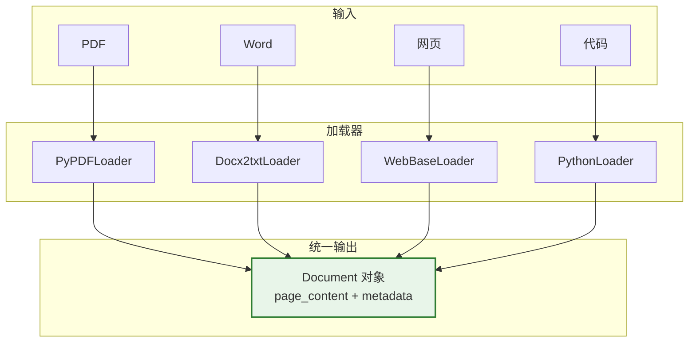
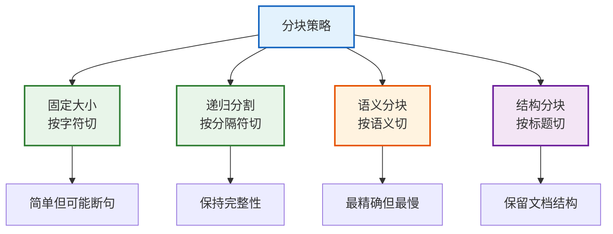
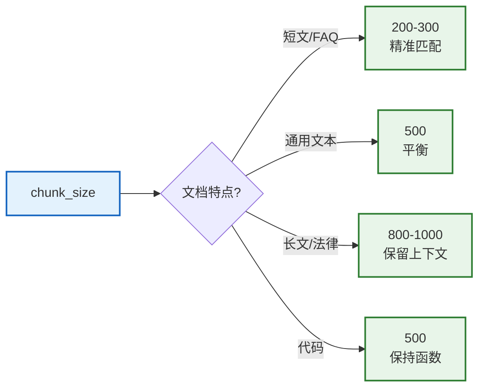

# 第21课：数据预处理——让文档变得可搜索

> **学习目标**：掌握 LangChain 文档加载、分块策略和数据清洗的完整管道，学会把各种格式的文档变成可检索的知识。

> **配套知识库**：`知识库/17_文档解析与数据预处理技术参考.md`

---

## 本课导航

| 小节 | 主题 | 预计时间 |
|------|------|---------|
| 1 | 文档加载——把文件读进来 | 15 分钟 |
| 2 | 分块策略——切大小有讲究 | 15 分钟 |
| 3 | 数据清洗——垃圾进垃圾出 | 10 分钟 |
| 4 | 完整管道——从文件到索引 | 10 分钟 |

---

## 1. 文档加载——把文件读进来

### 生活类比

文档加载就像**快递分拣**——不同类型的包裹（PDF/Word/网页）走不同的分拣通道，但最终都变成统一的"标准包裹"（Document 对象）。



> **图解说明**：不同格式的文档用不同的加载器，但最终都输出统一的 Document 对象——包含 page_content（文本内容）和 metadata（来源/页码等信息）。后续处理不关心原始格式。

### 代码示例

```python
from langchain_community.document_loaders import (
    PyPDFLoader, DirectoryLoader, WebBaseLoader
)

# === 加载 PDF ===
docs = PyPDFLoader("report.pdf").load()
print(f"页数: {len(docs)}")
print(f"内容: {docs[0].page_content[:100]}")
print(f"元数据: {docs[0].metadata}")
# {'source': 'report.pdf', 'page': 0}

# === 批量加载目录 ===
loader = DirectoryLoader("./docs", glob="**/*.pdf", loader_cls=PyPDFLoader)
all_docs = loader.load()
print(f"总文档: {len(all_docs)}")

# === 加载网页 ===
web_docs = WebBaseLoader("https://example.com").load()
```

---

## 2. 分块策略——切大小有讲究

### 生活类比

分块就像**切蛋糕**——切太大一口吞不下（token 超限），切太小碎渣太多（信息不完整）。要切成一口大小、每块都有完整的"味道"（语义）。



> **图解说明**：四种分块策略——固定大小（简单但可能切断句子）、递归分割（按段落→句子→词的优先级切，保持完整性）、语义分块（按语义相似度切，最精确）、结构分块（按标题/函数切，保留结构）。

### 选什么策略？

| 文档类型 | 推荐策略 | chunk_size | 原因 |
|---------|---------|------------|------|
| 纯文本 | 递归分割 | 500 | 通用平衡 |
| 技术文档 | 按标题 | - | 保留结构 |
| 代码 | 按语言 | 500 | 保留函数 |
| FAQ | 按问答 | - | 保持完整 |
| 法律合同 | 递归 | 1000 | 长上下文 |

### 代码示例

```python
from langchain_text_splitters import (
    RecursiveCharacterTextSplitter,
    MarkdownHeaderTextSplitter,
)
from langchain_text_splitters import Language

# === 递归分割（最常用） ===
splitter = RecursiveCharacterTextSplitter(
    chunk_size=500,
    chunk_overlap=50,
    separators=["\n\n", "\n", "。", ".", " ", ""],
)
chunks = splitter.split_documents(docs)

# === Markdown 按标题 ===
md_splitter = MarkdownHeaderTextSplitter(
    headers_to_split_on=[("##", "h2"), ("###", "h3")]
)
md_chunks = md_splitter.split_text(md_content)

# === 代码分块 ===
code_splitter = RecursiveCharacterTextSplitter.from_language(
    language=Language.PYTHON, chunk_size=500, chunk_overlap=50,
)
code_chunks = code_splitter.split_documents(code_docs)
```

### chunk_size 怎么选？



> **图解说明**：chunk_size 选择——短文用小（200-300精准）、通用用中（500平衡）、长文用大（800-1000保留上下文）、代码用中（500保持函数完整）。

---

## 3. 数据清洗——垃圾进垃圾出

### 生活类比

数据清洗就像**淘金**——原始文档里有泥沙（空行、乱码、页眉页脚），清洗后留下的才是"金子"（干净可检索的文本）。


> **图解说明**：数据清洗管道——去重（删重复文档）→清洗噪声（去空行/乱码/页眉）→过滤空块（删无内容块）→标注元数据（加来源/页码）。垃圾进则垃圾出，清洗后质量才好。

### 清洗代码

```python
import re

def clean_text(text: str) -> str:
    """清洗文本"""
    text = re.sub(r'\s+', ' ', text)           # 合并空白
    text = re.sub(r'第\s*\d+\s*页', '', text)   # 去页眉
    text = re.sub(r'[\x00-\x08\x0b\x0c\x0e-\x1f\x7f]', '', text)  # 去控制字符
    return text.strip()

def deduplicate(docs):
    """去重"""
    seen = set()
    return [d for d in docs if not (
        hash(d.page_content[:200]) in seen or
        seen.add(hash(d.page_content[:200]))
    )]

# 应用
for doc in docs:
    doc.page_content = clean_text(doc.page_content)
docs = deduplicate(docs)
docs = [d for d in docs if len(d.page_content.strip()) > 10]  # 过滤空块
```

### 质量检查

| 检查项 | 阈值 | 不达标处理 |
|--------|------|-----------|
| 空块率 | < 2% | 过滤 |
| 重复率 | < 5% | 去重 |
| 平均块长 | 200-800字 | 调 chunk_size |
| 特殊字符率 | < 1% | 清洗 |

---

## 4. 完整管道——从文件到索引

### 管道全流程


> **图解说明**：完整管道——加载→去重→清洗→分块→标注→向量化→入索引。每步都有质量检查，确保进入索引的数据干净、完整、可检索。

### 完整代码

```python
from langchain_community.document_loaders import PyPDFLoader, DirectoryLoader
from langchain_text_splitters import RecursiveCharacterTextSplitter
from langchain_openai import OpenAIEmbeddings
from langchain_chroma import Chroma
import re

def process_and_index(file_path: str, persist_dir: str):
    """完整处理管道"""
    # 1. 加载
    docs = PyPDFLoader(file_path).load()
    
    # 2. 去重
    seen = set()
    unique = []
    for d in docs:
        h = hash(d.page_content[:200])
        if h not in seen:
            seen.add(h)
            unique.append(d)
    docs = unique
    
    # 3. 清洗
    for d in docs:
        d.page_content = re.sub(r'\s+', ' ', d.page_content).strip()
    
    # 4. 分块
    splitter = RecursiveCharacterTextSplitter(chunk_size=500, chunk_overlap=50)
    chunks = splitter.split_documents(docs)
    
    # 5. 标注元数据
    for i, c in enumerate(chunks):
        c.metadata["chunk_index"] = i
        c.metadata["total_chunks"] = len(chunks)
    
    # 6. 过滤空块
    chunks = [c for c in chunks if len(c.page_content.strip()) > 10]
    
    # 7. 向量化 + 入索引
    vs = Chroma.from_documents(
        chunks, OpenAIEmbeddings(), persist_directory=persist_dir
    )
    
    print(f"完成: {file_path} → {len(chunks)} 块")
    return vs

# 使用
vectorstore = process_and_index("report.pdf", "./chroma_db")
results = vectorstore.similarity_search("查询内容", k=3)
```

---

## 本课小结

| 你学到了什么 | 一句话总结 |
|-------------|-----------|
| 文档加载 | 不同格式用不同 Loader，统一输出 Document |
| 分块策略 | 递归分割最通用，按文档类型调 chunk_size |
| 数据清洗 | 去重+去噪+过滤空块=垃圾进垃圾出 |
| 完整管道 | 加载→去重→清洗→分块→标注→向量→索引 |

### 下一课

🎉 **恭喜！你已完成全部 21 节课！** 从 LLM 入门到高级架构，你已具备系统构建 LangChain/LangGraph 应用的完整能力。继续实践，持续精进！
