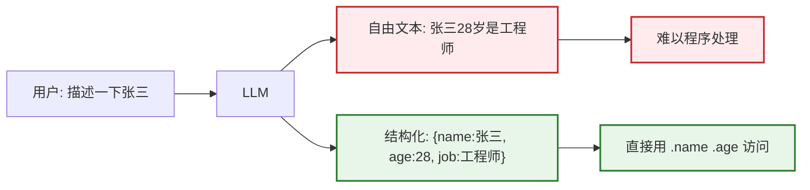
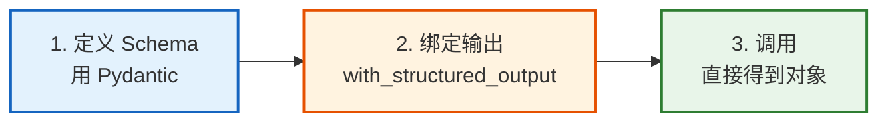
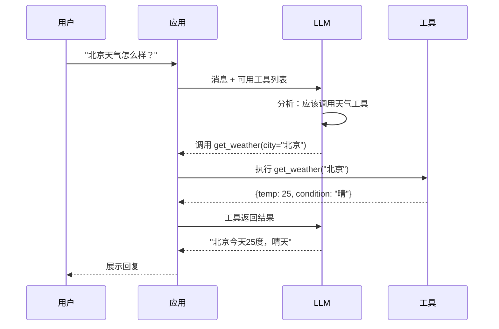
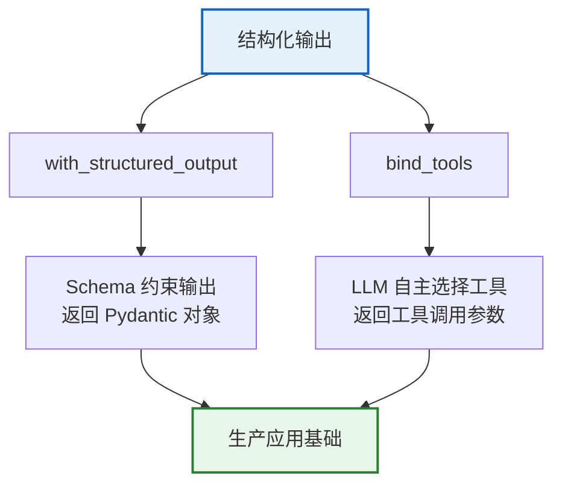

# 第 22 课：结构化输出 — 让 AI 说规范的话

> **学习课程 · 第 22 课**  
> 本课将教会你如何让 LLM 按照预定义的格式输出数据，而不是随意的自然语言。这是构建可靠 LLM 应用的关键一步。

---

## 本课目标

学完本课，你将能够：
- 理解什么是结构化输出，为什么需要它
- 使用 `with_structured_output()` 让 LLM 输出 Pydantic 对象
- 使用 `bind_tools()` 实现函数调用
- 处理结构化输出的常见错误

---

## 第一节：为什么需要结构化输出

### 生活类比：填表 vs 自由发挥

想象你去医院看病：

| 方式 | 类比 | LLM 对应 |
|------|------|---------|
| 自由发挥 | 医生口述病情 | LLM 输出自由文本 |
| 填表格 | 医生填写结构化病历 | LLM 输出结构化数据 |

自由发挥的医生可能说"这个病人嘛，大概30岁，男的，有点发烧"，但表格会精确记录：姓名、性别、年龄、体温、症状。



### 代码对比

```python
# 不好的方式：自由文本输出
response = llm.invoke("描述张三：28岁，Python工程师")
print(response.content)
# "张三，28岁，是一名经验丰富的Python工程师..."
# 问题：程序怎么提取年龄？正则匹配？太脆弱了！

# 好的方式：结构化输出
from langchain_core.pydantic_v1 import BaseModel, Field

class PersonInfo(BaseModel):
    name: str = Field(description="姓名")
    age: int = Field(description="年龄")
    job: str = Field(description="职业")

structured_llm = llm.with_structured_output(PersonInfo)
result = structured_llm.invoke("描述张三：28岁，Python工程师")

print(result.name)  # 张三
print(result.age)   # 28
print(result.job)   # Python工程师
print(type(result)) # PersonInfo — 一个 Python 对象！
```

---

## 第二节：with_structured_output 详解

### 三步走



### 第一步：定义 Schema

Schema 就是"表格格式"，用 Pydantic 来定义：

```python
from typing import Optional
from langchain_core.pydantic_v1 import BaseModel, Field

class MovieReview(BaseModel):
    """电影评论"""
    movie_name: str = Field(description="电影名称")
    rating: int = Field(description="评分1-5星", ge=1, le=5)
    summary: str = Field(description="一句话评价", max_length=50)
    pros: list[str] = Field(description="优点列表")
    cons: list[str] = Field(description="缺点列表")
    recommend: bool = Field(description="是否推荐")
```

**关键点：**
- `Field(description=...)` 告诉 LLM 每个字段是什么
- `ge=1, le=5` 约束评分范围
- `max_length=50` 限制字符串长度
- `Optional` 表示可选字段

### 第二步：绑定结构化输出

```python
from langchain_openai import ChatOpenAI

llm = ChatOpenAI(model="gpt-4o", temperature=0)
# temperature=0 让输出更稳定
reviewer = llm.with_structured_output(MovieReview)
```

### 第三步：调用

```python
result = reviewer.invoke("评价电影《盗梦空间》")
# result 是 MovieReview 对象，不是字符串！

print(f"电影: {result.movie_name}")   # 盗梦空间
print(f"评分: {result.rating}星")    # 5星
print(f"优点: {result.pros}")        # ['剧情复杂精妙', '特效震撼', '诺兰导演']
print(f"缺点: {result.cons}")        # ['节奏较慢', '需要多次观看理解']
print(f"推荐: {'是' if result.recommend else '否'}")  # 是
```

---

## 第三节：函数调用（Function Calling）

### 什么是函数调用

函数调用是让 LLM "使用工具"的能力。你告诉 LLM 有哪些工具可用，LLM 自己决定用哪个工具、传什么参数。



### 定义工具

```python
from langchain_core.tools import tool

@tool
def search_weather(city: str) -> dict:
    """查询城市天气。
    
    Args:
        city: 城市名称，如"北京"
    
    Returns:
        天气信息字典
    """
    # 这里模拟返回
    return {"city": city, "temperature": 25, "condition": "晴"}

@tool
def calculate(expression: str) -> str:
    """计算数学表达式。
    
    Args:
        expression: 表达式，如 "2+3*4"
    """
    try:
        return str(eval(expression))
    except:
        return "计算错误"

# 绑定工具
llm = ChatOpenAI(model="gpt-4o")
llm_with_tools = llm.bind_tools([search_weather, calculate])

# LLM 决定是否使用工具
response = llm_with_tools.invoke("北京多少度？")
print(response.tool_calls)
# [{'name': 'search_weather', 'args': {'city': '北京'}}]

response = llm_with_tools.invoke("2+3等于几？")
print(response.tool_calls)
# [{'name': 'calculate', 'args': {'expression': '2+3'}}]
```

### 完整工具调用循环

```python
# 工具映射表
tool_map = {
    "search_weather": search_weather,
    "calculate": calculate,
}

def run_agent(query: str):
    """简单的 Agent 循环"""
    messages = [HumanMessage(content=query)]
    
    for _ in range(5):  # 最多 5 轮
        response = llm_with_tools.invoke(messages)
        messages.append(response)
        
        # 如果没有工具调用，直接返回
        if not response.tool_calls:
            return response.content
        
        # 执行工具调用
        for tc in response.tool_calls:
            tool_func = tool_map[tc["name"]]
            result = tool_func.invoke(tc["args"])
            messages.append(ToolMessage(
                content=str(result),
                tool_call_id=tc["id"]
            ))
    
    return "超过最大轮次"
```

---

## 第四节：错误处理与最佳实践

### 常见错误

```python
# 错误 1: Schema 定义不清晰
class Bad(BaseModel):
    name: str  # 缺少 description，LLM 不知道填什么

# 修正：加 description
class Good(BaseModel):
    name: str = Field(description="人物全名")

# 错误 2: 嵌套太深
class DeepNesting(BaseModel):
    a: B = Field(...)  # B 内嵌 C, C 内嵌 D... 太深了

# 建议：不超过 3 层嵌套

# 错误 3: 忘记设 temperature=0
# 高 temperature 导致输出不稳定

# 错误 4: 没有处理解析失败
result = structured_llm.invoke("描述张三")
# 如果 LLM 输出不符合 Schema，会抛异常
```

### 调试技巧

```python
# 使用 include_raw=True 保留原始输出
debug_llm = llm.with_structured_output(MovieReview, include_raw=True)
result = debug_llm.invoke("评价电影《盗梦空间》")

# result 包含三个 key:
# "raw": 原始 AIMessage
# "parsed": 解析后的对象（成功时）
# "parsing_error": 解析错误（失败时）

if result.get("parsing_error"):
    print("解析失败!")
    print("原始输出:", result["raw"].content[:500])
    print("错误:", result["parsing_error"])
else:
    print("成功:", result["parsed"])
```

### 最佳实践清单

| 实践 | 说明 |
|------|------|
| 每个 Field 都加 description | 帮助 LLM 理解期望 |
| 设 temperature=0 | 减少输出随机性 |
| 可选字段用 Optional | 避免缺失字段报错 |
| 嵌套不超过 3 层 | 深嵌套降低合规率 |
| 用 include_raw 调试 | 保留原始输出排查 |
| 设 fallback LLM | 主模型失败时降级 |

---

## 小结



**记住三步走：** 定义 Schema → 绑定输出 → 调用获得对象。

---

## 课后练习

1. 定义一个 `RecipeInfo` Schema，提取菜谱的名称、食材列表、步骤、烹饪时间
2. 定义一个 `search_web` 工具函数，让 LLM 可以搜索信息
3. 用 `include_raw=True` 调试你的结构化输出

---

## 下一课预告

下一课我们将学习 **Embedding 模型** — 如何选择合适的向量表示，让检索更精准。

## 相关文档

- [知识库 18：结构化输出与函数调用](../知识库/18_结构化输出与函数调用技术手册.md) — 技术详解
- [学习课程第 05 课：输出解析](./第05课_输出解析_让AI说规范的话.md) — 基础入门
- [学习课程第 06 课：Agent](./第06课_Agent_让AI自己做决定.md) — 工具调用进阶
