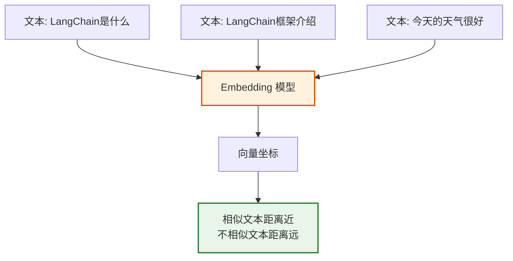
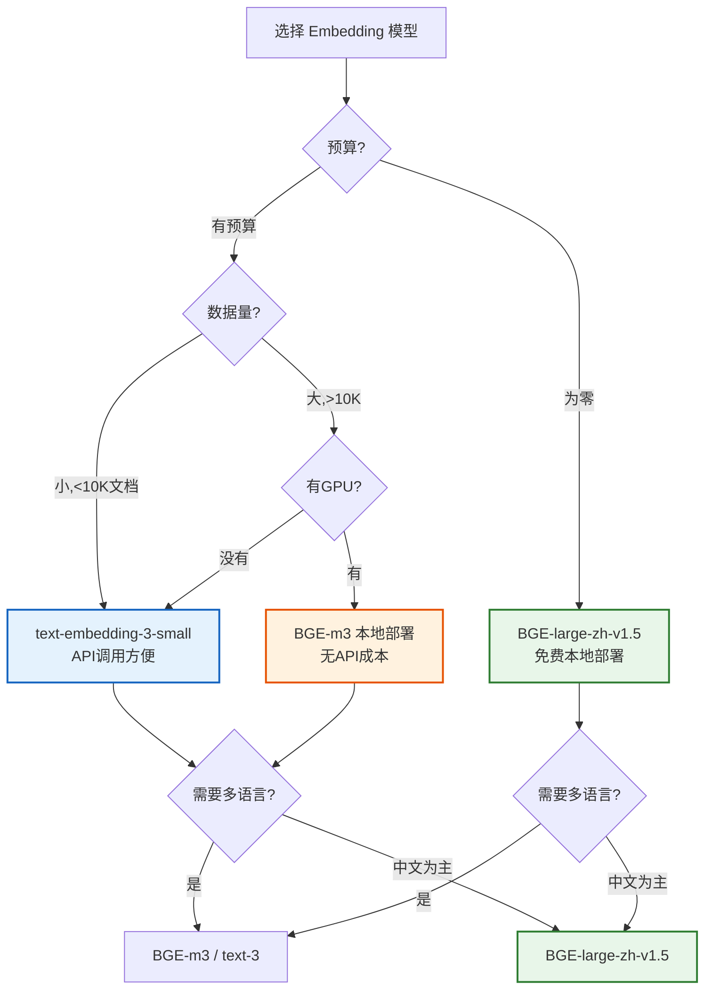
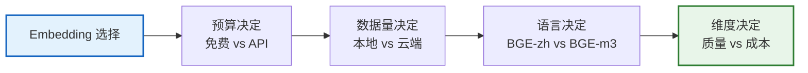

# 第 23 课：Embedding 模型 — 选择合适的向量表示

> **学习课程 · 第 23 课**  
> 本课将教会你 Embedding 模型的概念、主流模型对比，以及如何为你的 RAG 应用选择最合适的向量表示。

---

## 本课目标

学完本课，你将能够：
- 理解什么是 Embedding 以及它为什么重要
- 了解主流 Embedding 模型及其特点
- 掌握选择 Embedding 模型的决策方法
- 在 LangChain 中使用不同的 Embedding 模型

---

## 第一节：什么是 Embedding

### 生活类比：图书馆的索引系统

想象一个图书馆有 100 万本书。怎么快速找到和某本书"内容相似"的书？

| 方法 | 类比 | Embedding 对应 |
|------|------|---------------|
| 逐本阅读 | 看完每本书再判断 | 逐条文本计算相似度 |
| 关键词索引 | 按关键词分类 | 传统关键词检索 |
| 内容向量 | 每本书的内容用坐标表示 | Embedding 向量检索 |

Embedding 就是给每段文本分配一个"坐标"，语义相近的文本坐标也相近。



### Embedding 的直觉理解

```python
# 想象把文本映射到 2D 空间（实际是 768-3072 维）
# "LangChain框架" → [0.9, 0.8]
# "LangChain是什么" → [0.85, 0.75]  ← 距离很近！
# "今天天气很好" → [0.1, 0.2]      ← 距离很远

# 所以检索时，用查询的向量找最近的文档向量
```

---

## 第二节：主流模型速览

### 闭源 API 模型

| 模型 | 提供商 | 维度 | 价格 | 中文支持 | 特点 |
|------|--------|------|------|---------|------|
| text-embedding-3-large | OpenAI | 3072 | $0.013/1K | 好 | 最强通用 |
| text-embedding-3-small | OpenAI | 1536 | $0.002/1K | 好 | 性价比高 |
| voyage-3 | Voyage AI | 1024 | $0.012/1K | 好 | 长文本 |

### 开源模型

| 模型 | 维度 | 中文支持 | 特点 | 推荐场景 |
|------|------|---------|------|---------|
| BGE-large-zh-v1.5 | 1024 | 极好 | 中文最强开源 | 中文 RAG 首选 |
| BGE-m3 | 1024 | 极好 | 多语言+长文本 | 多语言场景 |
| gte-large-zh | 1024 | 很好 | 阿里达摩院 | 中文备选 |
| jina-embeddings-v3 | 1024 | 好 | 89 种语言 | 国际化 |

### 中文场景推荐

```python
# 选择建议
recommendations = {
    "免费本地部署": "BGE-large-zh-v1.5（中文质量最好的开源模型）",
    "多语言": "BGE-m3（支持 100+ 语言，跨语言检索）",
    "最省事API": "text-embedding-3-small（便宜、好用）",
    "最高质量API": "text-embedding-3-large（最强通用）",
    "超长文档": "gte-Qwen2-7B（支持 32K 上下文）",
}
```

---

## 第三节：选型决策树



### 维度选择

| 维度范围 | 存储成本 | 检索速度 | 语义质量 | 推荐 |
|---------|---------|---------|---------|------|
| 384-512 | 最低 | 最快 | 一般 | 超大规模/低延迟 |
| 768-1024 | 中等 | 中等 | 好 | 大多数场景推荐 |
| 1536-3072 | 最高 | 较慢 | 最好 | 对质量要求极高 |

---

## 第四节：在 LangChain 中使用

### 使用 OpenAI Embedding

```python
from langchain_openai import OpenAIEmbeddings

embeddings = OpenAIEmbeddings(
    model="text-embedding-3-small",
    # 可降维以节省存储
    dimensions=512
)

# 编码单条
vec = embeddings.embed_query("LangChain是什么？")
print(f"维度: {len(vec)}")  # 512

# 批量编码
vecs = embeddings.embed_documents(["文本1", "文本2", "文本3"])
print(f"批量: {len(vecs)} 条")
```

### 使用开源模型

```python
from langchain_huggingface import HuggingFaceEmbeddings

embeddings = HuggingFaceEmbeddings(
    model_name="BAAI/bge-large-zh-v1.5",
    model_kwargs={"device": "cpu"},  # 或 "cuda"
    encode_kwargs={"normalize_embeddings": True}
)

vec = embeddings.embed_query("LangChain框架介绍")
print(f"BGE维度: {len(vec)}")  # 1024
```

### 完整 RAG 管道

```python
from langchain_community.vectorstores import Chroma
from langchain_openai import OpenAIEmbeddings, ChatOpenAI
from langchain_text_splitters import RecursiveCharacterTextSplitter

# 1. 选择 Embedding 模型
embeddings = OpenAIEmbeddings(model="text-embedding-3-small")

# 2. 准备文档
texts = [
    "LangChain 是一个用于开发 LLM 应用的框架。",
    "LangGraph 是 LangChain 的图结构编程扩展。",
    "RAG 是检索增强生成的缩写。",
]

# 3. 存入向量库
vectorstore = Chroma.from_documents(
    [{"page_content": t} for t in texts],
    embedding=embeddings
)

# 4. 检索
results = vectorstore.similarity_search("什么是 LangChain？", k=1)
print(results[0].page_content)
# "LangChain 是一个用于开发 LLM 应用的框架。"
```

---

## 小结



**记住三个关键选择：** 预算（免费/付费）、语言（中文/多语言）、维度（质量/成本）。

---

## 课后练习

1. 用 `text-embedding-3-small` 编码 5 段文本，计算两两余弦相似度
2. 用 `BGE-large-zh-v1.5` 搭建一个简单的中文文档检索系统
3. 对比不同维度（256 vs 1024 vs 3072）的检索质量

---

## 下一课预告

下一课我们将学习 **多 Agent 编排** — 如何让多个 AI Agent 协同工作。

## 相关文档

- [知识库 19：Embedding 模型与策略](../知识库/19_Embedding模型与策略技术参考.md) — 技术详解
- [知识库 15：向量数据库选型](../知识库/15_向量数据库选型与对比技术参考.md) — 向量库对比
- [学习课程第 07 课：RAG](./第07课_RAG_让AI查资料回答.md) — RAG 入门
