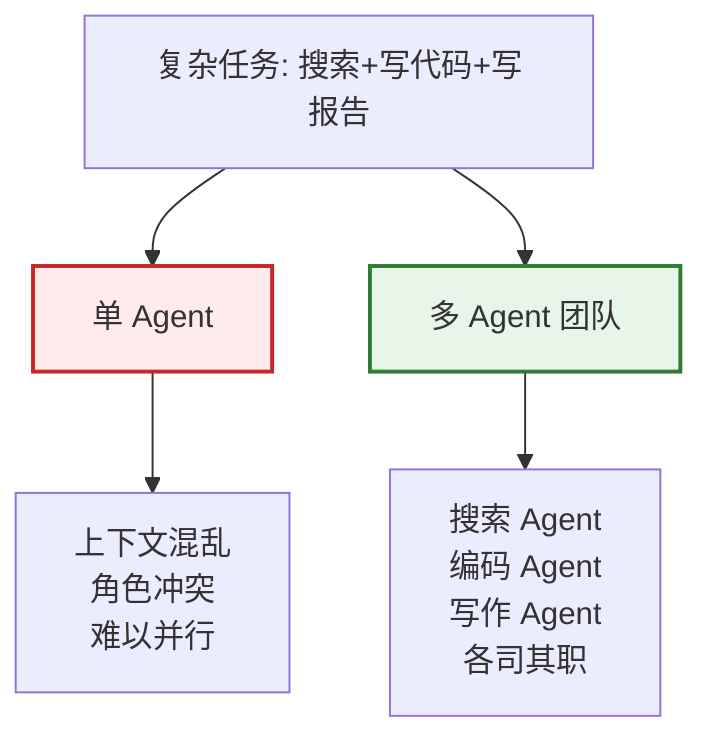
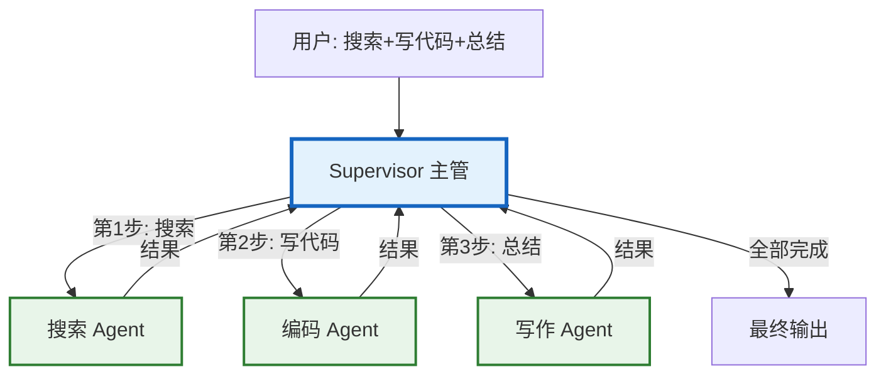
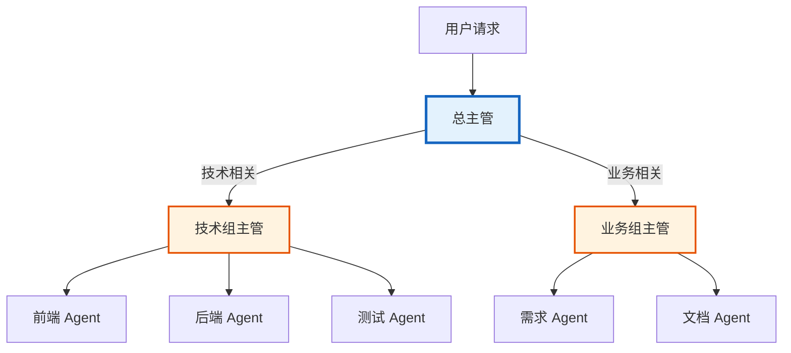
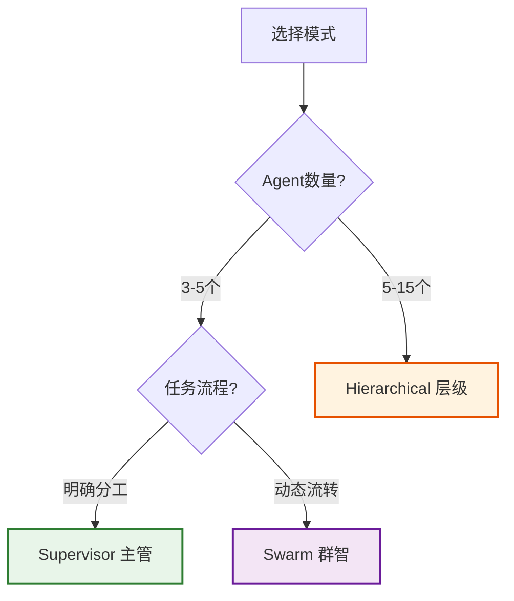

# 第 24 课：多 Agent 编排 — 主管与层级模式

> **学习课程 · 第 24 课**  
> 本课将教会你如何让多个 AI Agent 协同工作，包括 Supervisor（主管）模式和 Hierarchical（层级）模式。

---

## 本课目标

学完本课，你将能够：
- 理解为什么需要多 Agent 协作
- 掌握 Supervisor 主管模式的工作原理
- 了解 Hierarchical 层级模式的应用场景
- 使用 LangGraph 构建简单的多 Agent 系统

---

## 第一节：为什么需要多个 Agent

### 生活类比：一个人 vs 一个团队

| 单 Agent | 多 Agent |
|---------|---------|
| 一个人做所有事 | 团队分工协作 |
| 什么都懂一点，什么都不精 | 每人专业领域突出 |
| 任务多了容易混乱 | 各司其职，井然有序 |
| 出错了影响全局 | 某个环节出错可隔离 |



### 四大编排模式速览

| 模式 | 类比 | 特点 |
|------|------|------|
| Supervisor | 团队经理 | 一个主管调度多个工人 |
| Hierarchical | 公司组织架构 | 多层管理，树形结构 |
| Swarm | 接力赛 | Agent 之间自由传递控制权 |
| Network | 圆桌会议 | 所有 Agent 互相通信 |

---

## 第二节：Supervisor 主管模式

### 工作原理



**核心思想：** 主管 Agent 负责分析任务、决定分配给哪个工人 Agent，工人完成后回到主管，主管决定下一步。

### 简单实现

```python
from langchain_openai import ChatOpenAI
from langchain_core.messages import HumanMessage
from langgraph.graph import StateGraph, START, END
from typing import Annotated
import operator
from typing_extensions import TypedDict

# 状态定义
class AgentState(TypedDict):
    messages: Annotated[list, operator.add]
    next_agent: str

llm = ChatOpenAI(model="gpt-4o", temperature=0)

# Worker 1: 搜索
def searcher(state: AgentState):
    response = llm.invoke(
        [HumanMessage(content="你是搜索专家，负责查找信息。")]
        + state["messages"]
    )
    return {"messages": [response]}

# Worker 2: 编码
def coder(state: AgentState):
    response = llm.invoke(
        [HumanMessage(content="你是编程专家，负责编写代码。")]
        + state["messages"]
    )
    return {"messages": [response]}

# Worker 3: 写作
def writer(state: AgentState):
    response = llm.invoke(
        [HumanMessage(content="你是写作专家，负责总结文案。")]
        + state["messages"]
    )
    return {"messages": [response]}

# Supervisor: 决定下一步
def supervisor(state: AgentState):
    response = llm.invoke(
        [HumanMessage(content="""分析任务，决定下一步给谁处理。
可选: searcher / coder / writer / FINISH
只返回一个单词。""")]
        + state["messages"]
    )
    return {"next_agent": response.content.strip()}

# 构建图
graph = StateGraph(AgentState)
graph.add_node("supervisor", supervisor)
graph.add_node("searcher", searcher)
graph.add_node("coder", coder)
graph.add_node("writer", writer)

graph.add_edge(START, "supervisor")

def route(state):
    nxt = state.get("next_agent", "FINISH")
    return END if nxt == "FINISH" else nxt

graph.add_conditional_edges("supervisor", route)
graph.add_edge("searcher", "supervisor")
graph.add_edge("coder", "supervisor")
graph.add_edge("writer", "supervisor")

app = graph.compile()

# 运行
result = app.invoke({
    "messages": [HumanMessage(content="搜索LangChain信息，写示例代码，总结")],
    "next_agent": ""
})
```

### 使用官方库（更简单）

```python
from langgraph.supervisor import create_supervisor
from langgraph.prebuilt import create_react_agent

searcher = create_react_agent(
    model=ChatOpenAI(model="gpt-4o"), tools=[search_tool],
    name="searcher", prompt="你是搜索专家"
)
coder = create_react_agent(
    model=ChatOpenAI(model="gpt-4o"), tools=[code_tool],
    name="coder", prompt="你是编程专家"
)
writer = create_react_agent(
    model=ChatOpenAI(model="gpt-4o"), tools=[],
    name="writer", prompt="你是写作专家"
)

supervisor = create_supervisor(
    model=ChatOpenAI(model="gpt-4o"),
    agents=[searcher, coder, writer],
    prompt="你是任务主管，分配任务给合适的Agent",
)
app = supervisor.compile()
```

---

## 第三节：Hierarchical 层级模式

### 什么时候需要层级模式

当你有很多 Agent（比如 10 个以上），一个主管管不过来时，就需要分层：



### 层级模式实现

```python
from langgraph.supervisor import create_supervisor
from langgraph.prebuilt import create_react_agent

# 技术组 Workers
frontend = create_react_agent(
    model=ChatOpenAI(model="gpt-4o-mini"),
    name="frontend", prompt="你是前端开发"
)
backend = create_react_agent(
    model=ChatOpenAI(model="gpt-4o-mini"),
    name="backend", prompt="你是后端开发"
)

# 技术组主管
tech_lead = create_supervisor(
    model=ChatOpenAI(model="gpt-4o"),
    agents=[frontend, backend],
    prompt="你是技术组主管",
    supervisor_name="tech_lead"
)
tech_team = tech_lead.compile()

# 业务 Workers
analyst = create_react_agent(
    model=ChatOpenAI(model="gpt-4o-mini"),
    name="analyst", prompt="你是需求分析师"
)

# 总主管
top_boss = create_supervisor(
    model=ChatOpenAI(model="gpt-4o"),
    agents=[tech_team, analyst],  # 技术组作为整体 + 业务
    prompt="你是项目总管",
    supervisor_name="project_manager"
)
app = top_boss.compile()
```

### 设计建议

| 要点 | 建议 |
|------|------|
| 层级深度 | 2-3 层为宜，不要太深 |
| 每组大小 | 每个子主管管 3-5 个 Worker |
| 模型分配 | 主管用 GPT-4o，Worker 用 GPT-4o-mini |
| 状态隔离 | 每个子团队有独立状态 |

---

## 第四节：模式选择指南



| 场景 | 推荐模式 | 理由 |
|------|---------|------|
| 客服系统 | Supervisor | 明确路由到不同部门 |
| 软件开发 | Hierarchical | 多角色分层管理 |
| 研究报告 | Swarm | 动态传递搜索-分析-写作 |
| 简单流水线 | Supervisor | 最简单最可控 |

---

## 小结

**Supervisor 模式**就像团队经理：分析任务 → 分配给合适的人 → 收集结果 → 决定下一步。  
**Hierarchical 模式**就像公司架构：多个管理层，每层管几个下属，适合大规模 Agent 团队。

---

## 课后练习

1. 用 Supervisor 模式搭建一个"搜索 Agent + 翻译 Agent + 摘要 Agent"的系统
2. 尝试用 Hierarchical 模式将 Agent 分成两个子团队
3. 对比 Supervisor 和单独使用一个 Agent 的效果差异

---

## 下一课预告

下一课我们将学习 **流式处理** — 如何让 AI 的回复像流水一样实时输出。

## 相关文档

- [知识库 20：多 Agent 编排模式](../知识库/20_多Agent编排模式技术手册.md) — 技术详解
- [学习课程第 09 课：多 Agent](./第09课_多Agent_让AI团队协作.md) — 入门概念
- [学习课程第 08 课：LangGraph](./第08课_LangGraph_画出AI工作流.md) — 图结构编程
