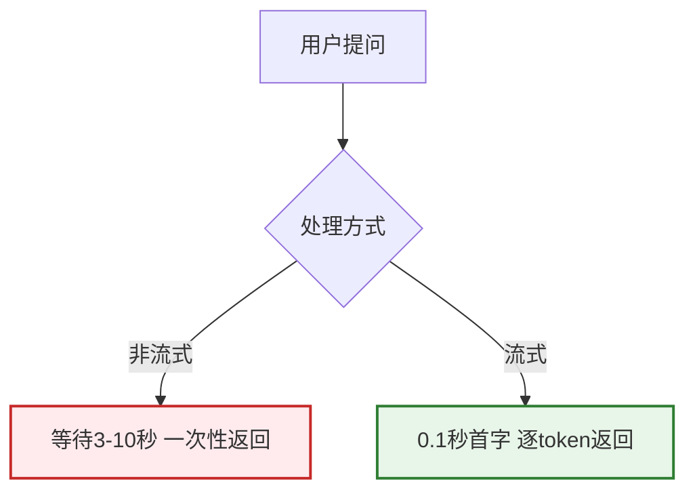
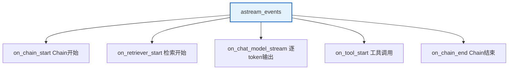
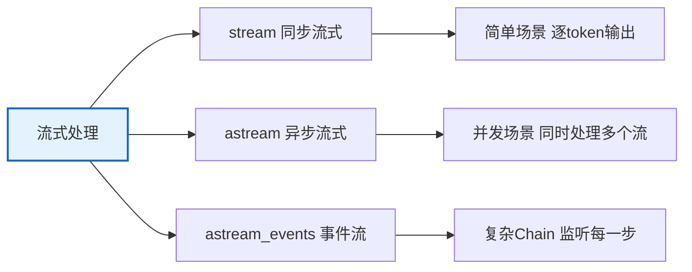

# 第 25 课：流式处理 — 让 AI 回复如流水

> **学习课程 · 第 25 课**
> 本课将教会你如何让 LLM 的回复像流水一样实时输出，而不是让用户等待漫长的完整生成。

---

## 本课目标

学完本课，你将能够：
- 理解流式输出的原理和价值
- 使用 `stream()` 和 `astream()` 实现流式调用
- 使用 `astream_events()` 监听结构化事件
- 将流式输出集成到 Web 应用中

---

## 第一节：为什么需要流式输出

### 生活类比：水龙头 vs 水桶

| 非流式 | 流式 |
|--------|------|
| 像用水桶接满水再倒 | 像打开水龙头持续出水 |
| 等 3-10 秒看到全部回复 | 0.1 秒看到第一个字 |
| 用户以为卡住了 | 用户知道正在生成 |



### 实际体验对比

```
非流式：用户提问 -> [等待3秒] -> 全部文本出现
流式：  用户提问 -> [0.1秒] L -> [0.2秒] La -> [0.3秒] Lan -> ... -> LangChain是一个...
```

---

## 第二节：基础流式调用

### 同步流式

```python
from langchain_openai import ChatOpenAI

llm = ChatOpenAI(model="gpt-4o", streaming=True)

# stream() 方法：逐 token 返回
for chunk in llm.stream("用300字介绍LangChain"):
    print(chunk.content, end="", flush=True)
    # 每个 chunk 包含 1-3 个字符
    # flush=True 立即刷新输出

print()  # 最后换行
```

### 异步流式

```python
import asyncio
from langchain_openai import ChatOpenAI

llm = ChatOpenAI(model="gpt-4o")

async def async_stream():
    """异步流式：可以同时做其他事"""
    async for chunk in llm.astream("用300字介绍LangChain"):
        print(chunk.content, end="", flush=True)

asyncio.run(async_stream())
```

### Chain 流式

```python
from langchain_core.prompts import ChatPromptTemplate

prompt = ChatPromptTemplate.from_messages([
    ("system", "你是技术助手"),
    ("human", "{topic}")
])
chain = prompt | ChatOpenAI(model="gpt-4o")

for chunk in chain.stream({"topic": "介绍RAG"}):
    if chunk.content:
        print(chunk.content, end="", flush=True)
```

---

## 第三节：事件流（astream_events）

### 为什么需要事件流

普通的 `stream()` 只能看到最终输出的 token。但一个复杂的 Chain 可能有多个步骤（检索、Prompt 渲染、LLM 调用），你想知道每一步的进展。



### 使用示例

```python
import asyncio
from langchain_openai import ChatOpenAI
from langchain_core.prompts import ChatPromptTemplate

llm = ChatOpenAI(model="gpt-4o")
prompt = ChatPromptTemplate.from_messages([
    ("system", "你是技术助手"),
    ("human", "{input}")
])
chain = prompt | llm

async def stream_with_events():
    async for event in chain.astream_events(
        {"input": "介绍LangChain"},
        version="v2"
    ):
        kind = event["event"]
        if kind == "on_chat_model_start":
            print("\n[模型开始调用]")
        elif kind == "on_chat_model_stream":
            chunk = event["data"]["chunk"]
            if chunk.content:
                print(chunk.content, end="", flush=True)
        elif kind == "on_chat_model_end":
            print("\n[模型调用结束]")

asyncio.run(stream_with_events())
```

### 常用事件类型

| 事件 | 触发时机 |
|------|---------|
| on_chain_start | Chain 开始执行 |
| on_chain_end | Chain 执行完成 |
| on_chat_model_start | LLM 开始调用 |
| on_chat_model_stream | LLM 逐 token 输出 |
| on_chat_model_end | LLM 调用完成 |
| on_tool_start | 工具开始执行 |
| on_tool_end | 工具执行完成 |
| on_retriever_start | 检索开始 |
| on_retriever_end | 检索完成 |

---

## 第四节：Web 应用集成

### FastAPI + SSE 流式

```python
from fastapi import FastAPI
from fastapi.responses import StreamingResponse
from langchain_openai import ChatOpenAI
import json

app = FastAPI()
llm = ChatOpenAI(model="gpt-4o", streaming=True)

@app.get("/chat")
async def chat(q: str):
    """SSE 端点：逐 token 推送给前端"""
    async def event_stream():
        async for chunk in llm.astream(q):
            if chunk.content:
                data = json.dumps({"content": chunk.content}, ensure_ascii=False)
                yield f"data: {data}\n\n"
        yield f"data: {json.dumps({'done': True})}\n\n"
    
    return StreamingResponse(event_stream(), media_type="text/event-stream")
```

### 前端接收（JavaScript）

```javascript
const eventSource = new EventSource('/chat?q=介绍LangChain');
eventSource.onmessage = (e) => {
    const data = JSON.parse(e.data);
    if (data.done) { eventSource.close(); return; }
    document.getElementById('output').textContent += data.content;
};
```

### 异步批量处理

```python
import asyncio

async def batch_stream(questions: list):
    """并行流式处理多个问题"""
    async def process_one(q):
        result = ""
        async for chunk in llm.astream(q):
            result += chunk.content
        return result
    
    tasks = [process_one(q) for q in questions]
    return await asyncio.gather(*tasks)

# 使用
results = asyncio.run(batch_stream(["问题1", "问题2", "问题3"]))
```

---

## 小结



**记住三个层次：** stream（简单token流） -> astream（异步并发） -> astream_events（全链路事件监控）。

---

## 课后练习

1. 用 `stream()` 流式输出一篇 500 字的技术介绍
2. 用 `astream_events()` 监听一个 RAG Chain 的完整执行过程
3. 用 FastAPI + SSE 搭建一个流式聊天 API 端点

---

## 下一课预告

本阶段全部 25 课已学习完毕！建议回顾附录中的实战项目，开始动手实践。

## 相关文档

- [知识库 21：流式处理与异步编程](../知识库/21_流式处理与异步编程技术参考.md) — 技术详解
- [知识库 05：API 集成与部署](../知识库/05_API集成与部署技术手册.md) — 部署基础
- [学习课程第 10 课：部署](./第10课_部署_把AI应用上线.md) — 部署入门
