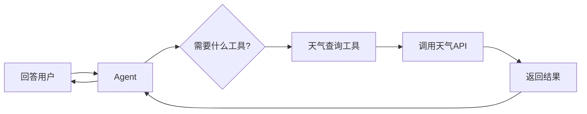
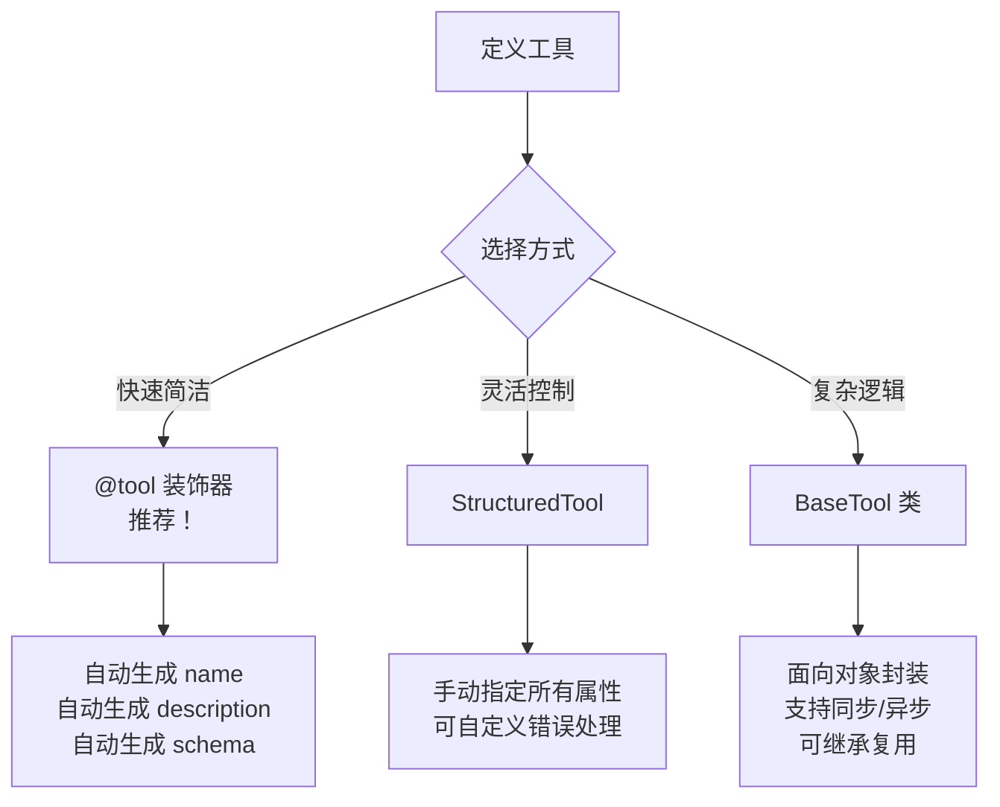
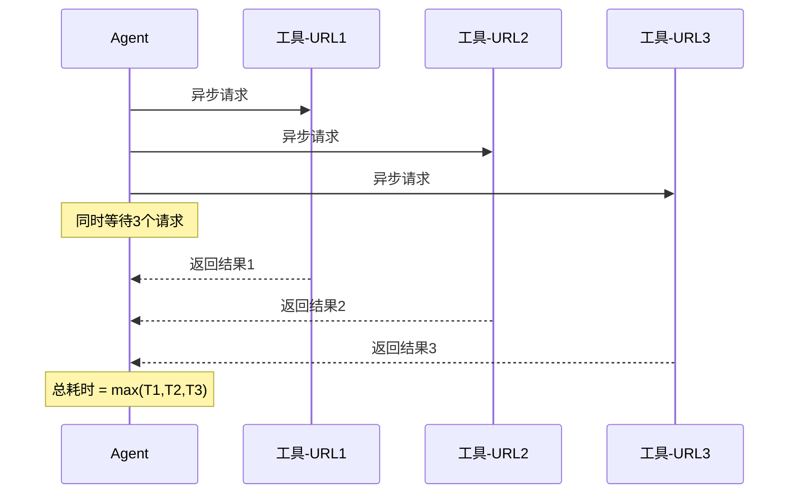
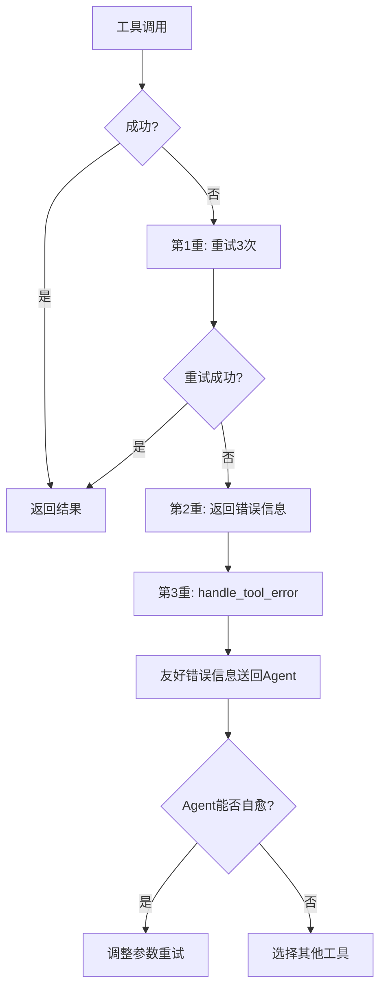
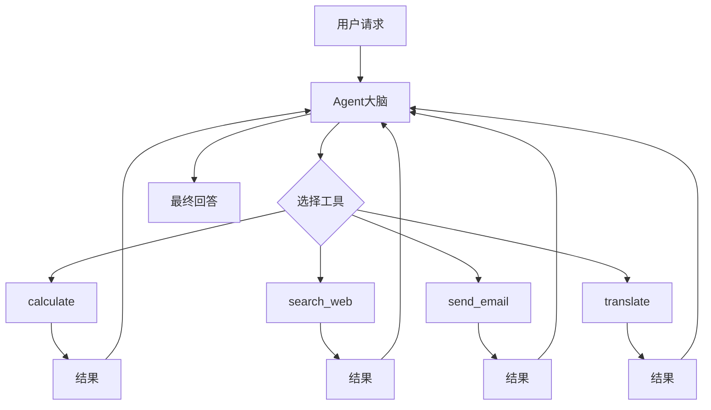

# 第26课：Agent 工具集成——让 AI 拥有双手

> **前置知识**：第06课 工具与代理Agent | **配套知识库**：22_Agent工具集成与自定义工具开发技术手册 | **难度**：中高级

---

## 开篇：为什么 Agent 需要工具？

想象你是一个经验丰富的顾问，脑子里装满了知识。但如果有人问你"今天北京天气如何？"你光靠脑子里的知识答不上来——你需要**打开手机查天气**这个"工具"。

Agent 也是如此。LLM 本身只能处理文字，但通过工具，它可以：
- 🔍 搜索网页
- 🧮 计算数学
- 🌐 调用 API
- 💾 查询数据库
- 📁 读写文件

**工具就是 Agent 的"手和脚"**。



---

## 第一节：三种工具定义方式

### 方式一：@tool 装饰器（最推荐）

```python
from langchain_core.tools import tool

@tool
def search_products(keyword: str, max_results: int = 5) -> str:
    """根据关键词搜索商品。
    
    Args:
        keyword: 搜索关键词
        max_results: 最多返回几条，默认5条
    
    Returns:
        搜索结果列表
    """
    # 你的搜索逻辑
    return f"找到关于'{keyword}'的 {max_results} 条商品"

# 就这么简单！docstring 就是工具描述
```

**三个要点**：
1. `@tool` 装饰器自动把函数变成工具
2. **docstring 是灵魂**——LLM 靠它判断"什么时候该用这个工具"
3. 类型注解自动变成参数校验

### 方式二：StructuredTool（灵活控制）

```python
from langchain_core.tools import StructuredTool

def get_weather(city: str) -> str:
    """获取天气"""
    return f"{city}今天晴，25度"

weather_tool = StructuredTool.from_function(
    func=get_weather,
    name="get_weather",
    description="查询城市天气",
    handle_tool_error=lambda e: f"查询失败: {e}"
)
```

### 方式三：BaseTool 类（面向对象）

```python
from langchain_core.tools import BaseTool
from typing import Type
from pydantic import BaseModel, Field

class CalcInput(BaseModel):
    expression: str = Field(description="数学表达式如 2+3")

class Calculator(BaseTool):
    name: str = "calculator"
    description: str = "计算数学表达式"
    args_schema: Type[BaseModel] = CalcInput

    def _run(self, expression: str) -> str:
        # 安全检查
        import re
        if not re.match(r'^[\d+\-*/.()\s]+$', expression):
            return "错误：包含非法字符"
        return str(eval(expression, {"__builtins__": {}}, {}))

    async def _arun(self, expression: str) -> str:
        return self._run(expression)
```



---

## 第二节：工具参数与校验

工具的参数校验用 Pydantic，确保 LLM 传入的参数合法。

```python
from pydantic import BaseModel, Field
from langchain_core.tools import tool

class EmailInput(BaseModel):
    to: str = Field(description="收件人邮箱")
    subject: str = Field(description="邮件主题", min_length=1, max_length=100)
    body: str = Field(description="邮件正文")
    priority: str = Field(
        default="normal",
        description="优先级：low/normal/high"
    )

@tool(args_schema=EmailInput)
def send_email(to: str, subject: str, body: str, priority: str = "normal") -> str:
    """发送邮件。"""
    return f"邮件已发送给 {to}，主题：{subject}，优先级：{priority}"

# 当 Agent 调用时传了非法参数，Pydantic 自动拦截
# send_email.invoke({"to": "a@b.com", "subject": "", "body": "test"})
# → 自动校验失败："subject: string too short"
```

**校验规则速查**：

| 规则 | 写法 | 说明 |
|------|------|------|
| 最小长度 | `min_length=1` | 至少1个字符 |
| 最大长度 | `max_length=100` | 最多100个字符 |
| 数值范围 | `ge=1, le=50` | 1到50之间 |
| 正则匹配 | `pattern=r'^\d+$'` | 只允许数字 |
| 默认值 | `default="normal"` | 不传时使用默认值 |

---

## 第三节：异步工具与错误处理

### 异步工具

当工具需要做网络请求、数据库查询时，用异步工具可以**同时处理多个请求**，大幅提升速度。

```python
import aiohttp
from langchain_core.tools import tool

@tool
async def fetch_url(url: str) -> str:
    """异步获取网页内容。"""
    async with aiohttp.ClientSession() as session:
        async with session.get(url, timeout=aiohttp.ClientTimeout(total=10)) as resp:
            if resp.status == 200:
                text = await resp.text()
                return text[:2000]
            return f"HTTP错误: {resp.status}"

# 并发调用3个URL
import asyncio

async def main():
    urls = ["https://api1.com", "https://api2.com", "https://api3.com"]
    tasks = [fetch_url.ainvoke({"url": u}) for u in urls]
    results = await asyncio.gather(*tasks)  # 3个请求同时发出
    for r in results:
        print(r[:50])

asyncio.run(main())
```



### 错误处理三重防线

```python
from langchain_core.tools import Tool

def call_api(query: str) -> str:
    """带三重错误处理的 API 调用"""
    import time
    # 第一重：重试
    for attempt in range(3):
        try:
            return external_api(query)
        except ConnectionError:
            if attempt < 2:
                time.sleep(2 ** attempt)  # 指数退避
                continue
            raise
        except Exception as e:
            # 第二重：捕获已知错误
            return f"执行错误: {type(e).__name__}: {e}"

# 第三重：工具级错误处理
def handle_error(error: Exception) -> str:
    """让错误信息对 Agent 可读"""
    if isinstance(error, ConnectionError):
        return "网络连接失败，Agent可以尝试其他工具"
    elif isinstance(error, ValueError):
        return f"参数错误，Agent可以修正参数重试: {error}"
    else:
        return f"未知错误: {error}"

tool = Tool(
    name="api_call",
    description="调用外部API",
    func=call_api,
    handle_tool_error=handle_error  # 关键！
)
```



---

## 第四节：工具包与多工具 Agent 实战

### 工具包模式

把相关工具打包成工具包，按场景加载：

```python
from langchain_core.tools import tool

class DatabaseToolkit:
    """数据库工具包"""
    
    def __init__(self, conn_str: str):
        self.conn = conn_str
    
    def get_tools(self):
        @tool
        def query_db(sql: str) -> str:
            """执行SQL查询（只读）"""
            if not sql.strip().upper().startswith("SELECT"):
                return "错误：只允许查询"
            return "查询结果: ..."

        @tool
        def list_tables() -> str:
            """列出所有表名"""
            return "users, orders, products"

        @tool
        def describe_table(table: str) -> str:
            """查看表结构"""
            return f"表 {table} 的结构: id, name, ..."

        return [query_db, list_tables, describe_table]

# 使用
toolkit = DatabaseToolkit("postgresql://...")
db_tools = toolkit.get_tools()
```

### 多工具 Agent 完整示例

```python
from langchain_openai import ChatOpenAI
from langchain.agents import create_tool_calling_agent, AgentExecutor
from langchain_core.prompts import ChatPromptTemplate
from langchain_core.tools import tool

# 定义4个工具
@tool
def calculate(expression: str) -> str:
    """计算数学表达式，如 '15+27*3'"""
    import re
    if not re.match(r'^[\d+\-*/.()\s]+$', expression):
        return "错误：非法字符"
    return str(eval(expression, {"__builtins__": {}}, {}))

@tool
def search_web(query: str) -> str:
    """搜索网页获取最新信息"""
    # 简化：实际用搜索API
    return f"搜索 '{query}' 的结果：..."

@tool
def send_email(to: str, subject: str, body: str) -> str:
    """发送邮件"""
    return f"邮件已发送给 {to}，主题：{subject}"

@tool
def translate(text: str, target_lang: str) -> str:
    """翻译文本到目标语言"""
    return f"{text} 翻译为 {target_lang}"

# 构建 Agent
tools = [calculate, search_web, send_email, translate]
llm = ChatOpenAI(model="gpt-4", temperature=0)
prompt = ChatPromptTemplate.from_messages([
    ("system", "你是多功能助手，可使用以下工具：计算、搜索、发邮件、翻译。"),
    ("human", "{input}"),
    ("placeholder", "{agent_scratchpad}"),
])

agent = create_tool_calling_agent(llm, tools, prompt)
executor = AgentExecutor(agent=agent, tools=tools, verbose=True)

# 测试
print(executor.invoke({"input": "计算 (15+27)*3"})["output"])
print(executor.invoke({"input": "搜索Python最新版本"})["output"])
```



---

## 本课小结

| 要点 | 说明 |
|------|------|
| @tool 装饰器 | 最简单的工具定义方式，docstring 是灵魂 |
| 参数校验 | 用 Pydantic BaseModel 做输入校验 |
| 异步工具 | 网络/IO 操作用 async def，并发更快 |
| 三重错误防线 | 重试 → 捕获 → 友好提示 |
| 工具包 | 按场景打包，动态加载 |

**下一步学习**：第27课 记忆系统——让 AI 拥有持久记忆，学习如何让 Agent 跨轮次记住对话上下文。
