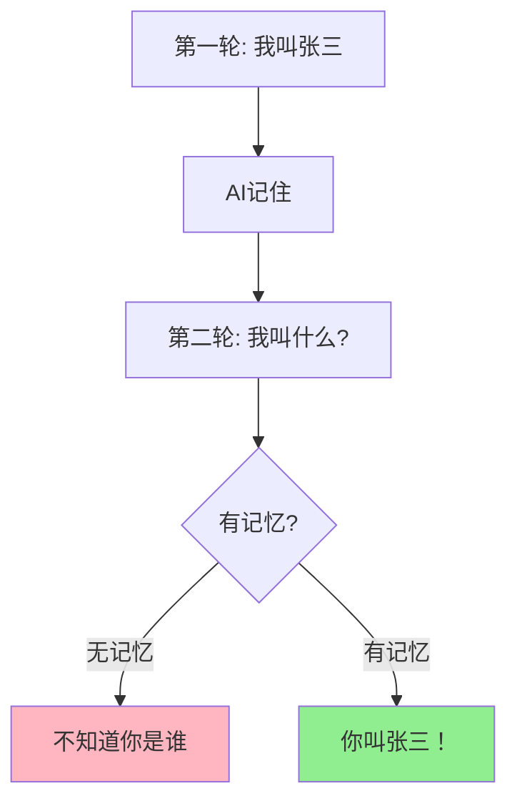
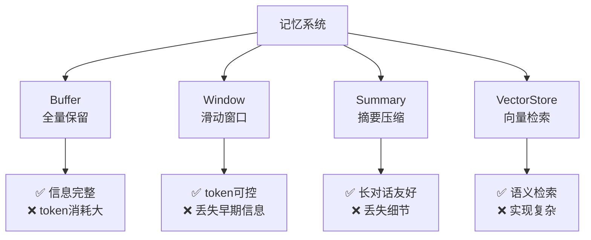
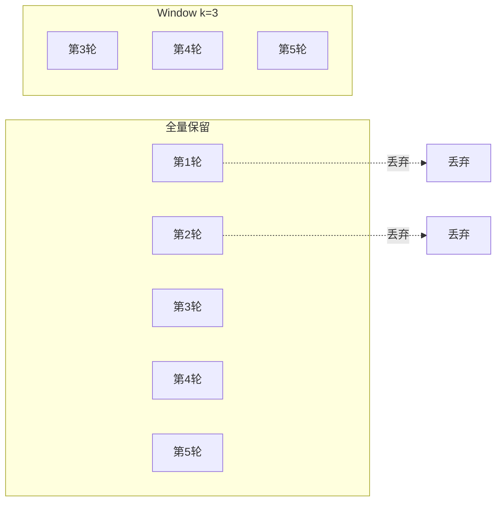
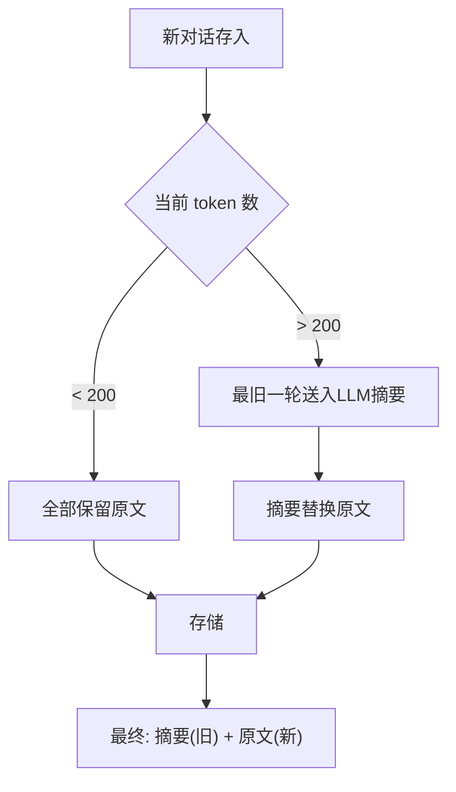
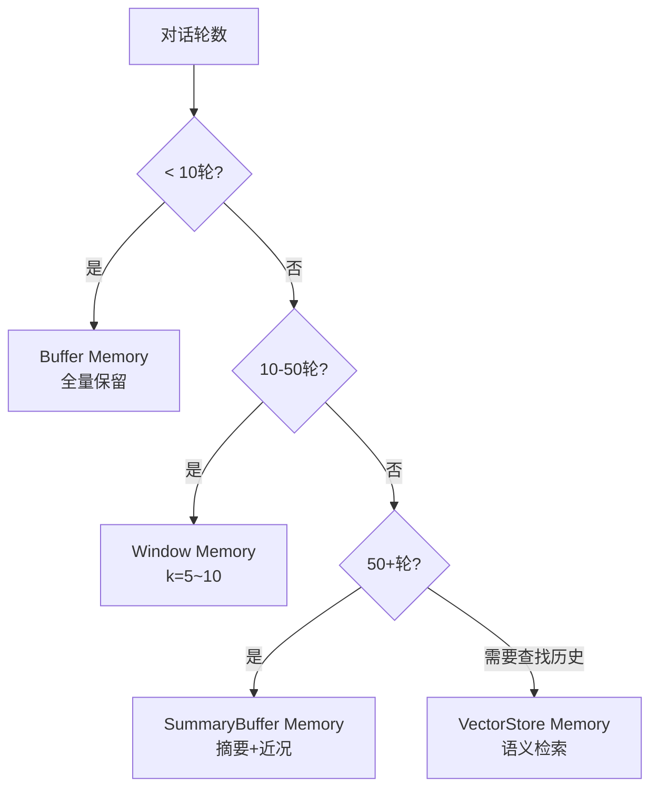
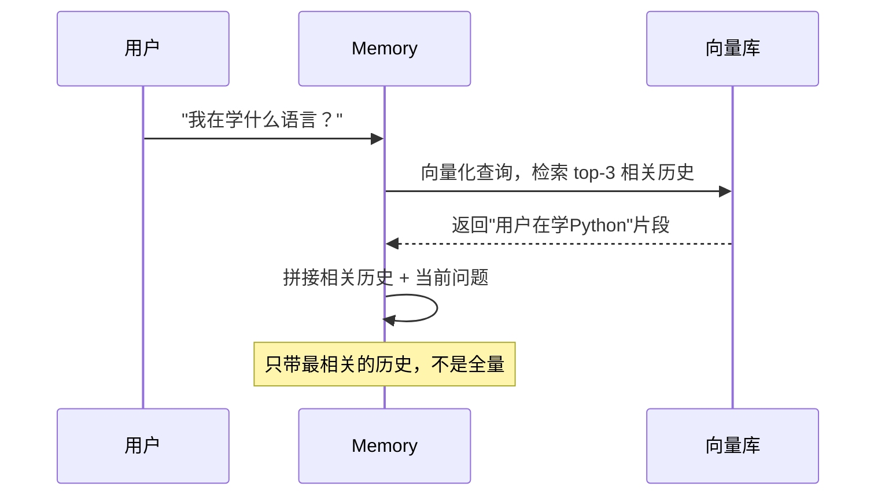
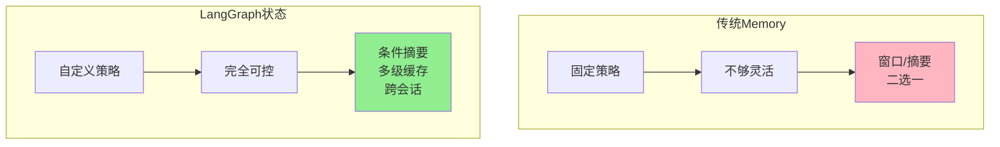

# 第27课：记忆系统——让 AI 拥有持久记忆

> **前置知识**：第04课 记忆机制 | **配套知识库**：23_记忆系统架构与策略技术参考 | **难度**：中高级

---

## 开篇：为什么 AI 需要记忆？

想象你每天去同一家咖啡店，店员已经认识你了：

> "老样子？一杯美式，加一份浓缩？"

这种体验之所以好，是因为店员**记住了你的喜好**。

如果没有记忆，每次对话都是全新的——AI 不知道你叫什么、聊过什么、你的偏好是什么。记忆系统让 AI 从"金鱼记忆"变成"贴心助手"。



---

## 第一节：四种记忆类型对比



### 生活类比理解

| 记忆类型 | 生活类比 | 特点 |
|---------|---------|------|
| Buffer | 录音笔 | 录下每一句话，但很快就满了 |
| Window | 只记最后几句话 | "你刚才说了什么来着" |
| Summary | 做会议纪要 | "今天聊了张三学Python的事" |
| SummaryBuffer | 纪要+近况 | "之前聊过Python(纪要)，刚才聊了RAG(原文)" |
| VectorStore | 记事本+索引 | "你提过Python，让我查查当时说了什么" |

---

## 第二节：Buffer 和 Window 记忆

### Buffer Memory——全量保留

```python
from langchain.memory import ConversationBufferMemory

memory = ConversationBufferMemory(return_messages=True)

# 存入对话
memory.save_context(
    {"input": "你好，我叫张三"},
    {"output": "你好张三！"}
)
memory.save_context(
    {"input": "我在学LangChain"},
    {"output": "很好的选择！"}
)

# 加载记忆
vars = memory.load_memory_variables({})
for msg in vars["history"]:
    print(f"{msg.type}: {msg.content}")
# human: 你好，我叫张三
# ai: 你好张三！
# human: 我在学LangChain
# ai: 很好的选择！
```

### Window Memory——只看最近 N 轮

```python
from langchain.memory import ConversationBufferWindowMemory

# 只保留最近3轮对话
memory = ConversationBufferWindowMemory(k=3, return_messages=True)

# 即使存入10轮对话
for i in range(10):
    memory.save_context(
        {"input": f"第{i+1}轮问题"},
        {"output": f"第{i+1}轮回答"}
    )

# 加载时只返回最后3轮
vars = memory.load_memory_variables({})
# history = [第8轮问答, 第9轮问答, 第10轮问答]
```



---

## 第三节：摘要记忆——压缩长对话

### Summary Memory

```python
from langchain.memory import ConversationSummaryMemory
from langchain_openai import ChatOpenAI

llm = ChatOpenAI(temperature=0)
memory = ConversationSummaryMemory(llm=llm)

# 存入对话，LLM自动维护摘要
memory.save_context(
    {"input": "我叫张三，是一名Python开发者"},
    {"output": "你好张三，Python是优秀的语言。"}
)
memory.save_context(
    {"input": "我在北京工作，正在学习LangChain"},
    {"output": "LangChain很适合你的背景。"}
)

# 加载摘要
vars = memory.load_memory_variables({})
print(vars["history"])
# 输出类似：
# "用户张三是Python开发者，在北京工作，正在学习LangChain框架。"
```

### SummaryBuffer Memory——混合策略

这是最实用的记忆类型：**最近的对话保留原文，旧对话自动摘要**。

```python
from langchain.memory import ConversationSummaryBufferMemory

memory = ConversationSummaryBufferMemory(
    llm=llm,
    max_token_limit=200,  # 超过200 token的部分开始摘要
    return_messages=True,
)

# 最近对话保留原文，旧对话变摘要
```



### 记忆类型选择决策树



---

## 第四节：向量检索记忆与 LangGraph 状态

### VectorStore Memory——语义检索

```python
from langchain.memory import VectorStoreRetrieverMemory
from langchain_community.vectorstores import FAISS
from langchain_openai import OpenAIEmbeddings

# 创建向量存储
embeddings = OpenAIEmbeddings()
vectorstore = FAISS.from_texts(["init"], embeddings)

# 构建记忆
memory = VectorStoreRetrieverMemory(
    retriever=vectorstore.as_retriever(search_kwargs={"k": 3}),
)

# 存入多轮对话
memory.save_context(
    {"input": "我喜欢吃四川菜"},
    {"output": "四川菜以麻辣著称。"}
)
memory.save_context(
    {"input": "我在北京工作"},
    {"output": "北京有很多科技公司。"}
)
memory.save_context(
    {"input": "我在学Python"},
    {"output": "Python语法简洁。"}
)

# 按语义检索相关历史
vars = memory.load_memory_variables({"input": "我在学什么？"})
# 返回包含"Python"的对话片段，而不是全量历史
```



### LangGraph 状态管理——记忆的未来

LangGraph 用 StateGraph 替代传统 Memory 类，提供**完全可控**的状态管理：

```python
from langgraph.graph import StateGraph, END
from langgraph.graph.message import add_messages
from langgraph.checkpoint.memory import MemorySaver
from typing import Annotated, TypedDict

class ChatState(TypedDict):
    messages: Annotated[list, add_messages]  # 消息自动追加
    summary: str  # 摘要字段

def chat_node(state: ChatState):
    messages = state["messages"]
    # 智能记忆：消息太多就摘要
    if len(messages) > 10:
        old_msgs = messages[:-4]
        summary = llm.invoke(
            f"总结: {[m.content for m in old_msgs]}"
        ).content
        messages = messages[-4:]
    else:
        summary = state.get("summary", "")
    
    response = llm.invoke(messages)
    return {
        "messages": [response],
        "summary": summary,
    }

graph = StateGraph(ChatState)
graph.add_node("chat", chat_node)
graph.set_entry_point("chat")
graph.add_edge("chat", END)

# Checkpointer 自动保存每步状态
app = graph.compile(checkpointer=MemorySaver())

# 用 thread_id 隔离不同用户
config = {"configurable": {"thread_id": "user_001"}}
result = app.invoke(
    {"messages": [{"role": "user", "content": "我叫张三"}]},
    config
)
# 下次对话自动恢复上次状态
result = app.invoke(
    {"messages": [{"role": "user", "content": "我叫什么"}]},
    config
)
# AI: "你叫张三"
```



---

## 本课小结

| 记忆类型 | 最佳场景 | token 消耗 | 实现难度 |
|---------|---------|-----------|---------|
| Buffer | 短对话 < 10 轮 | 高 | ★ |
| Window | 中等对话 10-50 轮 | 低 | ★ |
| SummaryBuffer | 长对话 50+ 轮 | 中 | ★★ |
| VectorStore | 需要检索历史 | 低 | ★★★ |
| LangGraph State | 复杂工作流 | 可控 | ★★★ |

**核心原则**：先用 Window Memory（k=5）启动项目，发现问题后再升级到 SummaryBuffer 或 LangGraph State。

**下一步学习**：第28课 LangGraph 状态管理——精确控制 AI 工作流，深入掌握状态机、检查点与人在回路。
