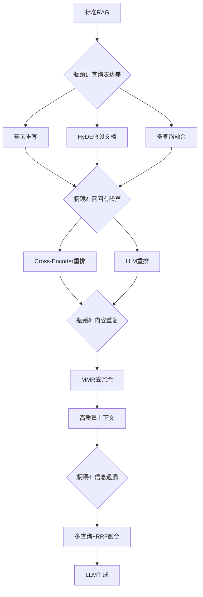
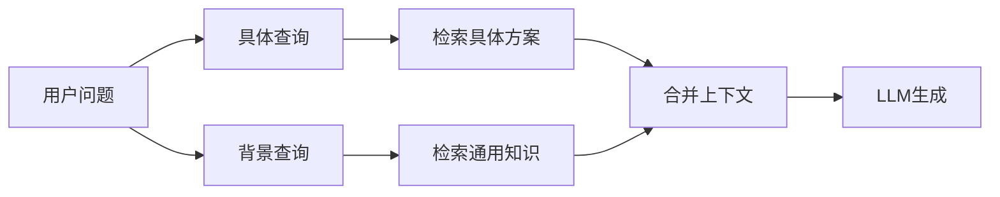
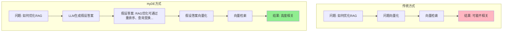
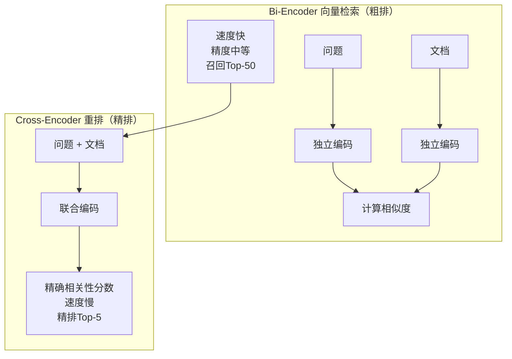
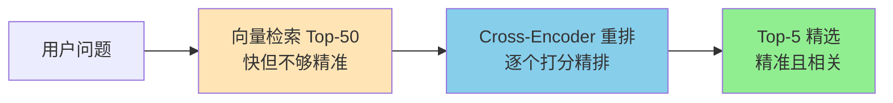
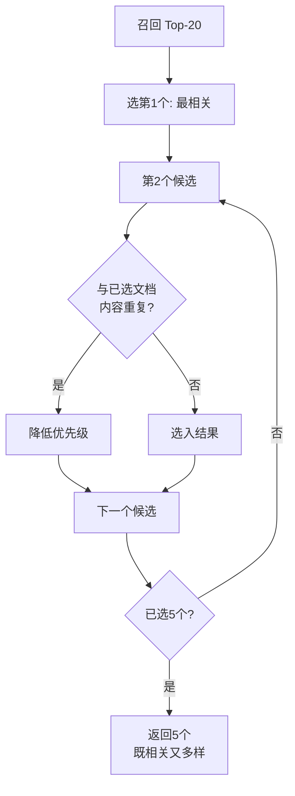
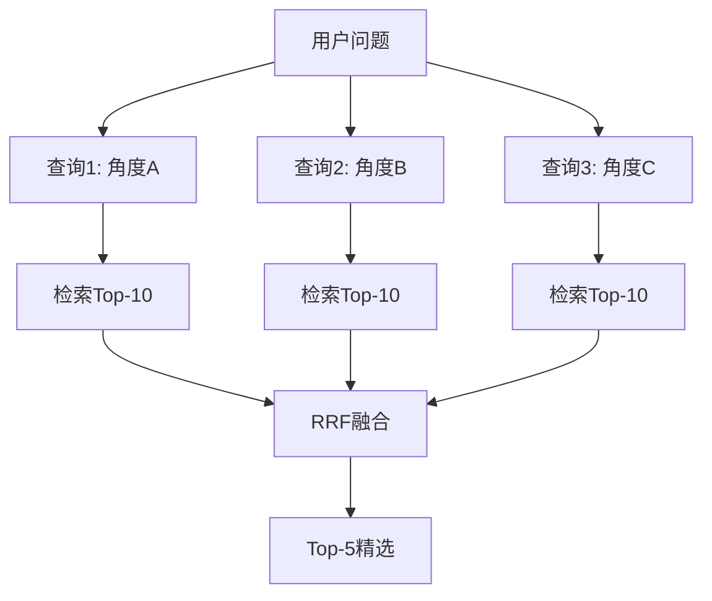
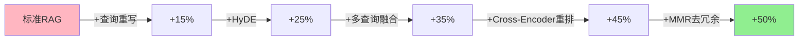

# 第29课：高级 RAG 优化——让检索更聪明

> **前置知识**：第07课 RAG入门、第12课 高级RAG | **配套知识库**：25_高级RAG优化_重排与查询变换技术参考 | **难度**：高级

---

## 开篇：标准 RAG 的四大瓶颈

标准 RAG 流程很简单：**用户问题 → 向量检索 → 取 Top-5 → 拼接上下文 → LLM 生成**。

但实际使用中你会发现四大问题：

| 问题 | 症状 | 原因 |
|------|------|------|
| 检索不准 | 找到的文档跟问题不相关 | 用户问题表达与文档语义差距大 |
| 噪声太多 | Top-5 里只有1个相关 | 向量检索精度有限 |
| 内容重复 | 5个文档说的差不多 | 检索结果缺乏多样性 |
| 信息遗漏 | 用户问"A和B的区别"，只检索到A | 单一查询覆盖不全 |

本课教你**逐一击破这四个瓶颈**。



---

## 第一节：查询重写——把口语变成检索语言

用户说的是口语，文档用的是专业术语。先"翻译"再检索。

```python
from langchain_openai import ChatOpenAI
from langchain_core.prompts import ChatPromptTemplate

rewrite_prompt = ChatPromptTemplate.from_messages([
    ("system", """将用户口语化问题重写为更适合向量检索的关键词查询。
规则：保留意图，用关键词，加同义词，每行一个。"""),
    ("human", "问题: {question}")
])

llm = ChatOpenAI(temperature=0)
rewrite_chain = rewrite_prompt | llm

# 用户的口语问题
question = "怎么用Python读取一个CSV文件"
result = rewrite_chain.invoke({"question": question}).content
# 重写后:
# "Python read CSV file"
# "csv模块 pandas read_csv"
# "文件读取 数据导入 Python"
```

**效果对比**：

| 检索输入 | 检索到 |
|---------|--------|
| "怎么用Python读取一个CSV文件" | 可能匹配到不相关文档 |
| "Python read CSV file, csv模块 pandas read_csv" | 精准匹配技术文档 |

### 步骤回退——同时查具体和背景

```python
step_back_prompt = ChatPromptTemplate.from_messages([
    ("system", "为具体问题生成一个更宽泛的背景问题。"),
    ("human", "具体: {question}\n背景:")
])

# 具体问题: "LangChain的BufferMemory怎么设窗口"
# 背景问题: "LangChain有哪些记忆类型和配置方法"
# 用具体问题查具体方案，用背景问题查通用知识
```



---

## 第二节：HyDE——先编答案再检索

### 核心思想

传统方式：**问题** → 向量检索 → 找到的可能不准

HyDE 方式：**问题 → LLM 先编一个假设性答案 → 用假设答案去检索** → 精准匹配

```python
from langchain_openai import ChatOpenAI
from langchain_core.prompts import ChatPromptTemplate

# 第一步：让LLM生成假设文档
hyde_prompt = ChatPromptTemplate.from_messages([
    ("system", "为以下问题写一段200字的假设性回答。即使不确定也要合理推测。"),
    ("human", "问题: {question}\n假设回答:")
])

llm = ChatOpenAI(temperature=0.3)
hyde_chain = hyde_prompt | llm

question = "如何优化RAG系统的检索准确率"
hypothetical_doc = hyde_chain.invoke({"question": question}).content

# 第二步：用假设文档而非原始问题去检索
docs = vectorstore.similarity_search(hypothetical_doc, k=5)
```



### 为什么有效？

问题（"如何优化RAG"）和答案（"RAG优化可通过重排序..."）在向量空间中距离较远。但**假设答案和真实答案**语义接近，检索更精准。

| 维度 | 传统检索 | HyDE |
|------|---------|------|
| 检索输入 | 问题原文 | 假设答案 |
| 语义距离 | 问题↔答案（远） | 假设答案↔真实答案（近） |
| 效果 | 基准 | +10-25% |
| 额外成本 | 0 | 1次LLM调用 |

---

## 第三节：Cross-Encoder 重排序——精排 Top-5

### Bi-Encoder vs Cross-Encoder



### 两步检索策略

```python
from langchain_cohere import CohereRerank
from langchain.retrievers import ContextualCompressionRetriever

# 第一步：向量检索召回 Top-50（要全，不要精）
retriever = vectorstore.as_retriever(search_kwargs={"k": 50})

# 第二步：Cross-Encoder 精排 Top-5
reranker = CohereRerank(
    model="rerank-multilingual-v3.0",
    top_n=5  # 重排后只留5个
)

# 组合
rerank_retriever = ContextualCompressionRetriever(
    base_compressor=reranker,
    base_retriever=retriever
)

docs = rerank_retriever.invoke("如何优化RAG性能")
# 返回经过精排的 Top-5
```



### 重排方案对比

| 方案 | 精度 | 速度 | 成本 | 推荐度 |
|------|------|------|------|--------|
| Cohere Rerank | ★★★★★ | 快 | API调用 | ★★★★★ |
| HuggingFace Cross-Encoder | ★★★★ | 中 | 本地部署 | ★★★★ |
| LLM 重排 | ★★★★★ | 慢 | LLM调用 | ★★★ |
| 不重排 | ★★ | 最快 | 免费 | ★ |

---

## 第四节：MMR 去冗余与多查询融合

### MMR——最大边际相关性

当 Top-5 文档内容相似时，MMR 自动选择**既相关又多样**的结果。

```python
retriever = vectorstore.as_retriever(
    search_type="mmr",
    search_kwargs={
        "k": 5,              # 最终返回5个
        "fetch_k": 20,       # 先召回20个候选
        "lambda_mult": 0.5  # 0=最大多样性, 1=最大相关性
    }
)
```



| lambda_mult | 效果 | 场景 |
|-------------|------|------|
| 0.0 | 最大多样性 | 信息覆盖面广 |
| 0.5 | 均衡（默认） | 通用场景 |
| 1.0 | 最大相关性 | 精确答案查找 |

### 多查询融合——RRF 算法

```python
from collections import defaultdict

def reciprocal_rank_fusion(results_list: list, k: int = 60) -> list:
    """RRF 融合多路检索结果"""
    scores = defaultdict(float)
    for results in results_list:
        for rank, doc in enumerate(results, 1):
            scores[doc] += 1.0 / (k + rank)  # 排名越靠前得分越高
    
    return sorted(scores.items(), key=lambda x: -x[1])[:5]
```



**生活类比**：三个朋友分别从不同角度找餐厅，各自推荐Top-10，然后综合三个人的推荐排名，选出大家都认可的5家。

---

## 优化效果总结



### 实施优先级建议

| 优先级 | 技术 | 效果 | 成本 |
|--------|------|------|------|
| 1 | Cross-Encoder 重排 | +20-30% | API调用 |
| 2 | 查询重写 | +10-15% | 1次LLM |
| 3 | MMR 去冗余 | +5-10% | 几乎免费 |
| 4 | 多查询融合 | +10-20% | N次检索+LLM |
| 5 | HyDE | +10-25% | 1次LLM |

**核心建议**：先加重排（性价比最高），再逐步叠加查询重写和MMR，最后考虑多查询和HyDE。不要一次全上，逐步优化才能定位效果来源。

**下一步学习**：课程已完成全部29课核心内容！建议回顾附录A-H中的实战项目模板和工具速查卡，动手做一个完整的RAG Agent项目。
