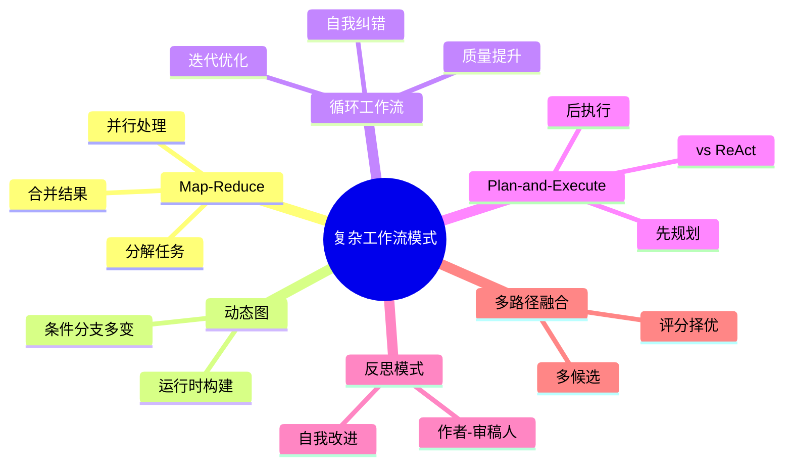
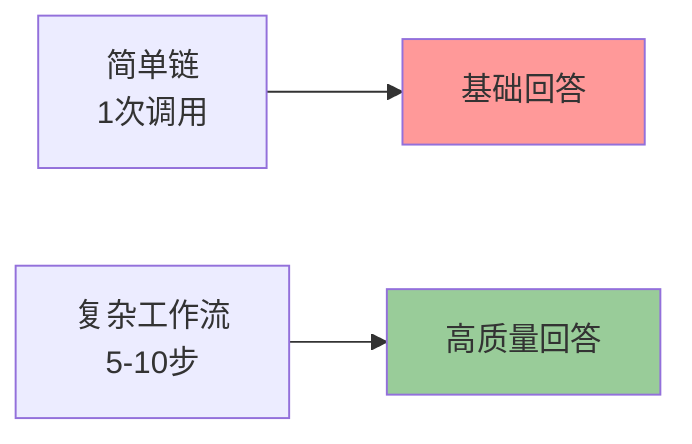
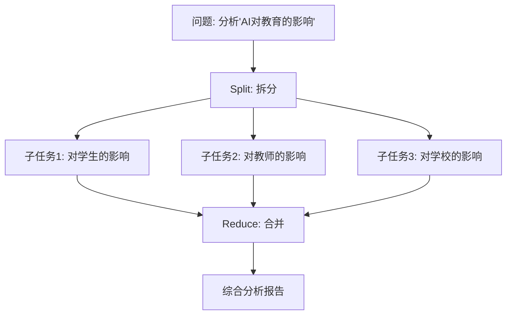
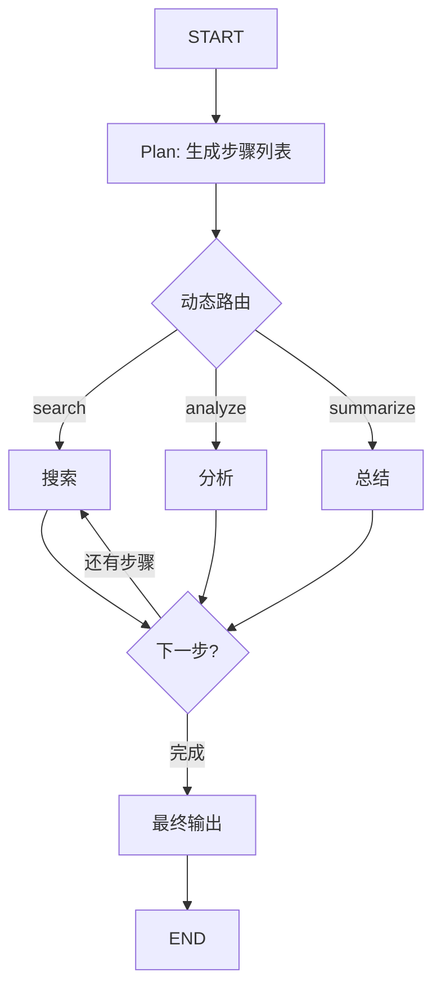
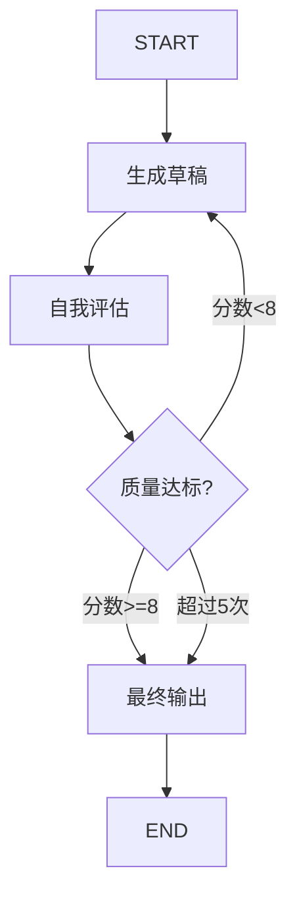
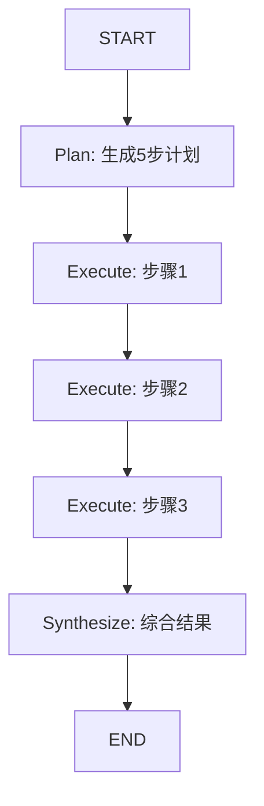
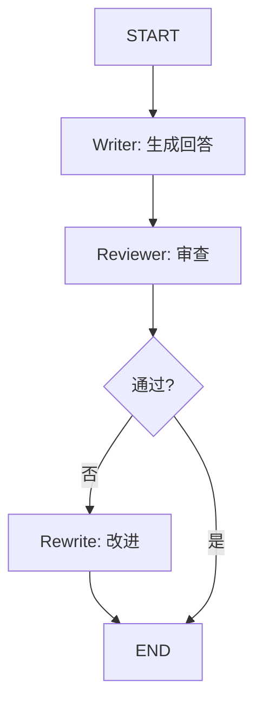
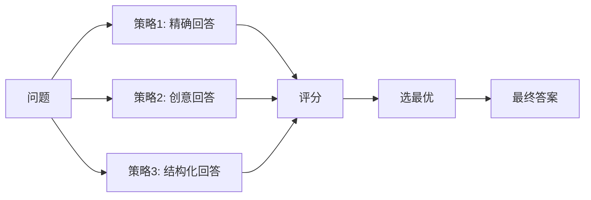
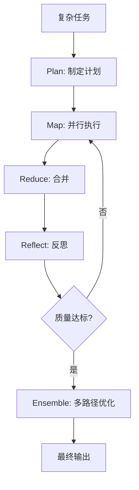
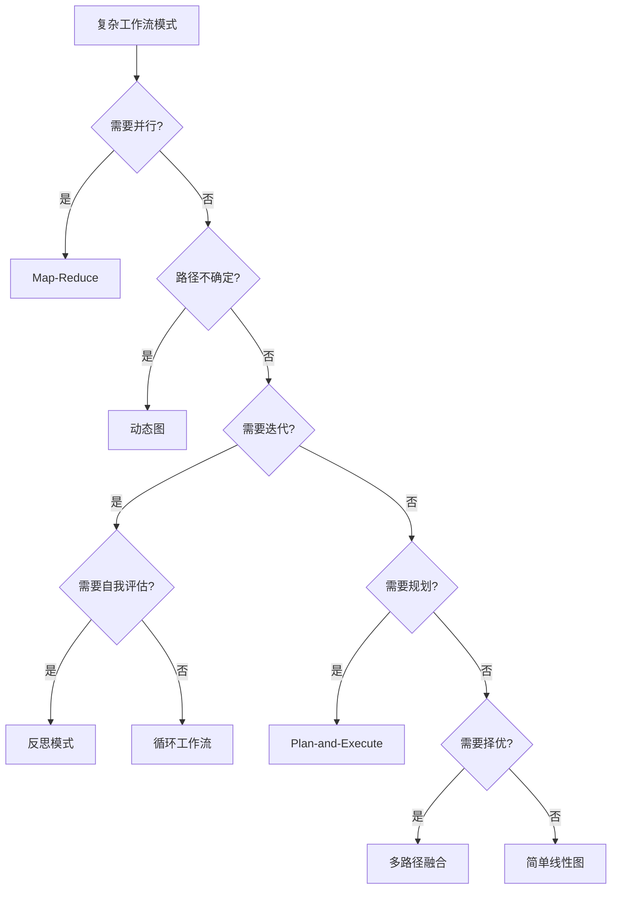

# 第30课：LangGraph 复杂工作流——高级图模式

> **学习目标**：掌握 LangGraph 六大复杂工作流模式，学会根据任务特征选型并组合使用
> **前置课程**：第28课 LangGraph 状态管理 | **难度**：高级 | **预计学时**：45分钟

---

## 本课导航

在前面的课程中，我们学会了用 LangGraph 构建线性和条件分支的工作流。但现实世界的问题远比"走直线"复杂——有些任务需要**并行处理**，有些需要**反复迭代**，有些需要**先规划再执行**。

本课将带你掌握六大高级工作流模式，让你的 AI 应用像真正的专家一样工作。



---

## 一、为什么需要复杂工作流？

### 简单链 vs 复杂工作流

想象你要回答"比较 GPT-4 和 Claude 3 的能力"：

**简单链**：一个 LLM 调用，基于已有知识回答 → 可能过时

**复杂工作流**：
1. 先规划：拆成"GPT-4能力"和"Claude 3能力"两个子任务
2. 并行检索两个模型的信息
3. 分别分析
4. 合并对比
5. 自我检查是否准确
6. 如果不准确，重新检索



### 六大模式速览

| 模式 | 一句话理解 | 生活类比 |
|------|-----------|---------|
| Map-Reduce | 分任务→并行干→汇总 | 小组分工作业 |
| 动态图 | 走到哪算到哪 | 迷宫探险 |
| 循环工作流 | 不满意就重来 | 反复修改作文 |
| Plan-and-Execute | 先列计划再执行 | 出门前先规划路线 |
| 反思模式 | 写完找人审稿 | 同行评议 |
| 多路径融合 | 找三个人回答选最好的 | 集思广益 |

---

## 二、Map-Reduce：并行处理

### 核心思想

把一个大问题拆成多个小问题，**并行处理**，然后合并结果。



### 代码实现

```python
from langgraph.graph import StateGraph, END, START
from typing import Annotated, TypedDict
from operator import add

class MapReduceState(TypedDict):
    question: str
    sub_tasks: list        # 拆分后的子任务
    results: Annotated[list, add]  # 各子任务结果（自动累加）
    final_answer: str

# 第1步：拆分
def split_node(state: MapReduceState):
    question = state["question"]
    sub_tasks = [
        f"从学生角度分析: {question}",
        f"从教师角度分析: {question}",
        f"从学校管理角度分析: {question}",
    ]
    return {"sub_tasks": sub_tasks}

# 第2步：并行处理
def map_node(state: MapReduceState):
    results = []
    for task in state["sub_tasks"]:
        result = llm.invoke(task).content
        results.append(result)
    return {"results": results}

# 第3步：合并
def reduce_node(state: MapReduceState):
    combined = "\n\n".join(state["results"])
    summary = llm.invoke(f"综合以下分析:\n{combined}").content
    return {"final_answer": summary}

# 构建图
graph = StateGraph(MapReduceState)
graph.add_node("split", split_node)
graph.add_node("map", map_node)
graph.add_node("reduce", reduce_node)
graph.add_edge(START, "split")
graph.add_edge("split", "map")
graph.add_edge("map", "reduce")
graph.add_edge("reduce", END)

app = graph.compile()
```

### 动手练习

**练习1**：修改 `split_node`，让它根据问题自动生成 3-5 个子任务（用 LLM 帮忙拆分）。

**练习2**：将 `map_node` 改为异步并行执行（用 `asyncio.gather`），比较执行时间。

---

## 三、动态图：运行时决定路径

### 核心思想

不是预先固定路线，而是**走到每个路口再决定下一步去哪**。



### 与条件分支的区别

条件分支是**预定义的** if-else，动态图是**LLM 实时决策的**。

| 特征 | 条件分支 | 动态图 |
|------|---------|--------|
| 路径 | 固定的几条 | 运行时生成 |
| 灵活性 | 中 | 极高 |
| 复杂度 | 低 | 高 |
| 可预测性 | 高 | 低 |

### 代码实现

```python
class DynamicState(TypedDict):
    messages: Annotated[list, add_messages]
    route_plan: list   # 运行时生成的步骤
    step: int          # 当前步

def plan_node(state: DynamicState):
    """让 LLM 生成执行计划"""
    question = state["messages"][-1].content
    plan = llm.invoke(
        f"为以下问题生成执行步骤(用JSON列表): {question}"
    ).content
    steps = parse_json(plan)  # ["search", "analyze", "summarize"]
    return {"route_plan": steps, "step": 0}

def dynamic_router(state: DynamicState) -> str:
    """根据计划动态决定下一步"""
    plan = state["route_plan"]
    step = state["step"]
    if step >= len(plan):
        return "finalize"
    return plan[step]  # 返回下一个节点名

# 各节点执行后 step+1
def search_node(state): return {"step": state["step"] + 1}
def analyze_node(state): return {"step": state["step"] + 1}

# 用 conditional_edges 连接
graph.add_conditional_edges("plan", dynamic_router)
graph.add_conditional_edges("search", dynamic_router)
graph.add_conditional_edges("analyze", dynamic_router)
```

---

## 四、循环工作流：反复迭代

### 核心思想

**不满意就重来**，直到达到质量标准或超过次数限制。



### 关键：退出条件

循环工作流**必须有退出条件**，否则会死循环：

```python
MAX_ITERATIONS = 5
QUALITY_THRESHOLD = 8

def should_continue(state) -> str:
    # 条件1：质量达标
    if state["quality_score"] >= QUALITY_THRESHOLD:
        return "done"
    # 条件2：超过最大次数
    if state["iteration"] >= MAX_ITERATIONS:
        return "done"
    # 否则继续
    return "regenerate"
```

### 动手练习

**练习3**：把 `MAX_ITERATIONS` 改成 3，观察输出质量的变化。思考：迭代次数和质量的关系是什么？

---

## 五、Plan-and-Execute：先规划后执行

### vs ReAct

| 模式 | 策略 | 优点 | 缺点 |
|------|------|------|------|
| ReAct | 走一步看一步 | 灵活 | 可能偏离 |
| Plan-and-Execute | 先想全再干 | 有全局视野 | 计划可能不准 |



### 适用场景

- 多步骤研究报告
- 项目分解执行
- 旅行规划
- 代码实现（先设计后编码）

---

## 六、反思模式：自我纠错

### 核心思想

**写完找人审稿**——用一个 LLM 当"作者"，另一个当"审稿人"。



### 为什么有效？

- 自己写的自己看不出问题
- "审稿人"用不同的 prompt，提供新视角
- 迭代改进通常能提升 10-20% 质量

### 动手练习

**练习4**：实现一个"翻译+审校"的反思工作流：先翻译，再审查翻译质量，不满意就重翻。

---

## 七、多路径融合：择优选择

### 核心思想

**找三个不同的人回答，选最好的答案。**



### 适合场景

- 创意写作（不同风格择优）
- 代码生成（不同实现方式择优）
- 总结摘要（不同角度择优）

---

## 八、模式组合

实际应用中，**多种模式组合使用**效果最好：



| 组合 | 效果 | 适用 |
|------|------|------|
| Plan + Map-Reduce | 复杂任务分解并行 | 大型研究报告 |
| Reflect + Loop | 迭代改进 | 高质量写作 |
| Ensemble + Reflect | 多候选+审查 | 创意内容 |
| Plan + Execute + Reflect | 全流程质量保证 | 生产级应用 |

---

## 九、本课小结



### 你学到了什么

1. **六大模式**：Map-Reduce、动态图、循环、Plan-Execute、反思、多路径融合
2. **选型思路**：根据任务特征选模式
3. **组合使用**：多种模式组合效果更好
4. **安全守卫**：循环必须有退出条件

### 下一课预告

下一课我们学习 **Agent 评估**——如何科学地衡量你的 Agent 表现好不好。
