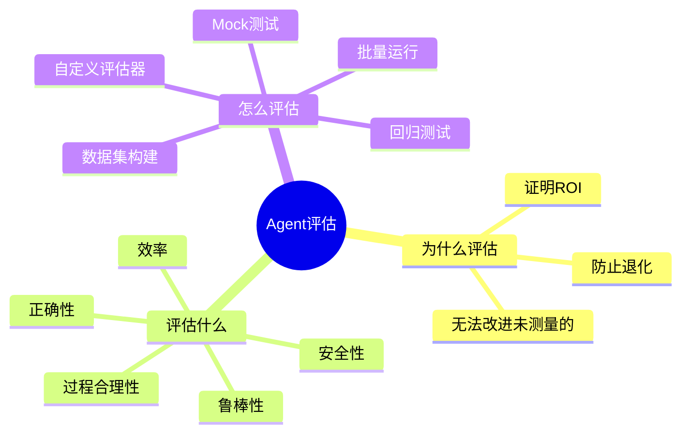
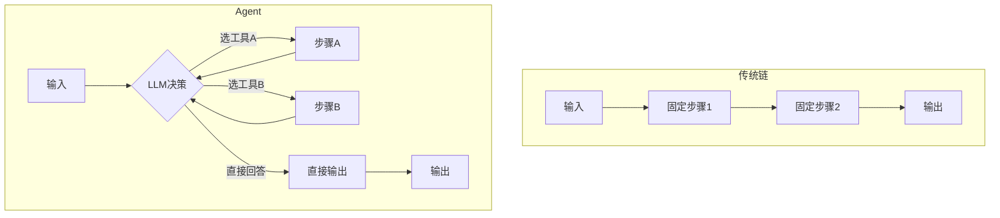
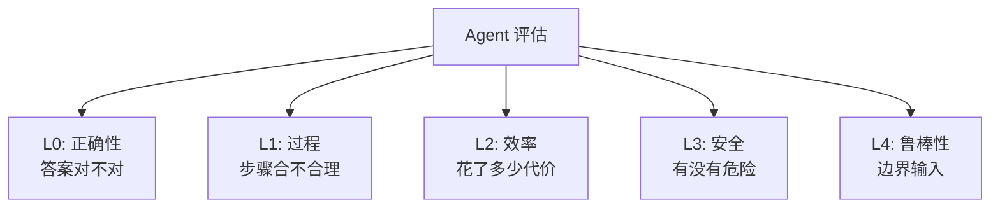
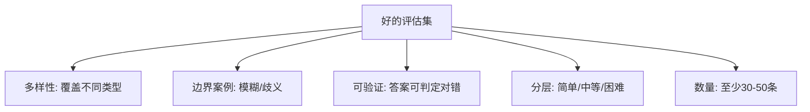
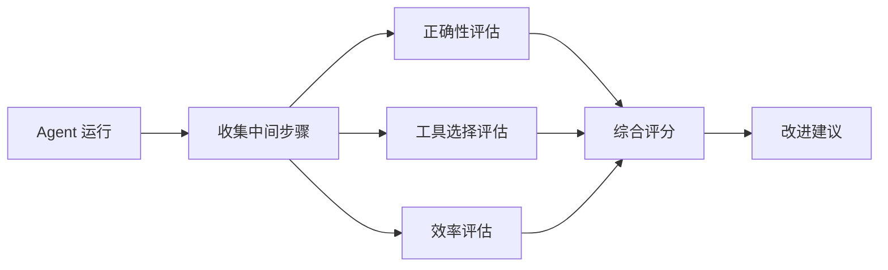
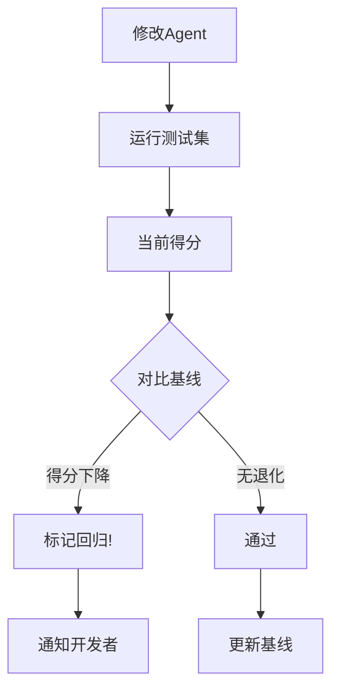
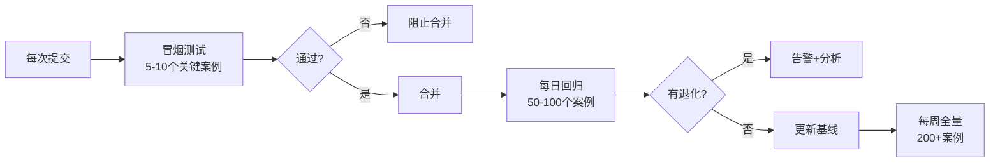
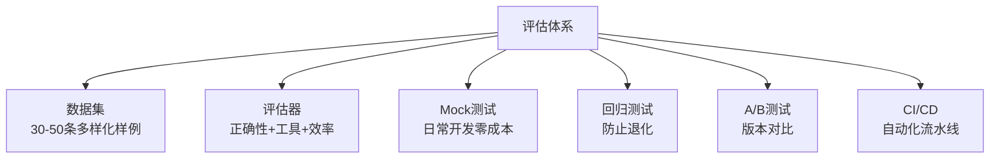

# 第31课：Agent 评估——让 AI 越来越准

> **学习目标**：理解 Agent 评估的五大维度，学会用 LangSmith 建立评估流水线
> **前置课程**：第30课 复杂工作流 | **难度**：高级 | **预计学时**：40分钟

---

## 本课导航

你做了一个 Agent，它表现好不好？改了一个 prompt，是变好了还是变差了？接了一个新工具，有没有影响其他功能？

**不评估就无法改进**。本课带你建立科学的 Agent 评估体系。



---

## 一、为什么 Agent 评估比传统链更难？

### 传统链 vs Agent



| 差异 | 传统链 | Agent |
|------|--------|-------|
| 路径 | 固定的 | 可变的 |
| 步数 | 已知 | 不确定 |
| 测试 | 输入→输出 | 输入→过程→输出 |
| 难度 | 低 | 高 |

**关键挑战**：同一输入，Agent 可能走不同路径到达同一答案——都算对吗？

---

## 二、评估五大维度



### 1. 正确性（最重要）

最基本：**最终答案对不对？**

```python
# 简单正确性评估
def evaluate_correctness(predicted, expected):
    """判断答案是否正确"""
    prompt = f"""
    判断回答是否正确:
    参考答案: {expected}
    实际回答: {predicted}
    回答 correct 或 incorrect
    """
    result = llm.invoke(prompt).content.strip()
    return 1.0 if result == "correct" else 0.0
```

### 2. 过程合理性

**Agent 走的路对不对？**

| 检查点 | 说明 |
|--------|------|
| 工具选择 | 选对了工具吗？ |
| 步骤顺序 | 先做了该做的吗？ |
| 有无多余步骤 | 有没有绕远路？ |
| 有无遗漏步骤 | 有没有跳过必要的？ |

### 3. 效率

**完成同样任务花了多少代价？**

| 指标 | 说明 | 理想值 |
|------|------|--------|
| 平均步数 | 完成任务用了几步 | 越少越好 |
| Token用量 | 总共消耗多少 Token | 在预算内 |
| 耗时 | 从开始到结束多久 | < 30秒 |
| API调用数 | 调了几次外部 API | 合理范围 |

### 4. 安全

**有没有做危险的事？**

- 越权访问不该看的文件
- 删除不该删的数据
- 泄露敏感信息
- 执行危险命令

### 5. 鲁棒性

**遇到奇怪输入会怎样？**

- 模糊问题
- 错别字
- 矛盾信息
- 空输入
- 超长输入

---

## 三、用 LangSmith 建立评估数据集

### 什么是评估数据集？

一组 **"问题+期望答案+期望过程"** 的样例集合。

```python
from langsmith import Client

client = Client()

# 创建数据集
dataset = client.create_dataset(
    name="my-agent-eval",
    description="Agent 评估测试集"
)

# 添加测试样例
test_cases = [
    {
        "question": "北京和上海今天的温差是多少？",
        "expected_answer": "温差5度（北京25度，上海30度）",
        "expected_tools": ["weather_api", "calculator"],
        "difficulty": "medium",
    },
    {
        "question": "什么是机器学习？",
        "expected_answer": "让计算机从数据中学习规律的技术",
        "expected_tools": [],  # 不需要工具
        "difficulty": "easy",
    },
]

for tc in test_cases:
    client.create_example(
        inputs={"question": tc["question"]},
        outputs={
            "expected_answer": tc["expected_answer"],
            "expected_tools": tc["expected_tools"],
        },
        dataset_id=dataset.id,
    )
```

### 数据集设计原则



---

## 四、自定义评估器

### 答案正确性评估器

```python
from langsmith.evaluation import RunEvaluator, EvaluationResult

class CorrectnessEvaluator(RunEvaluator):
    """评估答案是否正确"""
    
    def evaluate_run(self, run, example=None):
        predicted = run.outputs.get("answer", "")
        reference = example.outputs.get("expected_answer", "") if example else ""
        
        # 用 LLM 做语义比对
        prompt = f"参考答案: {reference}\n实际回答: {predicted}\n回答对吗? correct/incorrect"
        result = llm.invoke(prompt).content.strip()
        
        return EvaluationResult(
            key="correctness",
            score=1.0 if result == "correct" else 0.0,
        )
```

### 工具选择评估器

```python
class ToolUseEvaluator(RunEvaluator):
    """评估是否选对了工具"""
    
    def evaluate_run(self, run, example=None):
        # 提取实际使用的工具
        used_tools = []
        for step in run.inputs.get("intermediate_steps", []):
            if len(step) >= 2 and hasattr(step[1], "tool"):
                used_tools.append(step[1].tool)
        
        expected = example.outputs.get("expected_tools", []) if example else []
        
        # 计算匹配率
        if expected:
            matched = sum(1 for t in expected if t in used_tools)
            score = matched / len(expected)
        else:
            score = 1.0
        
        return EvaluationResult(
            key="tool_use",
            score=score,
            comment=f"Used: {used_tools}"
        )
```

### 步数效率评估器

```python
class EfficiencyEvaluator(RunEvaluator):
    """评估是否用最少步数完成任务"""
    
    def evaluate_run(self, run, example=None):
        actual_steps = len(run.inputs.get("intermediate_steps", []))
        expected_steps = len(example.outputs.get("expected_steps", [])) if example else 0
        
        if expected_steps == 0:
            score = 1.0
        elif actual_steps <= expected_steps:
            score = 1.0
        else:
            score = expected_steps / actual_steps
        
        return EvaluationResult(
            key="efficiency",
            score=score,
            comment=f"Took {actual_steps}, expected {expected_steps}"
        )
```



---

## 五、Mock 测试：不花真钱也能测

### 为什么要 Mock？

| 问题 | 真实调用 | Mock |
|------|---------|------|
| 成本 | 每次都花钱 | 0 |
| 速度 | 几秒/次 | 毫秒级 |
| 稳定性 | LLM 输出可变 | 固定返回 |
| 适合 | 最终验收 | 日常开发 |

### Mock 实现

```python
from langchain_core.messages import AIMessage

class MockLLM:
    """模拟 LLM 的返回"""
    
    def __init__(self, responses):
        """responses: 预设的返回列表"""
        self.responses = responses
        self.call_count = 0
    
    def invoke(self, prompt, **kwargs):
        if self.call_count < len(self.responses):
            resp = self.responses[self.call_count]
            self.call_count += 1
            return AIMessage(content=resp)
        return AIMessage(content="mock responses exhausted")
    
    def bind_tools(self, tools, **kwargs):
        return self  # 忽略工具

# 测试示例
def test_agent_uses_weather_tool():
    mock = MockLLM([
        "我需要查天气",           # 第1次：决定用工具
        "北京25度，上海30度，温差5度",  # 最终回答
    ])
    
    mock_tool = Mock()
    mock_tool.name = "weather_api"
    mock_tool.invoke = Mock(return_value={"beijing": 25, "shanghai": 30})
    
    agent = create_react_agent(mock, [mock_tool])
    result = agent.invoke({"messages": [{"role": "user", "content": "北京上海温差"}]})
    
    # 断言
    assert mock_tool.invoke.call_count == 1  # 调了1次天气工具
    assert "5" in result["messages"][-1].content  # 答案含"5"
```

---

## 六、批量评估与回归测试

### 批量运行

```python
from langsmith.evaluation import evaluate

def agent_func(inputs):
    result = agent.invoke({"question": inputs["question"]})
    return {"answer": result["output"]}

# 一次性跑完整个数据集
results = evaluate(
    agent_func,
    data="my-agent-eval",  # 数据集名
    evaluators=[
        CorrectnessEvaluator(),
        ToolUseEvaluator(),
        EfficiencyEvaluator(),
    ],
    experiment_prefix="agent-v1",
)
```

### 回归测试

改了代码后，确保没有退化：



```python
class RegressionChecker:
    def __init__(self, baseline_file="baseline.json"):
        self.baseline = self.load(baseline_file)
    
    def check(self, current_results):
        regressions = []
        for key, current in current_results.items():
            old = self.baseline.get(key)
            if old and current["score"] < old["score"] - 0.1:
                regressions.append({
                    "test": key,
                    "old": old["score"],
                    "new": current["score"],
                })
        return regressions
```

---

## 七、A/B 测试

对比两个版本哪个好：

```python
def ab_test(agent_a, agent_b, test_cases, evaluator):
    scores_a = []
    scores_b = []
    
    for case in test_cases:
        out_a = agent_a.invoke({"question": case["question"]})
        score_a = evaluator.evaluate(out_a, case["expected"])
        scores_a.append(score_a)
        
        out_b = agent_b.invoke({"question": case["question"]})
        score_b = evaluator.evaluate(out_b, case["expected"])
        scores_b.append(score_b)
    
    avg_a = sum(scores_a) / len(scores_a)
    avg_b = sum(scores_b) / len(scores_b)
    
    return {
        "A_avg": avg_a,
        "B_avg": avg_b,
        "winner": "A" if avg_a > avg_b else "B",
        "improvement": abs(avg_a - avg_b),
    }
```

---

## 八、评估频率建议



| 频率 | 范围 | 用途 |
|------|------|------|
| 每次提交 | 5-10 个 | 防止明显退化 |
| 每天 | 50-100 个 | 回归检查 |
| 每周 | 200+ 个 | 全面评估 |

---

## 九、本课小结

### 评估体系全景



### 你学到了什么

1. **五大维度**：正确性、过程、效率、安全、鲁棒性
2. **数据集**：好的评估从好的数据集开始
3. **自定义评估器**：用 LangSmith 写自己的评估逻辑
4. **Mock 测试**：日常开发不花真钱
5. **回归测试**：改代码后确保不退化
6. **A/B 测试**：科学对比版本

### 下一课预告

下一课进入 **生产级 RAG 调优**——把你的 RAG 从"能跑"变成"好用"。
