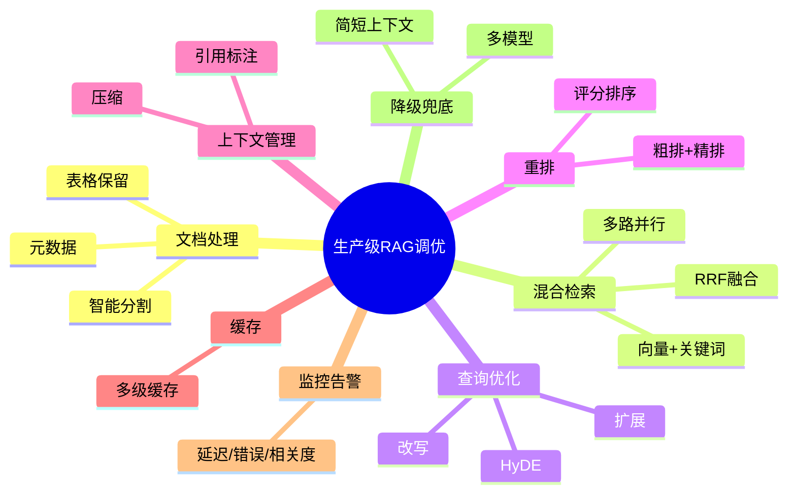
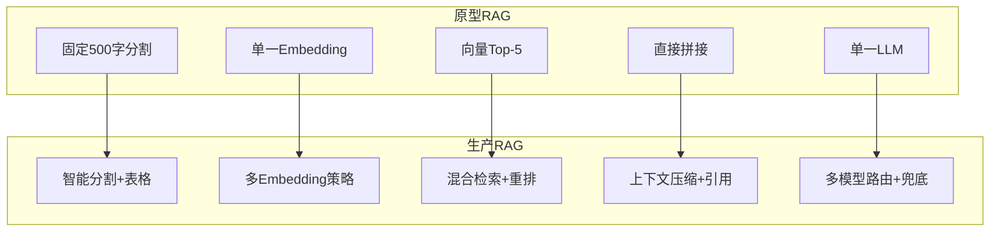
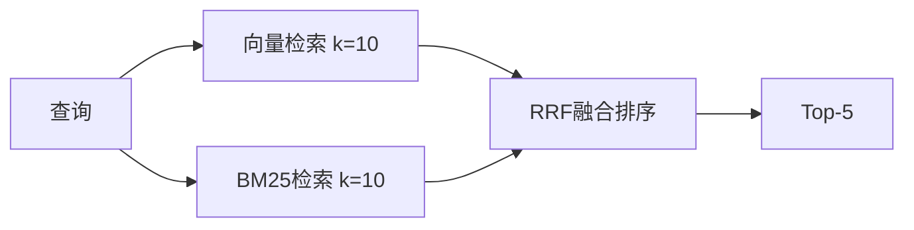
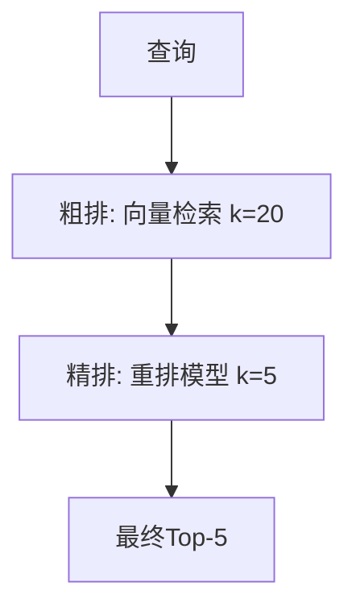
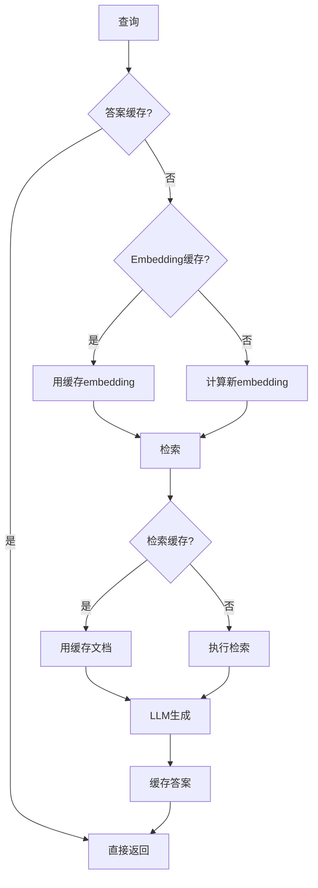
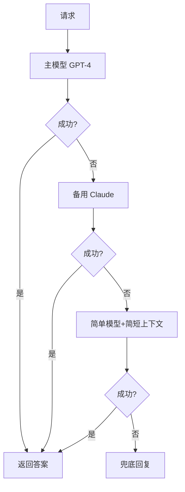

# 第32课：生产级 RAG 调优实战——让检索更专业

> **学习目标**：掌握从原型 RAG 到生产级 RAG 的关键调优技术
> **前置课程**：第31课 Agent评估 | **难度**：高级 | **预计学时**：45分钟

---

## 本课导航

你做了一个 RAG 原型，它"能跑"但"不好用"——回答不够准、太慢、偶尔出错、成本还高。

本课带你从原型走向生产级，让 RAG 真正好用。



---

## 一、原型 vs 生产级



| 维度 | 原型 | 生产级 |
|------|------|--------|
| 文档 | 固定分割 | 语义分割 |
| 检索 | 单一向量 | 混合检索 |
| 查询 | 原样使用 | 改写扩展 |
| 重排 | 无 | 粗排+精排 |
| 上下文 | 全量拼接 | 压缩+引用 |
| 监控 | 无 | 全链路追踪 |
| 兜底 | 无 | 多级降级 |

---

## 二、文档处理调优

### 问题：固定分割丢失语义

```
原文：表格"2024年Q1营收：硬件$200万，软件$150万"
固定分割：可能把表格切成两半！
```

### 解决：智能分割

```python
from langchain_text_splitters import (
    RecursiveCharacterTextSplitter,
    MarkdownHeaderTextSplitter
)

# 第一步：按标题结构分
md_splitter = MarkdownHeaderTextSplitter(
    headers_to_split_on=[
        ("#", "Section"),
        ("##", "Subsection"),
    ]
)

# 第二步：每个 section 内部再按语义分
char_splitter = RecursiveCharacterTextSplitter(
    chunk_size=500,
    chunk_overlap=50,
    # 按中文标点优先分割
    separators=["\n\n", "\n", "。", "！", "？", ".", " "],
)

# 流水线
sections = md_splitter.split_text(document)
chunks = []
for section in sections:
    chunks.extend(char_splitter.split_documents([section]))
```


---

## 三、混合检索：向量 + 关键词

### 为什么要混合？

| 检索方式 | 擅长 | 不擅长 |
|---------|------|--------|
| 向量 | 语义相似 | 精确匹配 |
| BM25 | 精确关键词 | 语义理解 |

**合起来效果最好。**

```python
from langchain_community.retrievers import BM25Retriever

class HybridRetriever:
    """混合检索"""
    
    def __init__(self, vector_store, docs):
        self.vector = vector_store.as_retriever(search_kwargs={"k": 10})
        self.bm25 = BM25Retriever.from_documents(docs)
        self.bm25.k = 10
    
    def invoke(self, query):
        # 向量检索
        vec_docs = self.vector.invoke(query)
        # 关键词检索
        bm25_docs = self.bm25.invoke(query)
        # RRF 融合
        return self.fuse(vec_docs, bm25_docs)[:5]
    
    def fuse(self, list_a, list_b, k=60):
        """Reciprocal Rank Fusion"""
        scores = {}
        for rank, doc in enumerate(list_a):
            key = doc.page_content[:50]
            scores[key] = scores.get(key, 0) + 1 / (k + rank + 1)
        for rank, doc in enumerate(list_b):
            key = doc.page_content[:50]
            scores[key] = scores.get(key, 0) + 0.7 / (k + rank + 1)
        
        all_docs = {d.page_content[:50]: d for d in list_a + list_b}
        sorted_keys = sorted(scores.keys(), key=lambda x: -scores[x])
        return [all_docs[k] for k in sorted_keys]
```



---

## 四、查询优化

### 用户问题不直接用来检索

用户问："那个能聊天的AI叫什么" → 直接检索效果差

优化后："AI聊天助手的名称" → 检索效果好

```python
class QueryOptimizer:
    """查询优化器"""
    
    def rewrite(self, query):
        """查询改写：消除歧义"""
        prompt = f"将以下问题改写为更清晰的检索查询: {query}"
        return llm.invoke(prompt).content
    
    def expand(self, query):
        """查询扩展：多个变体"""
        prompt = f"为以下查询生成3个不同角度的检索变体: {query}"
        result = llm.invoke(prompt).content
        variants = result.strip().split("\n")
        return [query] + [v.split(": ", 1)[-1] for v in variants]
    
    def hyde(self, query):
        """HyDE：用假设性回答做检索"""
        prompt = f"为以下问题写一段假设性回答: {query}"
        hypothetical = llm.invoke(prompt).content
        # 用假设性回答而非原问题做检索
        return vector_store.similarity_search(hypothetical, k=5)
```

| 技巧 | 原理 | 适合 |
|------|------|------|
| 改写 | 消除歧义 | 问题模糊 |
| 扩展 | 多角度覆盖 | 问题太窄 |
| HyDE | 用"假答案"检索 | 查询与文档风格差异大 |
| Step-Back | 抽象到更泛 | 问题太具体 |

---

## 五、重排：粗排+精排

### 两阶段检索



```python
class RerankPipeline:
    def retrieve_and_rerank(self, query, top_k=20, final_k=5):
        # 粗排：多取一些
        candidates = base_retriever.invoke(query)[:top_k]
        
        # 精排：LLM 打分
        scored = []
        for doc in candidates:
            prompt = f"文档与查询的相关性(0-10分):\n查询: {query}\n文档: {doc.page_content[:200]}"
            score = float(llm.invoke(prompt).content.strip() or "5")
            scored.append((doc, score))
        
        # 按分数排序取前5
        scored.sort(key=lambda x: -x[1])
        return [doc for doc, _ in scored[:final_k]]
```

---

## 六、上下文管理

### 压缩

检索到 10 个文档共 8000 字 → 直接拼接太长、太贵。

```python
class ContextCompressor:
    def compress(self, query, docs, max_tokens=2000):
        total = sum(len(d.page_content) for d in docs)
        budget = max_tokens * 4  # 粗略 1 token ≈ 4 字符
        
        if total <= budget:
            return docs  # 不用压缩
        
        # 按预算分配给每个文档
        per_doc = budget // len(docs)
        compressed = []
        for doc in docs:
            if len(doc.page_content) > per_doc:
                # 只保留含查询关键词的段落
                doc.page_content = self.extract_relevant(query, doc.page_content, per_doc)
            compressed.append(doc)
        return compressed
```

### 引用标注

```python
def add_citations(answer, sources):
    """给答案加引用来源"""
    citations = []
    for i, doc in enumerate(sources):
        src = doc.metadata.get("source", f"来源{i+1}")
        citations.append(f"[{i+1}] {src}")
    return answer + "\n\n参考:\n" + "\n".join(citations)
```


---

## 七、多级缓存



```python
import hashlib

class RAGCache:
    def __init__(self):
        self.answer_cache = {}    # 查询→答案
        self.embedding_cache = {} # 查询→embedding
        self.retrieval_cache = {} # 查询→文档
    
    def get_answer(self, query):
        return self.answer_cache.get(self._key(query))
    
    def set_answer(self, query, answer):
        self.answer_cache[self._key(query)] = answer
    
    def _key(self, text):
        return hashlib.md5(text.encode()).hexdigest()
```

---

## 八、监控与告警

| 指标 | 告警阈值 | 说明 |
|------|---------|------|
| 延迟 | > 5秒 | 用户等不及 |
| 错误率 | > 5% | 需排查 |
| 缓存命中率 | < 30% | 缓存策略差 |
| 检索相关度 | < 0.7 | 检索需调优 |
| Token消耗 | > 预算 | 需压缩 |

```python
class RAGMonitor:
    def __init__(self):
        self.metrics = {"count": 0, "avg_latency": 0, "errors": 0}
    
    def record(self, latency, error=False):
        n = self.metrics["count"] + 1
        self.metrics["count"] = n
        self.metrics["avg_latency"] = (
            self.metrics["avg_latency"] * (n-1) + latency
        ) / n
        if error:
            self.metrics["errors"] += 1
    
    def check_alerts(self):
        alerts = []
        if self.metrics["avg_latency"] > 5:
            alerts.append("HIGH_LATENCY")
        if self.metrics["errors"] / max(1, self.metrics["count"]) > 0.05:
            alerts.append("HIGH_ERROR_RATE")
        return alerts
```

---

## 九、降级兜底



```python
class FallbackRAG:
    def __init__(self, primary, fallback, simple):
        self.primary = primary
        self.fallback = fallback
        self.simple = simple
    
    def generate(self, query, context):
        # 第一级：主模型
        try:
            return self.safe_call(self.primary, query, context)
        except: pass
        
        # 第二级：备用模型
        try:
            return self.safe_call(self.fallback, query, context)
        except: pass
        
        # 第三级：简单模型+1个文档
        try:
            return self.safe_call(self.simple, query, context[:1])
        except: pass
        
        return "暂时无法处理，请稍后重试。"
```

---

## 十、本课小结

### 生产调优检查清单

| 检查项 | 你的系统 | 状态 |
|--------|---------|------|
| 智能分割 | 语义分割+表格保留 | □ |
| 混合检索 | 向量+BM25 | □ |
| 查询优化 | 改写/扩展/HyDE | □ |
| 重排 | 粗排+精排 | □ |
| 上下文压缩 | Token预算控制 | □ |
| 引用标注 | 标注来源 | □ |
| 多级缓存 | 答案+embedding+文档 | □ |
| 监控告警 | 延迟+错误+相关度 | □ |
| 降级兜底 | 多模型+简短上下文 | □ |
| 成本控制 | Token预算 | □ |

### 性能基线参考

| 指标 | 可接受 | 良好 | 优秀 |
|------|--------|------|------|
| 延迟 | < 5s | < 3s | < 1.5s |
| 准确率 | > 75% | > 88% | > 93% |
| 缓存命中 | > 20% | > 40% | > 60% |
| 错误率 | < 5% | < 2% | < 0.5% |

### 下一课预告

下一课学习 **自定义模型集成**——如何接入你自己的模型，实现模型路由和负载均衡。
