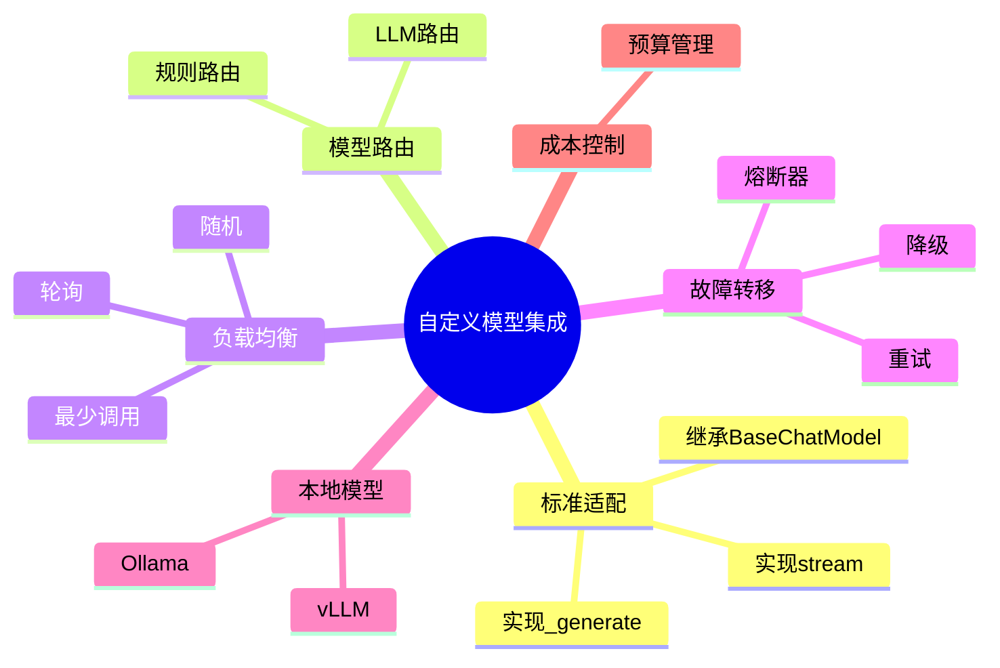
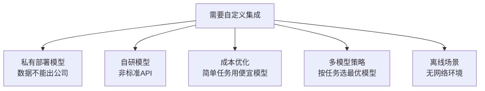
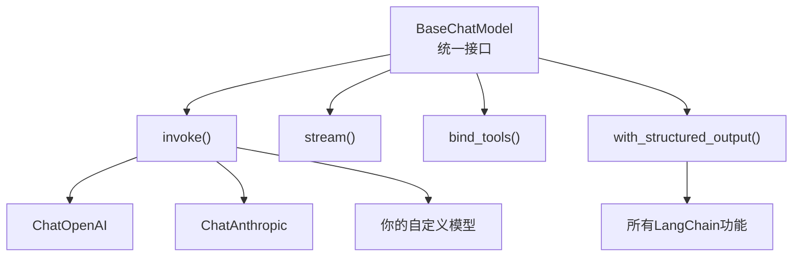
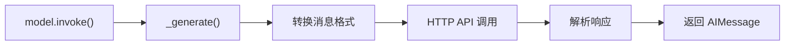
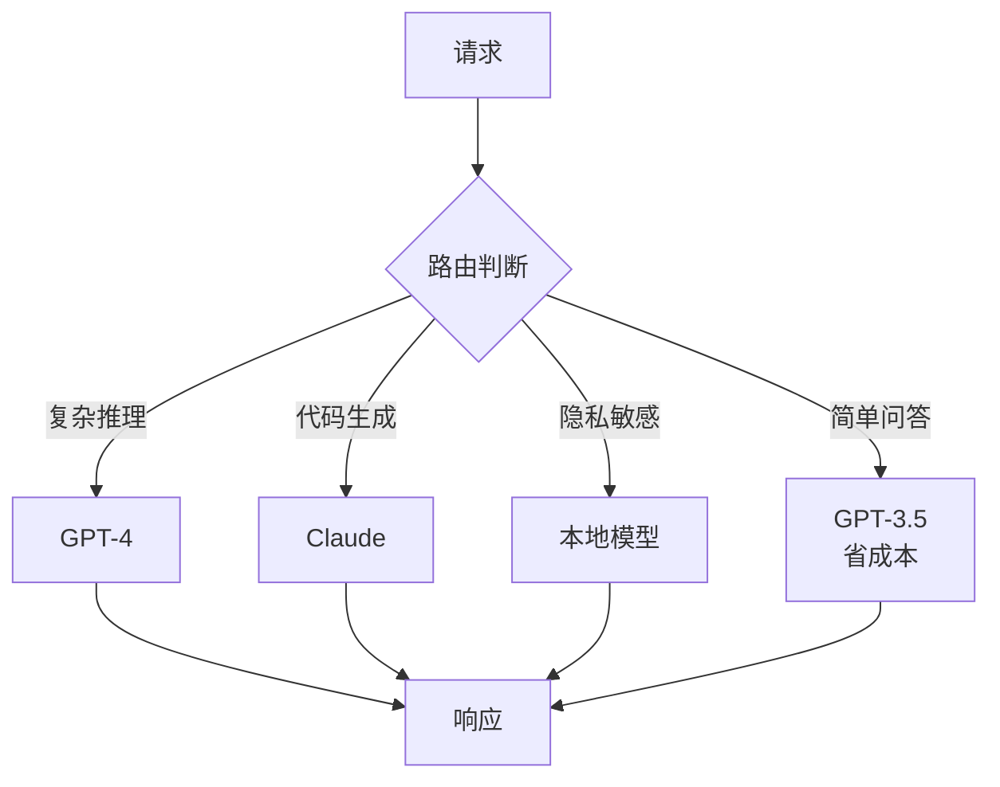
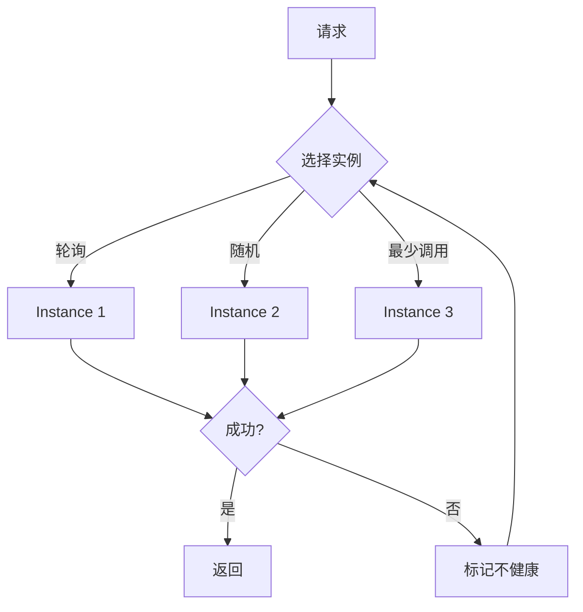
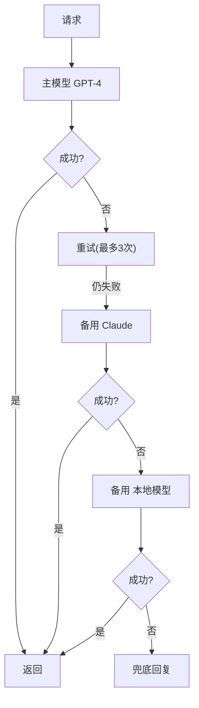
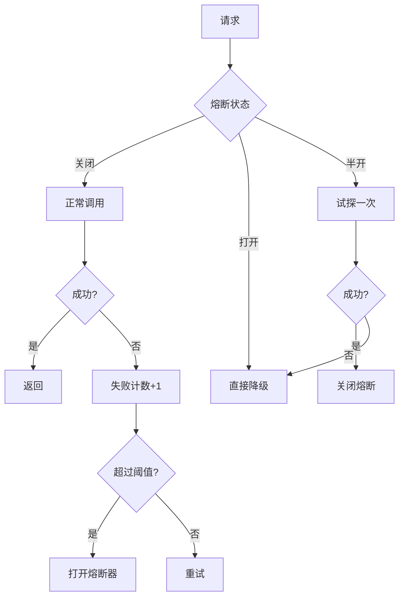
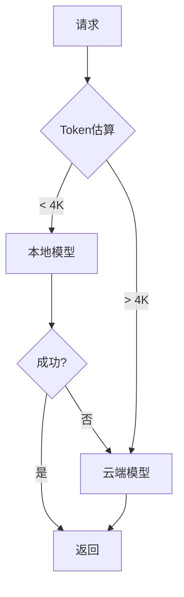
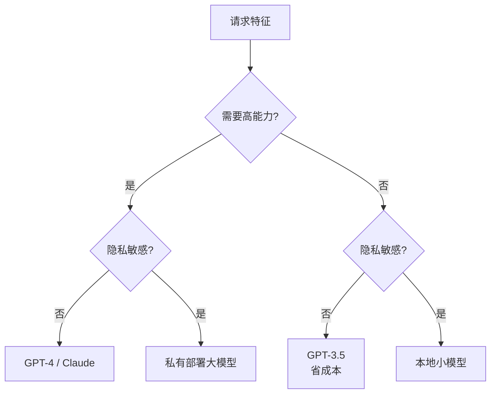

# 第33课：自定义模型集成——接入你自己的模型

> **学习目标**：学会将非标准模型接入 LangChain，实现模型路由、负载均衡和故障转移
> **前置课程**：第32课 生产级RAG调优 | **难度**：高级 | **预计学时**：40分钟

---

## 本课导航

LangChain 原生支持 OpenAI、Anthropic 等主流模型。但生产环境中，你可能需要接入：

- 私有部署的开源模型（Llama、Qwen 等）
- 自研的模型 API
- 第三方非标准接口
- 本地 vLLM/Ollama 服务

本课教你如何把这些模型统一接入 LangChain 生态。



---

## 一、为什么需要自定义模型集成？

### 常见场景



### LangChain 的标准接口

LangChain 所有聊天模型都继承 `BaseChatModel`，只要实现这个接口，就能用所有 LangChain 功能（链、Agent、工具调用等）。



---

## 二、实现自定义 ChatModel

### 最简实现

```python
from langchain_core.language_models import BaseChatModel
from langchain_core.messages import AIMessage, BaseMessage
from langchain_core.outputs import ChatGeneration, ChatResult
from typing import List, Optional, Dict, Any
import requests

class MyCustomModel(BaseChatModel):
    """自定义模型 - 接入任意 API"""
    
    # 配置参数（Pydantic 字段）
    api_url: str = "http://localhost:8080/v1/chat"
    api_key: str = ""
    model_name: str = "my-model"
    temperature: float = 0.7
    
    def _generate(self, messages, stop=None, run_manager=None, **kwargs):
        """核心方法：接收消息列表，返回生成结果"""
        
        # 1. 转换消息格式
        api_messages = []
        for msg in messages:
            role = {
                "human": "user",
                "ai": "assistant",
                "system": "system"
            }.get(msg.type, "user")
            api_messages.append({"role": role, "content": msg.content})
        
        # 2. 调用 API
        response = requests.post(
            self.api_url,
            headers={"Authorization": f"Bearer {self.api_key}"},
            json={
                "model": self.model_name,
                "messages": api_messages,
                "temperature": self.temperature,
            },
            timeout=30,
        )
        data = response.json()
        
        # 3. 构造返回
        content = data["choices"][0]["message"]["content"]
        return ChatResult(
            generations=[ChatGeneration(message=AIMessage(content=content))]
        )
    
    @property
    def _llm_type(self):
        return "my-custom-model"
    
    @property
    def _identifying_params(self):
        return {"model": self.model_name, "api_url": self.api_url}
```

### 使用方式

```python
# 和原生模型一样使用
model = MyCustomModel(
    api_url="http://localhost:8080/v1/chat",
    model_name="llama3-8b",
)

# 直接调用
response = model.invoke("你好")
print(response.content)

# 在链中使用
chain = model | StrOutputParser()
print(chain.invoke("写一首诗"))

# 绑定工具（需额外实现）
# agent = create_react_agent(model, tools)
```



---

## 三、流式实现

```python
from langchain_core.messages import AIMessageChunk
from langchain_core.outputs import ChatGenerationChunk
from typing import Iterator

class StreamingCustomModel(MyCustomModel):
    """支持流式输出"""
    
    def _stream(self, messages, stop=None, run_manager=None, **kwargs):
        api_messages = self._convert(messages)
        
        response = requests.post(
            self.api_url,
            headers={"Authorization": f"Bearer {self.api_key}"},
            json={
                "model": self.model_name,
                "messages": api_messages,
                "stream": True,  # 开启流式
            },
            stream=True,
            timeout=60,
        )
        
        for line in response.iter_lines():
            if line:
                text = line.decode("utf-8").replace("data: ", "")
                data = json.loads(text)
                content = data.get("choices", [{}])[0].get("delta", {}).get("content", "")
                if content:
                    yield ChatGenerationChunk(message=AIMessageChunk(content=content))
```

### 流式使用

```python
model = StreamingCustomModel()

# 逐字输出
for chunk in model.stream("讲个故事"):
    print(chunk.content, end="", flush=True)
```

---

## 四、模型路由

### 为什么要路由？

| 场景 | 最优模型 | 原因 |
|------|---------|------|
| 复杂推理 | GPT-4 | 推理能力强 |
| 代码生成 | Claude | 代码能力强 |
| 简单问答 | GPT-3.5 | 省钱 |
| 隐私数据 | 本地模型 | 数据不出内网 |



### 规则路由

```python
class ModelRouter:
    """基于规则的路由"""
    
    def __init__(self, models, rules):
        self.models = models  # {"gpt4": model, "local": model, ...}
        self.rules = rules    # [{"condition": fn, "model": "gpt4", "priority": 10}]
    
    def invoke(self, prompt, **kwargs):
        selected = self._route(prompt)
        return self.models[selected].invoke(prompt, **kwargs)
    
    def _route(self, prompt):
        text = prompt if isinstance(prompt, str) else str(prompt)
        # 按优先级检查规则
        for rule in sorted(self.rules, key=lambda r: -r.get("priority", 0)):
            if rule["condition"](text):
                return rule["model"]
        return "default"

# 创建路由器
router = ModelRouter(
    models={
        "gpt4": ChatOpenAI(model="gpt-4"),
        "gpt35": ChatOpenAI(model="gpt-3.5-turbo"),
        "local": MyCustomModel(api_url="http://localhost:8080/v1/chat"),
    },
    rules=[
        # 隐私数据用本地（最高优先级）
        {"condition": lambda p: any(kw in p for kw in ["密码", "密钥", "隐私"]),
         "model": "local", "priority": 20},
        # 复杂推理用 GPT-4
        {"condition": lambda p: any(kw in p for kw in ["分析", "推理", "推导"]),
         "model": "gpt4", "priority": 10},
        # 简单问答用 GPT-3.5
        {"condition": lambda p: len(p) < 50,
         "model": "gpt35", "priority": 5},
    ],
)
router.models["default"] = router.models["gpt35"]
```

### LLM 路由

更灵活的方式：让一个轻量 LLM 来决定用哪个模型。

```python
class LLMRouter:
    def __init__(self, router_llm, models):
        self.router_llm = router_llm  # 轻量模型做路由
        self.models = models
    
    def invoke(self, prompt, **kwargs):
        routing_prompt = f"""选择最适合的模型:
        可选: {list(self.models.keys())}
        请求: {prompt}
        只输出模型名:"""
        
        choice = self.router_llm.invoke(routing_prompt).content.strip()
        
        if choice in self.models:
            return self.models[choice].invoke(prompt, **kwargs)
        return self.models["default"].invoke(prompt, **kwargs)
```

---

## 五、负载均衡

多个模型实例分流，提高吞吐：

```python
import random
from collections import defaultdict

class LoadBalancer:
    def __init__(self, instances, strategy="round_robin"):
        self.instances = instances
        self.strategy = strategy
        self.idx = 0
        self.calls = defaultdict(int)
        self.healthy = {k: True for k in instances}
    
    def invoke(self, prompt, **kwargs):
        available = [k for k, h in self.healthy.items() if h]
        if not available:
            raise RuntimeError("No healthy instances")
        
        selected = self._select(available)
        self.calls[selected] += 1
        
        try:
            return self.instances[selected].invoke(prompt, **kwargs)
        except:
            self.healthy[selected] = False
            return self.invoke(prompt, **kwargs)  # 重试其他
    
    def _select(self, available):
        if self.strategy == "round_robin":
            name = available[self.idx % len(available)]
            self.idx += 1
            return name
        elif self.strategy == "random":
            return random.choice(available)
        elif self.strategy == "least_calls":
            return min(available, key=lambda k: self.calls[k])
```



---

## 六、故障转移与熔断

### 多级故障转移

```python
class FailoverManager:
    def __init__(self, primary, fallbacks, max_retries=3):
        self.primary = primary
        self.fallbacks = fallbacks
        self.max_retries = max_retries
    
    def invoke(self, prompt, **kwargs):
        models = [self.primary] + self.fallbacks
        
        for model in models:
            for attempt in range(self.max_retries):
                try:
                    return model.invoke(prompt, **kwargs)
                except Exception as e:
                    if attempt < self.max_retries - 1:
                        time.sleep(1 * (attempt + 1))
        
        return AIMessage(content="服务暂时不可用，请稍后重试。")
```



### 熔断器

连续失败到阈值后直接短路，不再尝试：



---

## 七、本地模型集成

### Ollama（最简单）

```python
from langchain_community.chat_models import ChatOllama

# 启动 Ollama 服务后
local_model = ChatOllama(
    base_url="http://localhost:11434",
    model="llama3:8b",
    temperature=0.7,
)

# 用法和原生模型完全一样
response = local_model.invoke("你好")
```

### vLLM（OpenAI 兼容）

```python
from langchain_openai import ChatOpenAI

# vLLM 启动后提供 OpenAI 兼容 API
vllm_model = ChatOpenAI(
    base_url="http://localhost:8000/v1",
    api_key="EMPTY",  # vLLM 不需要真实 key
    model="meta-llama/Meta-Llama-3-8B-Instruct",
)

# 加入路由
router = ModelRouter(
    models={"local": vllm_model, "cloud": ChatOpenAI(model="gpt-4")},
    rules=[{"condition": lambda p: True, "model": "local", "priority": 1}],
)
```

### 本地优先策略

```python
class HybridStrategy:
    """本地优先，云端兜底"""
    
    def __init__(self, local, cloud, max_local_tokens=4096):
        self.local = local
        self.cloud = cloud
        self.max_tokens = max_local_tokens
    
    def invoke(self, prompt, **kwargs):
        estimated = len(prompt) // 4  # 粗略估算
        
        if estimated <= self.max_tokens:
            try:
                return self.local.invoke(prompt, **kwargs)
            except:
                pass  # 本地失败走云端
        
        return self.cloud.invoke(prompt, **kwargs)
```



---

## 八、成本控制

| 模型 | 输入$/1K | 输出$/1K | 适合 |
|------|---------|---------|------|
| GPT-4 | 0.03 | 0.06 | 复杂推理 |
| GPT-3.5 | 0.0015 | 0.002 | 日常问答 |
| Claude | 0.003 | 0.015 | 代码生成 |
| 本地 | 0 | 0 | 隐私/省钱 |

```python
class CostController:
    COST_PER_1K = {
        "gpt-4": {"in": 0.03, "out": 0.06},
        "gpt-3.5": {"in": 0.0015, "out": 0.002},
    }
    
    def __init__(self, daily_budget=10.0):
        self.budget = daily_budget
        self.spent = 0.0
    
    def estimate(self, model, in_tokens, out_tokens):
        rates = self.COST_PER_1K.get(model, {"in": 0.01, "out": 0.02})
        return (in_tokens/1000*rates["in"]) + (out_tokens/1000*rates["out"])
    
    def check(self, estimated_cost):
        return self.spent + estimated_cost <= self.budget
    
    def record(self, cost):
        self.spent += cost
```

---

## 九、本课小结

### 集成最佳实践



### 你学到了什么

1. **自定义 ChatModel**：继承 BaseChatModel，实现 `_generate`
2. **流式适配**：实现 `_stream` 支持逐字输出
3. **模型路由**：规则路由 + LLM 路由
4. **负载均衡**：轮询/随机/最少调用
5. **故障转移**：多级 fallback + 熔断器
6. **本地模型**：Ollama/vLLM 接入
7. **成本控制**：按需选模型，预算管理

### 课程系列回顾

到这里，33 课的核心内容全部讲完！从零基础到生产级部署，你已经掌握了 LangChain + LangGraph 的完整知识体系。附录中还有 LangServe 部署、测试策略等实用指南，建议按需阅读。
