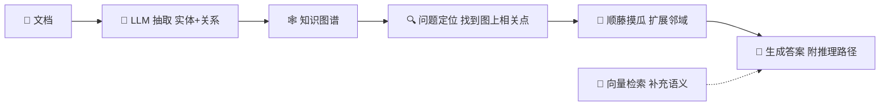

# 第34课 GraphRAG——让检索长出一张"知识网"

> 课程定位：学习课程第 34 课 · v8.0 · 37 课完整版系列
> 配套知识库：知识库/30_GraphRAG 知识图谱增强检索技术手册
> 本课导航：3 个为什么 → 1 张全景图 → 3 步上手 → 1 个对照实验 → 小结与练习

---

## 一、先问三个"为什么"

**为什么之前学的向量检索还不够？**

想象你有一摞公司公告。向量检索像"按意思找段落"：你问"A 公司和 B 公司什么关系"，它会分别找出提到 A 的段落、提到 B 的段落——但它们之间的**连线**没有回答。

**为什么需要知识图谱？**

知识图谱像一张**关系网**：每个公司是点，投资、隶属、合作是线。回答"什么关系"时，只要顺着线走几步就知道了，还能顺便告诉你"这条线上的证据"——这是向量检索做不到的。

**为什么用 LLM 来建图？**

人工建图太慢。LLM 读文档后能提取"谁-什么关系-谁"，然后自动写进图数据库。你只需要把规则定清楚（允许抽哪些类型的点、哪些类型的线），剩下的交给模型。

---

## 二、一张图看懂 GraphRAG



类比生活：**知识图谱是人物关系图，向量检索是日记全文搜索。** 问"谁认识谁"用关系图，问"日记里写过什么"用搜索——GraphRAG 就是两个一起用。

---

## 三、三步上手

### 第 1 步：定义"点和线"的类型（本体）

```python
allowed_nodes = ["Company", "Person", "Product"]
allowed_rels = ["FOUNDED_BY", "INVESTED_IN", "PART_OF"]
```

创业类比：先定好"游戏里有哪些角色、哪些动作"，LLM 才不会乱抽。

### 第 2 步：让 LLM 抽取并写入图数据库

```python
transformer = LLMGraphTransformer(llm=llm,
                                  allowed_nodes=allowed_nodes,
                                  allowed_rels=allowed_rels)
graph_documents = transformer.convert_to_graph_documents(documents)
graph.add_graph_documents(graph_documents)
```

### 第 3 步：回答问题时"图 + 向量"双通道

```python
# 通道1：图上顺藤摸瓜
graph_hits = graph.query("MATCH (e)-[r]-(n) WHERE e.name CONTAINS $q RETURN ...")
# 通道2：向量找相似段落
vec_hits = vector_store.similarity_search(question, k=6)
# 融合后交给 LLM 生成
```

---

## 四、做个对照实验

同一批"公司关系"语料，分别跑：
1. 纯向量 RAG：问"X 公司和 Y 公司有资本关联吗？"
2. GraphRAG：同上

典型结果：向量 RAG 要么说"没有直接证据"，要么把两段提到 X、Y 的文字拼在一起含糊其辞；GraphRAG 会给出"X 由 A 基金投资，A 基金持有 Y 股份，因此 X 与 Y 存在间接关联"，并列出这条路径。

**关键结论**：关系密集型问题，图谱通道是决定性的；单点事实问题，两者差不多。所以在生产里"双通道融合 + 路由"是性价比最高的组合。

---

## 五、常见坑与提醒

| 坑 | 提醒 |
| --- | --- |
| 不定义本体就抽取 | 图谱会无限膨胀、质量失控 |
| 一上来建全量图谱 | 先 100 篇小规模试跑，人工抽查 50 条 |
| 忘了给实体建索引 | 查询变全表扫描，秒级变分钟级 |
| 只用图不用向量 | 单点事实问题丢失（图上没抽到的信息） |

---

## 六、小结与练习

**本课要点**：
- 知识图谱 = 实体（点）+ 关系（线）+ 属性
- GraphRAG = 图谱检索 + 向量检索双通道融合
- 本体定义决定抽取质量；社区摘要解决全局性问题

**动手练习**：
1. 准备 20 篇公司新闻，定义本体（3 类实体、3 类关系）
2. 用 LLMGraphTransformer 抽取并存入 Neo4j
3. 写 3 个多跳问题（如"投资 X 的公司还投资了谁"），验证图谱能答
4. 对照纯向量 RAG，记录两类问题的正确率差异

**完成标准**：能画出手绘版 GraphRAG 架构图，并解释"为什么图通道能给出推理路径"。

**下一步**：第 35 课——让 Agent 学会写代码。