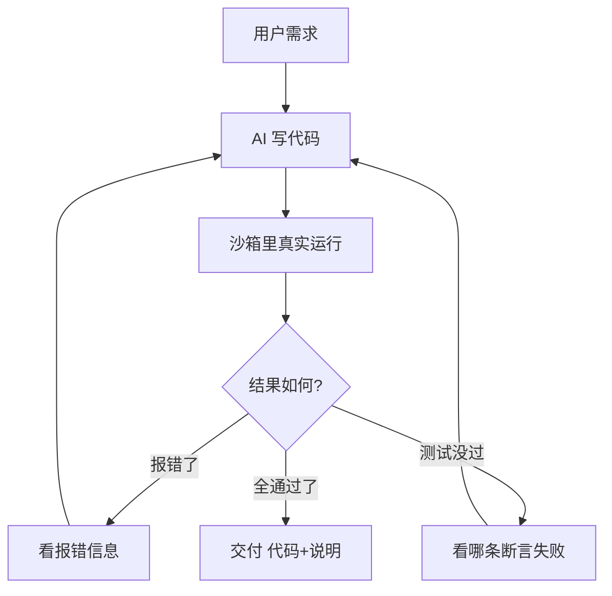

# 第35课 代码 Agent——教 AI 写代码、跑代码、改代码

> 课程定位：学习课程第 35 课 · v8.0 · 37 课完整版系列
> 配套知识库：知识库/31_代码 Agent 开发技术手册
> 本课导航：1 个心智模型 → 核心循环拆解 → 安全沙箱 → 测试驱动 → 小结与练习

---

## 一、一个心智模型：把代码 Agent 想成"带反馈的实习生"

传统 AI 聊天是"知识丰富的顾问"：你说什么它回什么，错了也认不出来。代码 Agent 更像**实习生**：它写完代码要**真的跑一遍**，跑错了看报错，改完再跑，直到通过。

```
顾问模式：  你说 → AI 说（无法验证对错）
实习生模式：你说 → AI 写代码 → 真实运行 → 看结果 → 改 → 再跑 → 通过 ✅
```

核心金句：**"AI 的幻觉，由运行环境来纠错。"** 代码 Agent 强就强在它有一个"会说实话的裁判"——执行器。

---

## 二、核心循环拆解



四个角色缺一不可：
- **生成器**（AI）：把需求翻译成代码
- **执行器**（沙箱）：真实运行，给出铁面无私的反馈
- **测试器**（pytest）：提前定义"什么叫做对"
- **终止阀**（轮次上限）：防止 AI 无限改下去烧钱

---

## 三、为什么必须用沙箱

AI 写的代码你不敢直接在本机跑——它可能：
- 删除文件、读取你的私密配置
- 写死循环占满 CPU
- 悄悄联网外传数据

**所以让它在一次性容器里跑：**

```bash
docker run --rm --network none --memory 512m --cpus 1 python:3.12-slim python main.py
```

```
所以让它在**一次性容器**里跑：
```bash
docker run --rm --network none --memory 512m --cpus 1 python:3.12-slim python main.py
```

类比：**让实习生在隔离实验室里做实验，而不是直接在你的生产服务器上操作。** 关网络（--network none）、限资源、用完即焚（--rm）。

---

## 四、测试驱动：定义"什么叫做对"

没有测试，AI 说"我写好了"你无法判断。有了测试，一切以结果说话：

```python
# 需求：写一个函数，把字符串反转
def test_reverse():
    assert reverse("abc") == "cba"   # 期望行为写清楚
    assert reverse("") == ""         # 边界情况
```

流程：
1. AI 根据需求**先写测试**（把需求翻译成断言）
2. AI 写实现
3. 跑测试 → 失败清单 = 改进指令
4. 循环直到全绿

改进技巧：报错信息要**截短**（只回传最近 3-5 条失败和 stderr 尾部），不然 AI 的上下文会被淹没；同时记录"已经试过什么方案"，防止原地打转。

---

## 五、上下文管理：AI 的"工作台"

写代码项目时 AI 无法把整个工程塞进上下文。工程做法：
- 只给它看**符号表**（函数名、签名），需要时再读具体函数
- 报错只传**关键片段**
- 最多循环 3-5 轮，超了就回退到上一个稳定版本

---

## 六、小结与练习

**本课要点**：
- 代码 Agent = 生成 + 执行 + 测试 + 修复的闭环
- 沙箱隔离是安全底线（关网络、限资源、用完即焚）
- 测试是唯一可信的"做对了"的标准
- 控制上下文与轮次，防止失控

**动手练习**（零基础友好版）：
1. 本地建一个目录，写一个 `sandbox.py`：用 `subprocess` 跑子进程并设定 `timeout=10`
2. 让 AI 生成"把 CSV 中的数字列求和"的代码 + 测试
3. 手动把测试改成错误断言，观察 Agent 一轮一轮改到对
4. 给代码加 `try/except`，看看反馈循环是否失效，思考为什么

**完成标准**：能画出"生成-执行-反馈"闭环，并说清沙箱三要素。

**下一步**：第 36 课——用时间旅行调试 LangGraph 应用。