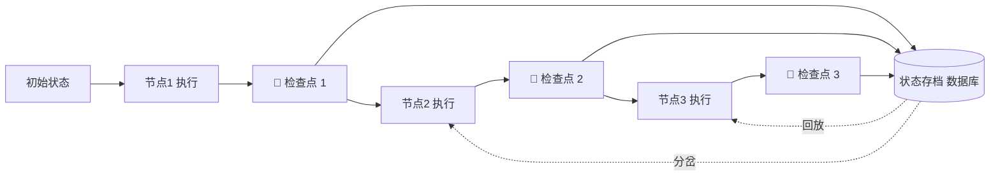
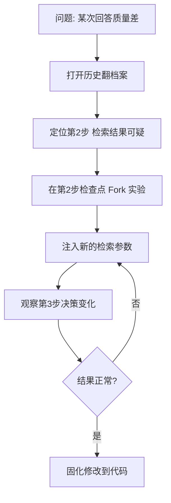

# 第36课 LangGraph 调试——给 AI 应用装一个"时间机器"

> 课程定位：学习课程第 36 课 · v8.0 · 37 课完整版系列
> 配套知识库：知识库/32_时间旅行与 LangGraph 调试技术手册
> 本课导航：为什么需要"后悔药" → 检查点原理 → 三个神操作 → 实战演示 → 小结与练习

---

## 一、为什么需要"后悔药"

你的 LangGraph 应用跑一个任务，中间要调用 5 次大模型、3 次外部 API，每次都要花钱花时间。突然第 3 步出错：

- 整个重跑一遍？太贵。
- 想知道第 2 步是怎么算的？没有记录。
- 想试试"第 2 步换个写法会怎样"？现应用改不动。

如果应用有个**时间机器**就好了：

| 你想要的 | 时间机器的名字 |
| --- | --- |
| 从出错前一步重新跑 | 回放（Replay） |
| 在历史某点分岔出一条新路径做实验 | 分支（Fork） |
| 翻看每一步留下的状态快照 | 检查点（Checkpoint） |

LangGraph 的检查点机制就是这架时间机器——**做完每一步，自动存一张状态快照**。

---

## 二、检查点原理：每步留痕



类比：**游戏存档。** 每个检查点像一次存档——读档（回放）能回到存档时刻；分岔就像在存档处开了一条新的剧情线，不影响原来的存档。

启用代码只需一行：

```python
app = graph.compile(checkpointer=SqliteSaver.from_conn_string("checkpoints.sqlite"))
```

关键概念：
- `thread_id`：一次对话/任务的"档案柜编号"
- `checkpoint_id`：具体某一步的"存档编号"

---

## 三、三个神操作

### 操作1：翻档案（get_state_history）

```python
for s in app.get_state_history({"configurable": {"thread_id": "user-123"}}):
    print(s.values)
```

用途：审计"这个回答是基于哪些中间状态得出的"。

### 操作2：回放（Replay）—— 从历史某步重跑

```python
app.invoke({}, {"configurable": {"thread_id": "user-123",
                                  "checkpoint_id": "目标存档编号"}})
```

特点：存档点**之前**的步骤不重跑（省钱省时），从存档点之后重新执行。

### 操作3：分支（Fork）—— 分岔做实验

```python
app.invoke({"override": {"检索方式": "改写后的策略"}},
           {"configurable": {"thread_id": "user-123",
                             "checkpoint_id": "分岔点存档编号"}})
```

特点：像 Git 开分支，实验结果是**新的一支**，不影响原历史。

---

## 四、实战演示：一次完整的错误调试



调试纪律（重要）：
1. **动手前先记下当前存档编号**——随时能退回
2. **一次只改一个变量**——知道是什么导致的变化
3. **分支实验用独立编号**——别污染线上历史

---

## 五、容易踩的坑

| 坑 | 避开方法 |
| --- | --- |
| 忘了开检查点 | `compile(checkpointer=...)` 必加 |
| 检查点无限增长 | 配置保留策略，定期清理 |
| 状态里有密钥 | 敏感字段不持久化 |
| 实验污染线上记录 | Fork 用独立 thread_id |

---

## 六、小结与练习

**本课要点**：
- 检查点 = 每步存档；thread_id 找会话，checkpoint_id 找步骤
- 回放：从历史某步重跑，不重跑前面步骤
- 分支：在历史某点开新线做实验，不影响原历史
- 调试纪律：先存档、小步改、独立编号

**动手练习**：
1. 用第 26 课的知识搭一个 3 节点小图（意图→检索→生成）
2. 开启 SqliteSaver 检查点，跑两次不同问题
3. 用 `get_state_history` 打印全部检查点，找到第二次运行的中间步骤
4. 在"检索"节点处 Fork，override 检索结果，对比生成答案的差异
5. 故意把某节点写错，用 Replay 从错误前一步重放，验证不重复执行前面节点

**完成标准**：能准确说出 Replay 和 Fork 的区别，并亲自完成一次"Fork 后答案改变"的演示。

**下一步**：第 37 课——Agentic RAG，让检索自己动脑子。