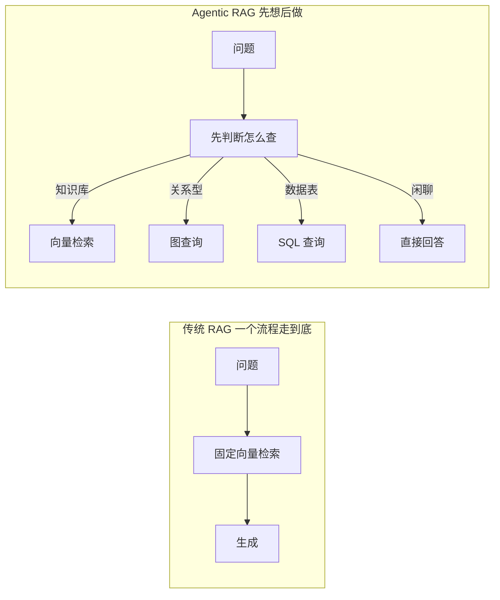
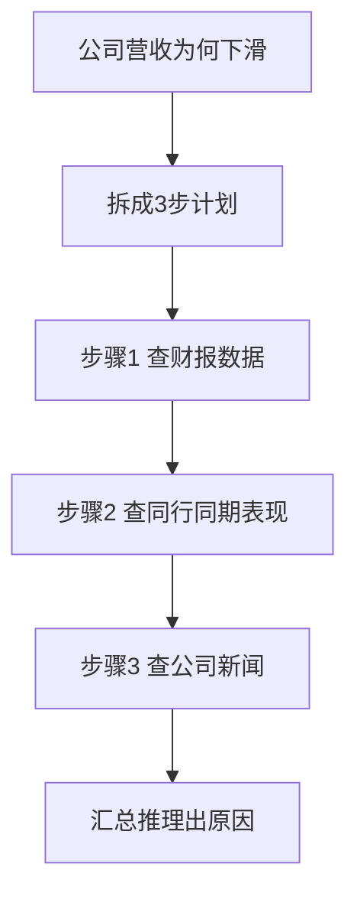
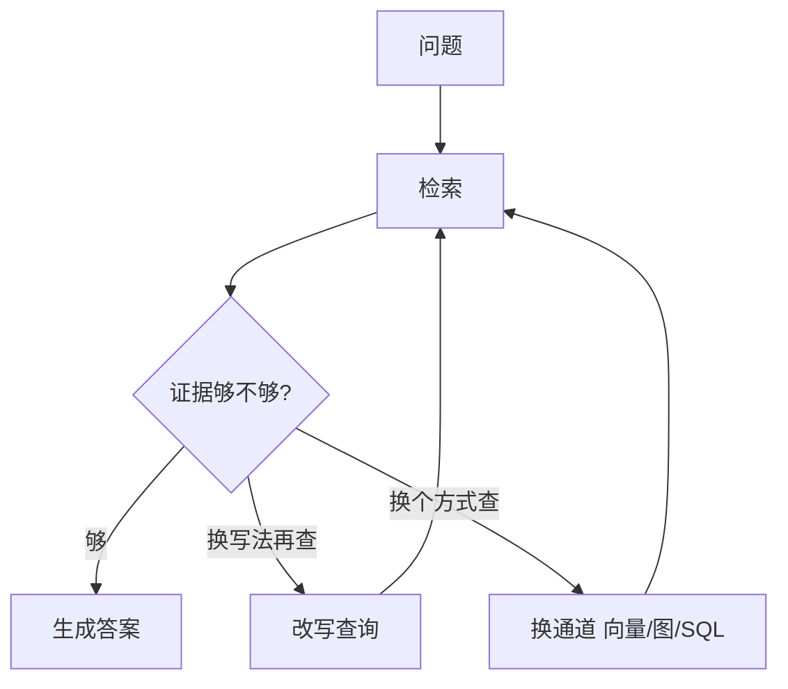

# 第37课 Agentic RAG——让检索自己"动脑子"

> 课程定位：学习课程第 37 课 · v8.0 · 37 课完整版系列（知识库主线课程收官课）
> 配套知识库：知识库/33_Agentic RAG 自主检索技术手册
> 本课导航：从"流水线"到"自主决策" → 三种超能力 → 用图实现 → 成本与上线 → 小结与练习

---

## 一、从"流水线"到"自主决策"

还记得第 20 课学的 RAG 吗？固定三步：检索 → 拼接 → 生成。它有个问题：**对什么问题都走同一套流程**。



一句话：**传统 RAG 是"问一次查一次答一次"，Agentic RAG 是"边查边想，不够再查"。**

（纠正：Agentic RAG 的拼写是 Agentic RAG，即"智能代理式 RAG"。）

---

## 二、三种超能力

### 超能力1：路由（Router）—— 问题走对通道

不同的问法走不同的"门"：

| 问题类型 | 走哪扇门 |
| --- | --- |
| "露娜 8 的拍摄参数？"（明确名词） | 关键词/向量检索 |
| "两家公司是什么关系？" | 知识图谱查询 |
| "Q3 销售额是多少？"（表格数据） | SQL 查询 |
| "你好，今天天气不错"（闲聊） | 直接回答，不检索 |

实现：一个小 LLM 当"门卫"，把问题分类，然后走对应通道。

### 超能力2：规划（Planner）—— 复杂问题拆步骤



### 超能力3：反思（Reflector）—— 不够就重来



---

## 三、用 LangGraph 实现（状态机思想）

三种能力组合成一个图：

```python
class State(TypedDict):
    question: str
    attempts: int
    evidence: list

MAX_ATTEMPTS = 3    # 最多反思重试3次

def should_continue(state):
    if state["attempts"] >= MAX_ATTEMPTS:
        return "end"        # 尽力了，如实告知
    if len(state["evidence"]) < 2:
        return "rewrite"    # 证据不足再查一次
    return "generate"

builder.add_node("analyze", analyze_node)
builder.add_node("retrieve", retrieve_node)
builder.add_node("evaluate", evaluate_node)
builder.add_conditional_edges("evaluate", should_continue,
    {"rewrite": "rewrite", "generate": "generate", "end": END})
```

上图是逻辑骨架（伪代码风格、非可直接运行），真实可运行代码请看知识库篇 33「Agentic RAG 自主检索技术手册」第 3 节。

**设计要点**：路由/评估用轻量小模型（便宜快），生成用强模型（质量高）——把"决定"和"创作"分开。

---

## 四、成本与上线：别让 Agent 放飞

| 问题 | 对策 |
| --- | --- |
| Agent 反复重试烧钱 | 设最大轮次 3、token 预算 |
| 结果重复查询 | 检索结果加缓存 |
| 决策太慢 | 决策用轻量模型 |
| Agent 出错没退路 | 降级链路：Agent 故障回退固定 RAG |

上线检查三连问：
1. **会不会死循环？** → 轮次上限 + 预算
2. **有没有退路？** → 降级链路
3. **有没有记录？** → 每次路由/反思留日志便于调优

---

## 五、小结与练习

**本课要点**：
- Agentic RAG = 路由 + 规划 + 反思，在 RAG 外面加一层"决策脑"
- 路由让问题走对通道；规划拆解复杂问题；反思让检索不足时自救
- LangGraph 用条件边实现反思循环，必须设终止条件
- 成本控制：决策用小模型、检索加缓存、设预算

**动手练习**：
1. 在你已有的 RAG 项目加一个路由节点：识别"需要 SQL 的问题"
2. 给检索结果加评估函数（数量阈值即可），实现"不够就重写查询"
3. 在 LangGraph 里把 above 流程画成图，加入尝试次数上限
4. 构造 10 个混合问题测路由准确率，记录结果

**完成标准**：能用自己的话解释"路由、规划、反思"三者差异，并在代码中实现一条反思重试路径。

---

## 六、收官寄语

37 课到此结束。回顾整条路：从 Prompt、LLM、Retriever 一步步搭起，到 LangGraph 的状态机、多 Agent、代码 Agent、GraphRAG、Agentic RAG——你已经掌握了从"写一个链"到"搭一套自主系统"的完整图景。

**下一步建议**：
- 重做附录 E 端到端实战，加入 Agentic RAG 与检查点
- 用附录 L 测试策略给你的系统配评估集
- 持续关注 LangChain 官方文档，新技术会继续演进

（本课为知识库主线收官课；附录 M/N 仍会继续补充工具向内容。）