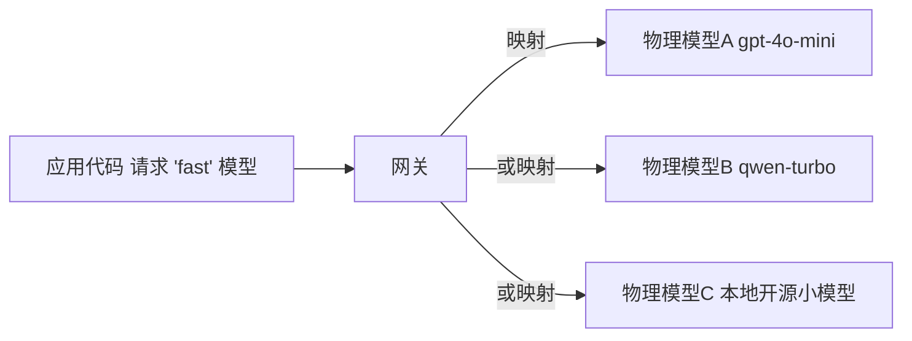

# 第39课 LLM 网关——多模型统一调度入门

> 课程定位：学习课程第 39 课 · v9.0 · 41 课完整版系列
> 配套知识库：知识库/35_多租户 LLM 网关与统一接入架构手册
> 本课导航：为什么需要网关 → 关键概念 → 三步搭建 → 成本控制 → 小结与练习

---

## 一、一个比喻：LLM 网关是"电力公司的总电表 + 配电柜"

你家里不会直接从发电厂拉线——中间有变电站、电表、配电箱。多模型时代也一样：

```
没网关:  每个应用各自接 OpenAI、Claude、文心…… 谁用了多少电没人知道
有网关:  所有应用统一接一个口子，配电、计费、限流都在这道口子管
```

想象一下公司里有 10 个团队做 AI 应用：
- 有的想用 GPT-4o，有的想用 Claude，有的想用开源模型
- 每个团队自己去申请 API Key、自己记账、自己处理故障

太乱了。网关把这一切收拢：**应用只跟网关打交道，模型由网关统一调度**。

---

## 二、核心要搞懂的一件事：逻辑模型名 vs 物理模型名

这是网关最重要的设计思想。



- **逻辑模型名**（`fast`、`reasoning`、`code`）：应用写死在代码里的名字
- **物理模型名**（`gpt-4o`、`claude-3-5-sonnet`）：真实调用哪个模型

应用永远只写逻辑名。某天你想把"fast"从 A 模型换成更便宜的 B 模型——**只改网关配置，不用动任何应用代码**。这就是解耦的力量。

---

## 三、三步搭建你的第一个网关

### 第 1 步：定义模型路由配置

```yaml
# gateway_config.yaml 示意
models:
  fast:
    provider: openai
    model: gpt-4o-mini
    fallback: qwen-turbo        # 挂了自动切换
  reasoning:
    provider: anthropic
    model: claude-3-5-sonnet
  code:
    provider: local
    model: deepseek-coder       # 本地部署

tenants:
  team-a: { rpm: 600, daily_cost_cap: 500 }
  team-b: { rpm: 100, daily_cost_cap: 100 }
```

### 第 2 步：暴露统一接口（OpenAI 兼容）

所有应用都按 OpenAI 的格式调用网关，网关内部翻译成各供应商的格式。好处：**LangChain 不用改一行代码**，只需把 `base_url` 指向网关。

```python
from langchain_openai import ChatOpenAI

# 应用侧：一行改动，从此只认网关
llm = ChatOpenAI(
    base_url="http://localhost:8000/v1",   # 指向本地网关
    api_key="租户密钥",
    model="fast",        # 逻辑模型名!
)
```

### 第 3 步：配限流 + 降级

```python
def gateway_call(model_tag, messages, tenant):
    if not quota_ok(tenant):         # 限流/配额
        return quota_error(tenant)
    for provider in resolve(model_tag):   # 包含 fallback 链
        try:
            return provider.call(messages)
        except ProviderError:
            log_fallback(provider)
            continue                    # 换下一个
    return service_unavailable()
```

---

## 四、省钱三招

1. **语义缓存**：相同问题不重复调用模型，直接返回缓存答案（相似度 95% 命中）
2. **分级路由**：简单问题走小模型（便宜），难题才走大模型
3. **成本封顶**：每个团队设每日费用上限，超过自动拒绝——防刷量也防失控

---

## 五、小结与练习

**本课要点**：
- 网关统一入口：应用与模型解耦，换模型不改代码
- 逻辑模型名 / 物理模型名分离是核心设计
- 三大职责：路由（用哪个模型）、治理（限流配额）、观测（成本计量）
- 降级链、语义缓存、成本封顶是省钱三件套

**动手练习**：
1. 搭建一个最小网关（可用 LiteLLM 或自写 FastAPI 代理）
2. 定义 3 个逻辑模型名，各映射 2 个物理模型（含 fallback）
3. 用 LangChain 的 `base_url` 指向网关，验证一行代码接入成功
4. 模拟主模型故障，验证自动切换到 fallback
5. 给两个租户配不同配额，验证超限被拒

**完成标准**：能画出门控路由图；能演示"应用代码不变、网关换模型"。

**下一步**：第 40 课——上下文工程，把最贵的记忆管好。