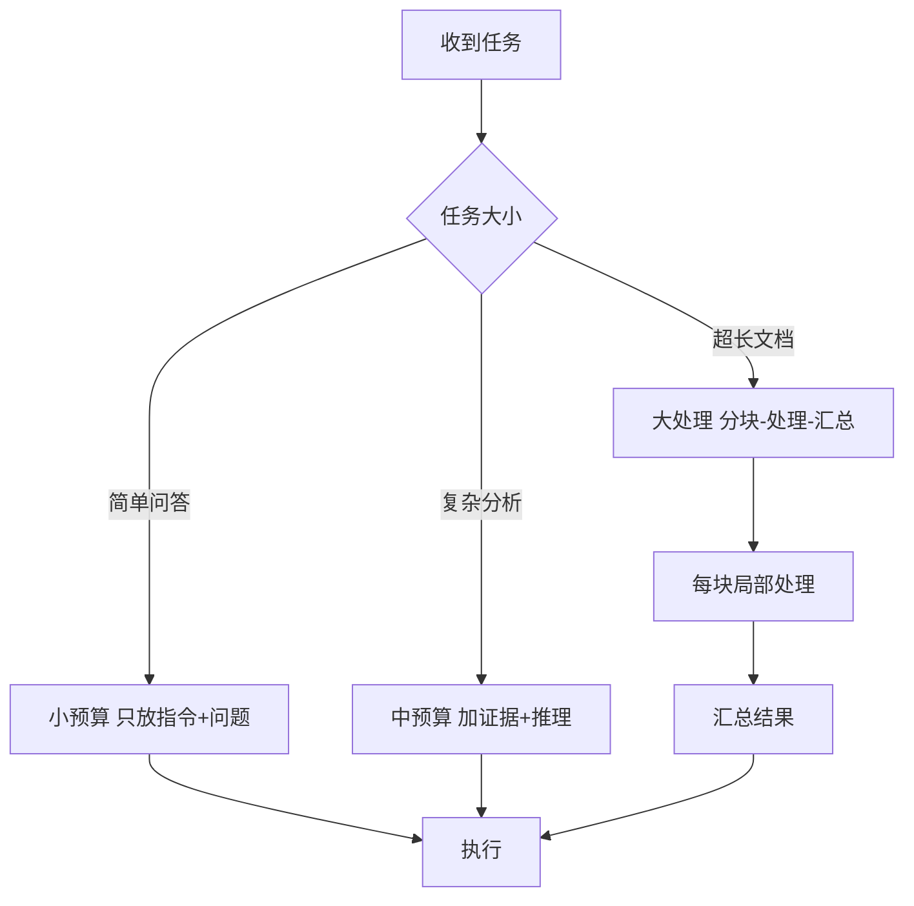

# 第40课 上下文工程——把最贵的"记忆"管好

> 课程定位：学习课程第 40 课 · v9.0 · 41 课完整版系列
> 配套知识库：知识库/36_上下文工程与长上下文优化技术手册
> 本课导航：一个直觉 → 三个管理动作 → 一条组装口诀 → 动手练习 → 小结

---

## 一、一个直觉：上下文是你的"工作台"

想象你在写文章，桌上只能摆 10 张纸：

- 摆系统提示（写作要求）——最重要的纸，放最中间
- 摆用户要求（题目）——第二重要
- 摆参考材料（证据）——有用的放近处
- 摆聊天记录（历史）——旧的收进文件夹，要用再翻

桌上空间 = **上下文窗口**；每张纸 = **一段内容**；纸上有字 = **token**。而 token 是要花钱的（就是这么贵的"桌子"）。

**上下文工程就是：决定在有限的桌子上摆什么、怎么摆、旧纸怎么办。**

经典研究发现：模型对**开头和结尾**记得最牢，中间容易"看不见"——这叫 Lost in the Middle。所以排序很重要。

---

## 二、三个管理动作

### 动作1：压缩——旧纸收进文件夹

对话太长怎么办？把旧内容浓缩成摘要：

```python
# 核心一个动作: 近8轮保留原文, 更早的压缩成摘要
recent = history[-8:]                 # 近的原文
old_summary = llm.invoke(f"把以下对话压缩成要点:\n{history[:-8]}")
context = old_summary + recent
```

记住：**摘要会丢细节**，所以"近原文 + 远摘要"混合，而不是全摘要。

### 动作2：注入——重要的放前面

不看上下文的模型几乎没有；但排错了位置效果差很多。按重要性排序：

```
第1位: 系统指令 + 任务定义
第2位: 用户当前问题
第3位: 关键约束（格式、红线）
第4位: 检索证据（按重排分数从高到低）
第5位: 历史对话（可压缩）
```

### 动作3：规划——该塞多少就塞多少



超长文档**不要整篇硬塞**（又贵又容易淹没关键信息）——先分块各处理，再汇总。

---

## 三、一条组装口诀（背下来）

**每段进上下文的内容，先回答四个问题：**
1. 它服务当前哪个任务？（不服务就不进）
2. 它是最新最准的版本吗？（去重）
3. 它的信息密度够高吗？（能摘要就摘要）
4. 它该放在第几位？（重要前置）

```python
def build_context(system, question, evidence, history):
    parts = [
        ("系统", system),                    # 第1位
        ("任务", question),                  # 第2位
        ("约束", "仅基于证据回答，不确定要明说"),  # 第3位
        ("证据", sort_by_relevance(evidence)[:5]), # 第4位
        ("历史", recent_then_summary(history)),    # 第5位
    ]
    return format(parts)
```

---

## 四、动手练习

1. 打开你之前的 RAG 项目，打印每次请求的实际 token 数，按"系统/证据/历史"分类统计，画出占比
2. 把证据从"全量塞入"改成"按重排分数取前 5 + 截断"，对比答案质量
3. 给对话加"近 8 轮原文 + 更早摘要"的压缩策略，观察长对话表现
4. 故意把关键信息放在中间，验证 Lost in the Middle 现象（可对比前后位置）

**完成标准**：能说出上下文预算公式、排序原则、三类管理动作，并完成一次"压缩后效果对比"实验。

---

## 五、小结

- 上下文 = 有限且计费的资源，要主动管理
- 三个动作：压缩（远近混合）、注入（重要前置）、规划（按需配给）
- 超长文档走"分块-处理-汇总"，不硬塞大窗口
- 大窗口不是免死金牌：管理比窗口大更重要

**下一步**：第 41 课——幻觉检测，让 AI 学会"说实话"。