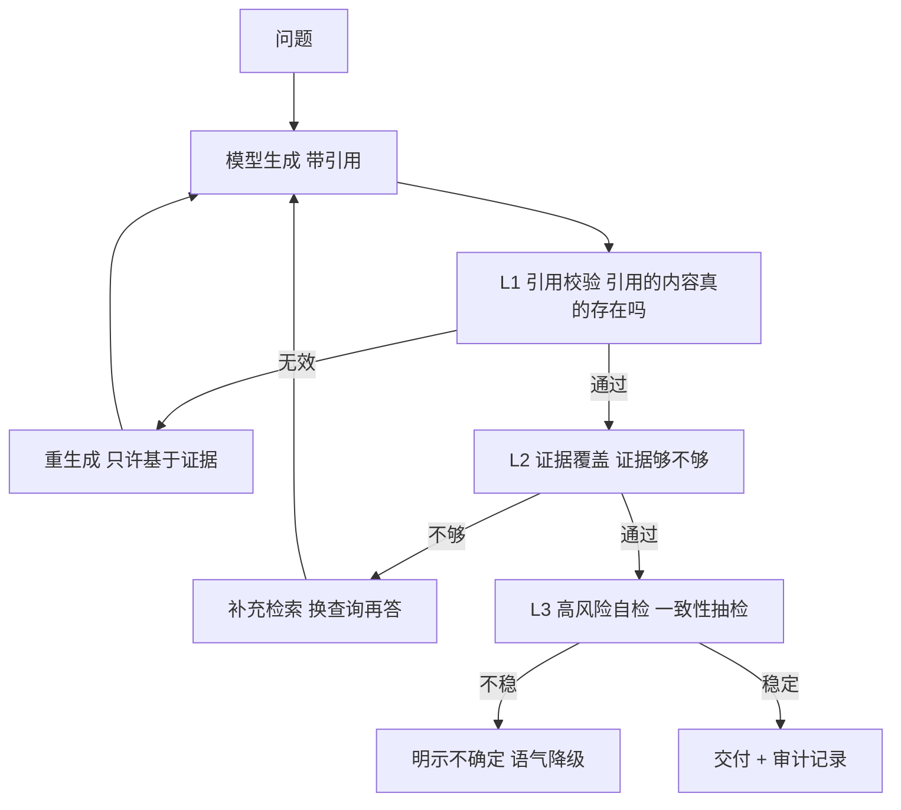

# 第41课 幻觉检测——让 AI 学会"说实话"

> 课程定位：学习课程第 41 课 · v9.0 · 41 课完整版系列（本轮主线收官课）
> 配套知识库：知识库/37_幻觉检测与可靠性工程技术手册
> 本课导航：幻觉的本质 → 两个实战检测法 → 检测-拦截-兜底链路 → 动手练习 → 小结

---

## 一、幻觉是什么？为什么 AI 会"一本正经地胡说八道"？

幻觉 = 模型生成**看似合理、实则无据**的内容。

它不是"模型故意撒谎"，而是机制使然：**模型本质是概率续写器**，按"最像人话的下一个词"生成，而不是查完事实再回答。训练数据里没有的知识，它也会自信地"编"出来。

打个比方：模型像一位**记忆力超强但从不查证的实习生**——你问它不知道的事，它不会说"不知道"，而是基于见过的类似信息**推测**一个合理答案，而且语气还特别笃定。

关键认知转变：

```
❌ 目标: 让 AI 永远不犯错（不可能）
✅ 目标: 让 AI 犯错时能被发现、被拦截、有兜底（可做到）
```

---

## 二、两个必须会用的检测法

### 检测法1：证据对照（最实用，RAG 必备）

答案必须能"追溯到证据"。实现 = 让一个"事实核查器"角色检查：

```python
verifier = PromptTemplate.from_template("""
你是事实核查器。逐条判断答案中的论断是否被证据支持。
证据: {evidence}
答案: {answer}
输出每条: 论断 | 支持程度(完全/部分/无) | 证据出处
""") | llm
```

结果怎么用：

| 核查结果 | 动作 |
| --- | --- |
| 全部支持 | 放心交付 |
| 部分支持 | 标出"基于部分证据" |
| 无支持占比高 | 触发重生成 / 补充检索 |
| 引用无效 | 强制重写，命中断言"只基于证据回答" |

### 检测法2：自一致性（高风险问题用）

同一个问题让模型**独立回答 5 次**，如果答案高度一致→可信；七嘴八舌→不可信。

```python
answers = [llm.invoke(question) for _ in range(5)]
similar = count_semantically_same(answers)     # 算出几成一致
if similar / 5 < 0.6:
    flag("回答不稳定，需要人工复核")
```

代价是 5 次调用，所以**只在高风险环节用**（合同条款、医疗建议、财务数字）。

---

## 三、检测 → 拦截 → 兜底完整链路



**最后一道兜底（最重要）**：允许模型说"我不知道"。

```python
# Prompt 里明确允许承认无知
SAFE_PROMPT = "基于提供的证据回答。如果证据不足以回答，直接回答'资料中没有相关信息'，不要推测。"
```

为什么重要：**"明说不知道"是可接受的最低质量；"自信地胡说"是最高危害。** 允许说不知道，幻觉率会显著下降。

---

## 四、动手练习（给 AI 上"测谎仪"）

1. 造一个"幻觉测试集"（5 条有证据支持的 + 5 条证据不足的），跑你的 RAG
2. 实现 L1 引用校验：检查回答里的引用编号是否都真实存在
3. 实现 L2 证据覆盖评判器，统计"无支持论断"占比
4. 对比两种 Prompt 的幻觉率：强制生成 vs 允许说不知道
5. 高价值问题跑一次自一致性（5 次采样），记录一致性分数

**完成标准**：能画出"检测-拦截-兜底"链路；验证"允许说不知道"降低了幻觉率。

---

## 五、小结与收官寄语

**本课要点**：
- 幻觉无法根除，但可检测（证据对照、自一致性）、可拦截（重生成）、可兜底（允许说不知道）
- 强制引用 + 证据核查双层检测是 RAG 可靠性基石
- 主动降级语气、明示不确定，好过自信犯错

**41 课收官语**：从第一课搭环境，到现在你能讨论 Agent 安全、LLM 网关、上下文工程和幻觉检测——你已具备从"写链"到"运营一个可靠的 AI 系统"的完整视野。真正的成长在动手：把课程里的练习做过三遍，把附录的检查清单抄进自己的项目。

**下一步建议**：重跑附录E端到端实战（把第38-41课的安全、网关、上下文、防幻觉全部融入）；继续读附录 O/P 补充工程能力。