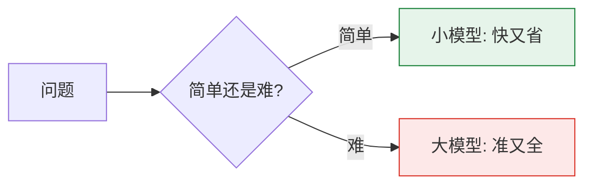

# 第42课 让AI应用跑得更快更省：性能优化入门

> 系列：LangChain / LangGraph 系统学习 · 第 42 课（v10.0 第十轮）
> 定位：教学引导 — 类比、动手练习、检查清单
> 上节课回顾：第 41 课我们学会了如何用幻觉检测让 AI"说实话"。
> 本节课你将学会：为什么 AI 应用慢、钱花在哪、以及三个立刻见效的优化招。

## 导航（本课大纲）

1. 一个比喻：餐厅出菜与 AI 出答案
2. 先体检：三个瓶颈一眼找
3. 动手优化：加缓存、开流式、换小模型
4. 练习与自测
5. 小结

## 1 一个比喻：餐厅出菜与 AI 出答案

想象一家餐厅。客人点菜，后厨从备菜、炒菜到上桌需要 5 分钟——这就是**延迟**（Latency）；一晚上能接待 100 桌——这就是**吞吐**（Throughput）；买食材花的钱——这就是**成本**（Cost）。

AI 应用完全一样：你问一句，模型从收到、思考到逐字吐出来，就是一次"出菜"。想让它更快，只有三条路：**减少工作量、加快每步、或者雇更便宜的大厨**。

## 2 先体检：三个瓶颈一眼找

别一上来就优化，先回答三个问题：

| 体检项 | 怎么查 | 常见病 |
| --- | --- | --- |
| 首字慢 | 数一数"第一个字几秒出现" | 没开流式（TTFT 长） |
| 整体慢 | 看整段回答耗时 | 上下文塞太多、串行调用 |
| 花钱多 | 看账单/token 统计 | 全用大模型、重复请求没缓存 |

**口诀：先量一量，再动手。**

## 3 动手优化：三招立刻见效

### 招 1：加缓存（把重复问题"记下来"）

同样的"公司年假制度是什么？"，100 个人问 100 遍，就付 100 次钱。加一行缓存，第二次开始免费：

```python
from langchain_core.caches import InMemoryCache
from langchain_core.globals import set_llm_cache

set_llm_cache(InMemoryCache())  # 相同问题直接命中，不再调模型
```

试试看：连续问两次同一个问题，感受第二次的秒回。

### 招 2：开流式（把 3 秒变成"打字机"）

人感受不到 3 秒，但感受得到"逐字往外蹦"。把 `invoke` 换成 `stream`，首字 0.3 秒就出现：

```python
for chunk in llm.stream("用一句话介绍向量数据库"):
    print(chunk.content, end="", flush=True)
```

### 招 3：换小模型（把钱花在刀刃上）

不是所有问题都需要旗舰模型：

- 简单分类、抽取 → 用小模型（便宜 10 倍）；
- 复杂推理、长文创作 → 才用大模型；
- 用网关/路由（第 39 课）自动分流，人工零干预。



## 4 练习与自测

**练习 1（3 分钟）**：把上节课（第 41 课）的幻觉检测链改成流式输出，观察首字延迟变化。

**练习 2（5 分钟）**：给你的助手应用加上缓存，连续追问 10 个相同问题，对比第 1 次与第 10 次的花费（没有账单就看速度）。

**练习 3（思考题）**：一个客服机器人每天被问"退款流程是什么"2 万次。按 2 万次 × 每次 500 token 算，加缓存后一天能省多少钱？（提示：按你实际使用的模型单价估算。）

**自测题**：
- TTFT 和 TPOT 分别对应餐厅流程的哪一步？
- 为什么流式不能减少成本，却能改善体验？
- 什么情况下"换小模型"会翻车？

## 5 小结

- 性能 = 延迟 / 吞吐 / 成本三角，先定目标再优化；
- 三招立等见效：**缓存、流式、小模型路由**；
- 更深入的工程手段（量化、投机解码、并行图）见知识库 38。

> 下一课：第 43 课《查字典还是上培训班——微调与 RAG 怎么选》。