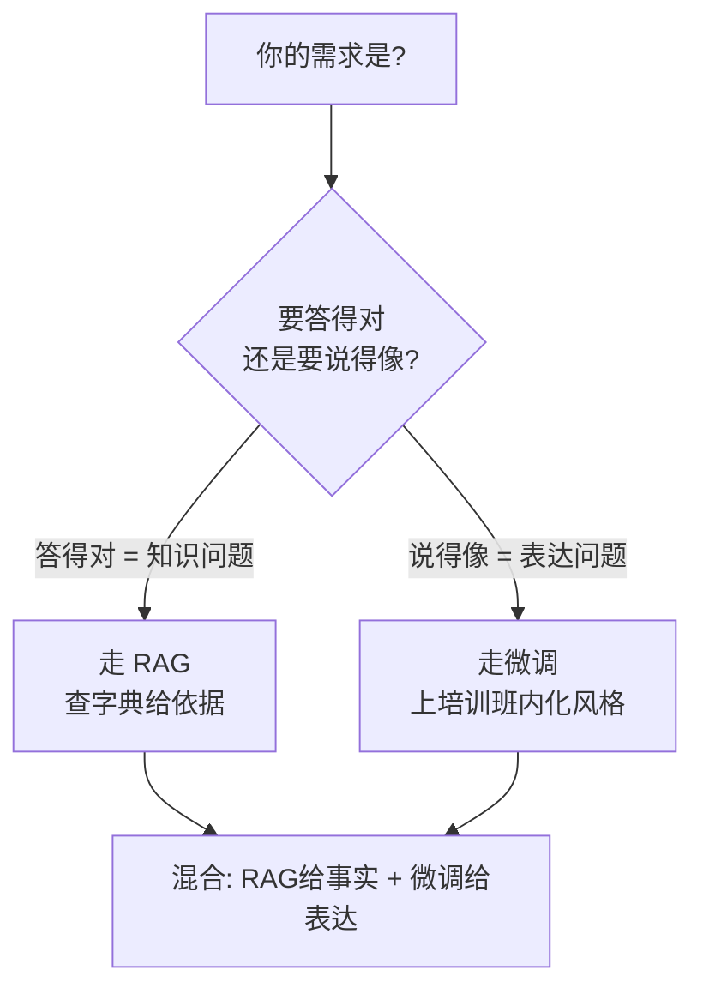

# 第43课 查字典还是上培训班：微调与RAG怎么选

> 系列：LangChain / LangGraph 系统学习 · 第 43 课（v10.0 第十轮）
> 定位：教学引导 — 类比、对比表、决策口诀
> 上节课回顾：第 42 课我们学会了三招性能优化。
> 本节课你将学会：区分"查字典"（RAG）和"上培训班"（微调），并知道什么时候该组合使用。

## 导航（本课大纲）

1. 一个比喻：两种让自己变专业的方式
2. 一张对比表看清区别
3. 决策口诀：问事实 vs 学表达
4. 动手任务：先跑通 RAG 再评估要不要微调
5. 小结

## 1 一个比喻：两种让自己变专业的方式

假设你是公司新人，要做一名"政策咨询专家"，有两条路：

- **查字典（RAG）**：工位上放一套完整规章制度，遇到问题翻原文、引用原文回答——**知识在外部，随时可更新**；
- **上培训班（微调）**：花几周集中培训，把规章内化成自己的习惯——**知识在脑子里，说话更专业，但知识一变就得重新培训**。

两者不冲突：你完全可以"平时查字典 + 培训表达方式"。

## 2 一张对比表看清区别

| 维度 | RAG（查字典） | 微调（上培训班） |
| --- | --- | --- |
| 知识更新 | 换文档即可，秒级 | 要重新训练，天级 |
| 回答依据 | 可引用出处，可追溯 | 凭"内化"回答，难追溯 |
| 成本 | 每次检索 + 生成 | 一次性训练 + 部署 |
| 擅长 | 知识问答、事实查询 | 语气风格、领域术语、格式 |
| 短板 | 检索不到就答不好 | 知识容易过时 |

## 3 决策口诀

**口诀三句**：
1. 问**事实** → 查字典（RAG）；
2. 学**表达** → 上培训班（微调）；
3. 先字典后培训，**永远先用 RAG**。

## 4 一个容易混的点：什么时候微调有用？

记住这条重要判断：

> 如果检索出来的文档是对的，但模型写的答案语气不像你们公司的人——该微调了。
> 如果模型根本搜不到对的文档——微调救不了，那是检索管线的问题。

换个说法：**微调解决"表达"，不解决"找不找得到"**。

## 5 动手任务：7 步小项目

**任务**：为你虚构的"宠物医院客服"做一个混合版助手。

1. 用第 13 课的 RAG 链，接入 5 份宠物护理文档（基础事实层）；
2. 观察回答的语气是否"够温柔专业"；
3. 记录 3 个"答案对但语气不对"的例子；
4. 假装微调：在提示词里加一段"请用温和专业的客服语气回答"（模拟微调效果）；
5. 对比前后回答，填写一个简单的 0-5 分语气评分表；
6. 思考：如果真去微调，你需要收集什么数据？（提示：好/坏回答对）
7. 结论记录到你的学习笔记："本项目适合 RAG + 提示词即可，暂时不需要真微调"。

**自测题**：
- 公司制度每周更新，该选 RAG 还是微调？为什么？
- LoRA 是什么？（提示：只训练一小块增量权重，见知识库 39）
- 微调后模型答错旧知识，最可能的原因是什么？

## 6 小结

- RAG 管"知识"，微调管"表达"，长上下文管"一次性大文档"；
- **先跑 RAG，再按需微调**，永远用统一评测集说话；
- 微调首选 LoRA/QLoRA，成本可控、可插拔。

> 下一课：第 44 课《让 AI 看懂世界：多模态入门》。