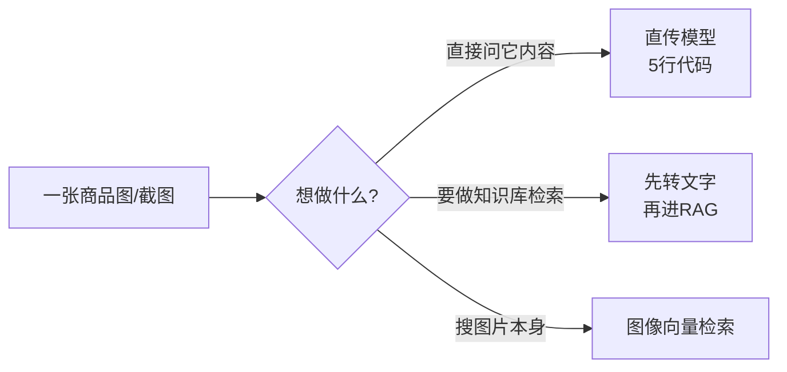
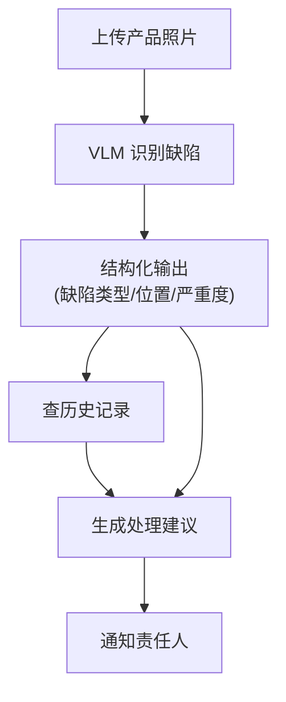

# 第44课 让AI看懂世界：多模态入门

> 系列：LangChain / LangGraph 系统学习 · 第 44 课（v10.0 第十轮）
> 定位：教学引导 — 类比、动手练习、案例
> 上节课回顾：第 43 课我们学会了 RAG 与微调怎么选。
> 本节课你将学会：让 AI 看图、看表、听懂话的三条路，以及怎么在 LangChain 里传一张图。

## 导航（本课大纲）

1. 一个比喻：给助手配上一双眼睛
2. 三条路：直传、转述、检索
3. 动手：5 行代码让 AI 看图
4. 进阶案例：视觉质检 Agent
5. 练习与小结

## 1 一个比喻：给助手配上一双眼睛

这之前的 AI 助手像个"盲人顾问"：你只能把一切信息念给它听。**多模态**就是给它装上眼睛和耳朵——现在它能直接看图说话、看表读数、听懂语音。

什么时候用得着？客服要看用户上传的截图、质检要看生产线照片、档案管理员要搜扫描件里的表格。这些场景，正是"会看"的价值所在。

## 2 三条路：直传、转述、检索

| 路线 | 一句话理解 | 什么时候用 |
| --- | --- | --- |
| 直传（原生多模态） | 把图直接丢给模型看 | 看图问答、图表理解 |
| 转述 | 先让 AI 把图文写成文字再入库 | 想复用已有的文本 RAG |
| 检索（ColPali 类） | 整页图直接向量化搜索 | 扫描件、复杂表格检索 |



## 3 动手：5 行代码让 AI 看图

用支持视觉的多模态模型，把图片作为第二条消息传进去：

```python
from langchain_openai import ChatOpenAI

llm = ChatOpenAI(model="gpt-4o", max_tokens=300)

回答 = llm.invoke([
    {"type": "text", "text": "这张截图里有什么错误提示？用一句话总结。"},
    {"type": "image_url", "image_url": {"url": "你的图片URL或base64"}},
])
print(回答.content)
```

**动手练习**：找一张报错截图（比如软件安装失败的提示），用上面代码问出错误原因；再换一张图表截图，问它"哪个季度销量最高"。

> 小提示：本地图片转 base64 再传：`data:image/png;base64,<编码内容>`。

## 4 进阶案例：视觉质检 Agent

一家工厂想让 AI 帮忙检查产品图片。完整链路是一个 LangGraph 状态机：



你在第 38-40 课学过的所有东西都在这里串起来了：多模态调用（本课）、结构化输出（KB18）、检索（KB16/33）、LangGraph 状态机（KB26/29）。

## 5 练习与小结

**练习**：为"宠物医院"做一个看图助手——用户上传宠物照片，AI 判断"猫/狗/其他"并给出初步护理建议。用 3 条路分别实现（直传 / 转述进 RAG / 检索），对比效果与成本。

**自测题**：
- 转述路线最大的损失是什么？（提示：图表里的精确数字）
- 为什么扫描件 PDF 用 ColPali 类检索比普通切块好？
- 图像 token 很贵，你会怎么省？（提示：缩图/先粗筛再精读）

**小结**：
- 三条路：直传、转述、检索，按场景选；
- ️VLM 看图 + 结构化输出 + Agent 工具 = ️多模态 Agent；
- 视觉幻觉与成本是两大坑，评估集和压缩手段要跟上。

> 下一课：第 45 课《毕业实战：从 0 到 1 ️的完整项目》（主线索收官课）。