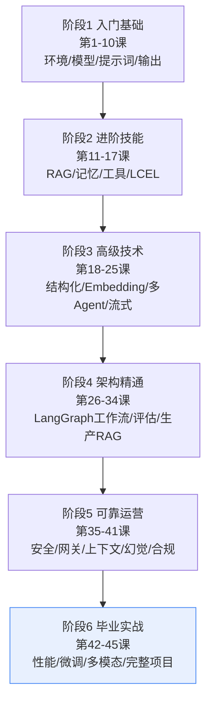
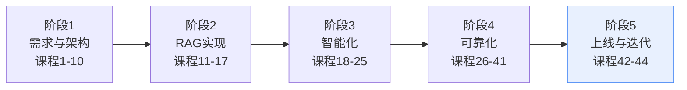

# 第45课 毕业实战：从0到1的完整项目（收官课）

> 系列：LangChain / LangGraph 系统学习 · 第 45 课（v10.0 第十轮收官课）
> 定位：教学引导 — 总复习、毕业项目路线图、通关清单
> 上节课回顾：第 44 课我们让 AI 看懂了世界。
> 本节课目标：把 1-44 课的知识连成一条线，独立完成一个"从 0 到 1"的完整 AI 应用。

## 导航（本课大纲）

1. 总复习：一张图看完全部 45 课
2. 毕业项目：企业内部知识问答 Agent
3. 五阶段通关路线图
4. 结业寄语与下一步

## 1 总复习：一张图看完全部 45 课

回顾每阶段的"一句话收获"：

| 阶段 | 你掌握的核心能力 | 代表课 |
| --- | --- | --- |
| 入门基础 | 能用 LangChain 调模型、写链 | 第 1-10 课 |
| 进阶技能 | 能做检索问答、会用工具与记忆 | 第 11-17 课 |
| 高级技术 | 能驾驭结构化输出、多 Agent、流式 | 第 18-25 课 |
| 架构精通 | 能设计 LangGraph 状态机与生产 RAG | 第 26-34 课 |
| 可靠运营 | 知道怎么让应用安全、省钱、可信 | 第 35-41 课 |
| 毕业实战 | 能独立交付一个完整应用 | 本课 |

## 2 毕业项目：企业内部知识问答 Agent

**项目需求**（虚构）：为一家公司做"制度问答 Agent"——员工问年假、报销、考勤，Agent 给答案、给出处、有礼貌。

**验收标准**：
- 答案必须能溯源到具体制度条款；
- 敏感问题（薪资明细查询他人）必须拒绝；
- 每天 2 万次咨询，成本可控；
- 答错的能快速定位与修正。

## 3 五阶段通关路线图

**阶段 1：需求与架构（用第 1-10 课）**

- [ ] 画出数据流向与功能清单
- [ ] 选模型：按任务分级（第 42 课思路）
- [ ] 设计三条链：问答链、工具链、兜底链

**阶段 2：RAG 实现（用第 11-17 课）**

- [ ] 制度文档切块 + 向量化（KB16）
- [ ] 检索 + 重排（KB17/28）
- [ ] 引用来源带出处（KB09 评估）

**阶段 3：智能化（用第 18-25 课）**

- [ ] 结构化输出：意图识别路由（KB18）
- [ ] 记忆：多轮对话上下文（KB23）
- [ ] 工具：查日历 / 请假状态查询（KB22）

**阶段 4：可靠化（用第 26-41 课）**

- [ ] LangGraph 状态机：路由 → 检索 → 生成 → 检测（KB26/29）
- [ ] 安全：提示注入防护、敏感问题拒答（KB34）
- [ ] 幻觉检测：证据核查层（KB37）
- [ ] 合规：脱敏 + 日志留痕 + 三版本记录（KB41）

**阶段 5：上线与迭代（用第 42-44 课）**

- [ ] 缓存 + 流式 + 小模型路由（KB38）
- [ ] 监控告警：QPS / 延迟 / 错误率（附录 O）
- [ ] 上线检查清单逐项打勾（附录 Q）
- [ ] 反例回流：答错的进评测集，持续改进（KB39 数据飞轮思路）

## 4 结业寄语与下一步

45 课走下来，你完成的不是"看过文档"，而是建立了一张完整的决策地图：**知道什么问题用哪套技术、为什么、怎么验证**。

接下来的三条进阶路线，任选其一深入：

1. **工程路线**：把毕业项目部署上线（LangServe、LangGraph 云），做真实压测与成本优化；
2. **研究路线**：追踪 RAG 前沿（Self-RAG、GraphRAG 深化）、Agent 推理（ReAct 变体、规划与反思）；
3. **产品路线**：多模态 + 多 Agent 组合出行业方案，用评估体系驱动迭代（附录 R 有完整资源导航）。

**最后一句**：AI 应用开发最大的成长秘密不是多看文档，而是**把一个个小项目做完、测好、上线**。从今天起，你已经有能力独立开始了——去做出你的第一个"从 0 到 1"吧。

> 恭喜你完成 LangChain / LangGraph 系统学习全部 45 课！下一步参考附录 R《进阶学习路线与资源导航》。