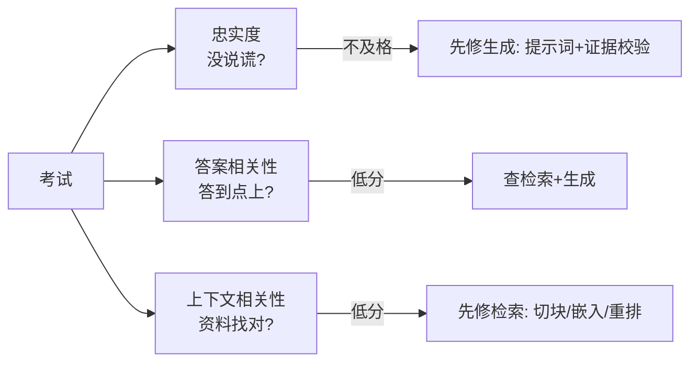
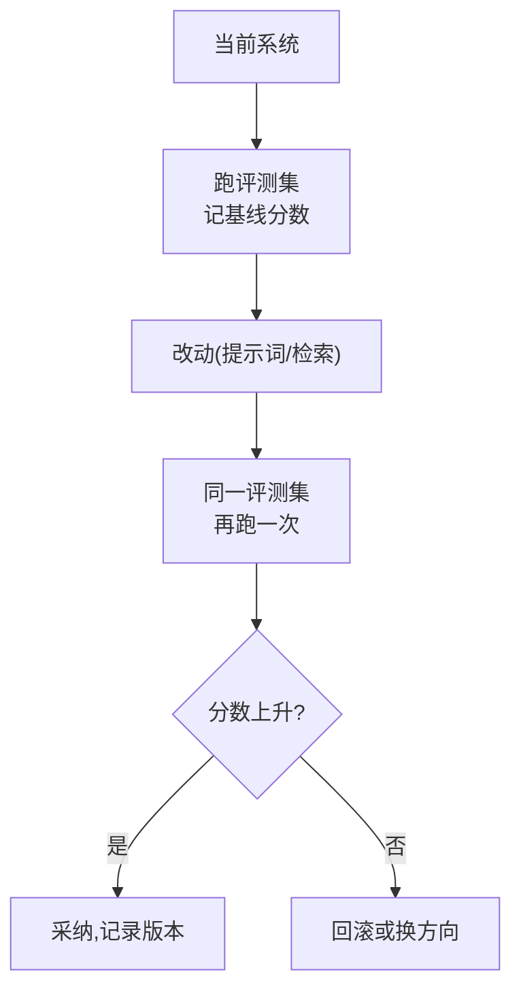

# 第46课 给AI打分：RAG评测入门

> 系列：LangChain / LangGraph 系统学习 · 第 46 课（v11.0 第十一轮）
> 定位：教学引导 — 类比、动手练习、自测
> 上节课回顾：第 45 课我们完成了从 0 到 1 的毕业实战。
> 本节课你将学会：怎么科学地给 AI 助手"打分"，以及分数怎么指导改进。

## 导航（本课大纲）

1. 一个比喻：考试系统 vs 拍脑袋
2. 三个核心分数：忠实度 / 相关性
3. 动手：搭一个 20 条的小评测集
4. 让分数驱动改进的三个动作
5. 练习与小结

## 1 一个比喻：考试系统 vs 拍脑袋

想象一位老师。从不考试的"感觉派老师"：随便问问学生"听懂了吗"，学生都说懂了，结果期末全挂。**考试派老师**：平时测、单元测、期末考，每次考完分析错题，下轮改进教学。

AI 应用也一样。"我觉得它答得还行"等于没评测。**RAG 评测 = 给你的 AI 助手建一套科学的考试系统**——没有它，你永远不知道改动是变好了还是变坏了。

## 2 三个核心分数

RAG 系统要考三张卷子（RAGAS 三大指标，见知识库 42）：

| 分数 | 考什么 | 白话理解 | 进哪个班 |
| --- | --- | --- | --- |
| 忠实度 | 有没有编造 | 回答是不是都"有据可依" | 生成环节的问题 |
| 答案相关性 | 答得切不切题 | 是不是在回答你问的 | 检索和生成都要看 |
| 上下文相关性 | 资料找得准不准 | 检回来的资料是不是相关 | 检索环节的问题 |

**最重要的一句话：忠实度优先。** 答得再好听，只要有一句是编的，这个助手就不能信——先保证不说谎，再优化说得准、说得全。

## 3 动手：搭一个 20 条的小评测集

**目标**：20 分钟，20 条问题，覆盖三种类型。

1. **事实型 10 条**：直接从你的知识库里问事实（"公司年假是几天？"）；
2. **推理型 5 条**：需要跨 2 篇文档才能答（"A 和 B 政策冲突时听谁的？"）；
3. **反例 5 条**：**故意问知识库里没有的**（"公司的咖啡豆供应商是谁？"）——考它会不会乱编。

每条记录四要素：`问题、标准答案（或"无答案"）、期望出处、类型`。用表格或 CSV 存好。

> 练习：用你自己的任意知识库（比如之前课程的 RAG 项目）完成这 20 条，这就是你第一个评测集。

## 4 让分数驱动改进的三个动作

有了分数和评测集，改进就有的放矢了：

1. **先看短板**：哪个分数最低，就先修哪个环节（查上面的"进哪个班"）；
2. **一致性对比**：改之前跑一遍、改之后跑一遍，同卷对比分数变化；
3. **坏例分析**：揪出 3 条答得最差的，逐条看是检索错了还是生成错了——这比看平均分有用得多。

## 5 练习与自测

**练习**：把你第 45 课毕业项目的 Agent 跑 10 个真实问题，人工给每个打"好/一般/差"，再和 RAGAS 自动分数对比，找 3 个不一致的例子分析原因。

**自测题**：
- 为什么说"忠实度不及格时，先别管相关性"？
- 评测集里的"反例"考的是什么？
- 分数涨了 0.01，能不能宣布改进成功？（提示：看波动区间，见知识库 42）

## 6 小结

- RAG 评测三分数：**忠实度、答案相关性、上下文相关性**；
- 评测集三维三层：事实/推理/反例，先 20 条起步；
- 分数驱动改进：看短板 → 同卷对比 → 坏例分析；
- 评测是长期习惯：反例回流、持续扩集（附录 R 有资源导航）。

> 下一课：第 47 课《把项目搬上云：团队协作与部署》。