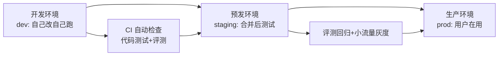
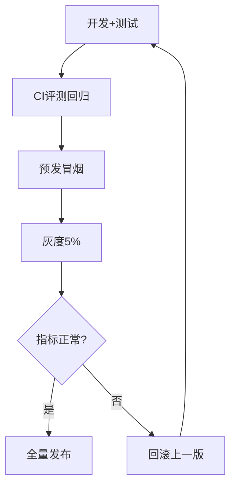

# 第47课 把项目搬上云：团队协作与部署

> 系列：LangChain / LangGraph 系统学习 · 第 47 课（v11.0 第十一轮）
> 定位：教学引导 — 比喻、环境流程、动手任务
> 上节课回顾：第 46 课我们学会了给 AI 打分。
> 本节课你将学会：一个人做项目和一群人做项目有什么不同，以及"三环境流水线"怎么搭。

## 导航（本课大纲）

1. 一个比喻：单人小厨房 vs 连锁餐厅中央厨房
2. 三个环境：开发 / 预发 / 生产
3. 发布流程：五步带着质量把关
4. 动手：给毕业项目搭三环境流程
5. 练习与小结

## 1 一个比喻：单人小厨房 vs 连锁餐厅中央厨房

一个人做菜：锅在自己手里，怎么炒都行，味道今天咸明天淡也没人管。

连锁餐厅：**中央厨房统一配方**（版本管理），每家店按标准流程出餐（环境隔离），新品先在小范围试卖（灰度），反馈不好立刻下架（回滚）。顾客吃到的每一份，都是"被把关过的同一道菜"。

你的 AI 应用从"自己电脑上能跑"到"多个人一起开发、稳定线上运行"，就要从"单人小厨房"升级成"连锁餐厅"。

## 2 三个环境：开发 / 预发 / 生产

| 环境 | 谁在用 | 干什么 |
| --- | --- | --- |
| dev | 开发者本人 | 随便改、随便跑、本地调试（KB32 时间旅行在这层） |
| staging | 测试 / 评测 | 模拟正式环境，跑评测集、压测 |
| prod | 真实用户 | 稳定第一，任何改动都经过前两层 |

## 3 发布流程：五步带着质量把关

**第一步**：开发分支里完成新功能，跑单元测试；**第二步**：合并到主分支，CI 自动跑评测集回归（忠实度分数不跌才放行）；**第三步**：部署到预发环境，跑冒烟测试（固定探针问题）；**第四步**：生产环境小流量灰度——先放 5% 用户，观察 15-30 分钟指标；**第五步**：指标正常 → 全量；异常 → 一键回滚到上一版本。

> 灰度为什么重要？就像连锁餐厅的新菜先让少量客人试吃——出问题只影响 5% 的人，而不是全店翻车。

## 4 动手：给毕业项目搭三环境流程

**任务**（用你第 45 课的毕业项目）：

1. 把项目代码纳入 git，建立 `dev` 和 `main` 两个分支；
2. 用你第 46 课建的评测集，写一个"评分脚本"（固定输入输出）；
3. 手动模拟 CI：在 `main` 分支跑一次评分，记下基线分；
4. 写一个"冒烟探针"文件：3 个固定问题 + 期望回答的关键词断言；
5. 在本地建"预发"目录，用同一份配置跑探针（模拟 staging）；
6. 记录你的"发布五步"清单，写完贴到学习笔记。

**自测题**：
- 为什么评测回归要卡在发布前而不是发布后？
- 灰度 5% 出了问题，你的回滚动作是什么？
- 单人项目需要三个环境吗？（提示：需要，但可以简化——见知识库 43 的"三问"）

## 5 练习与小结

**练习**：假装你多了一个同事，把毕业项目拆成两个人协作：一个人负责改检索，一个人负责改提示词，各自在 dev 分支做，最后按五步流程合并发布一次。全程记录流程问题（冲突、谁先合并、评测谁跑）。

**小结**：
- 多环境（dev/staging/prod）+ 灰度 + 回滚 = 团队开发的定心丸；
- 评测分数是最好的"发布门禁"——它替团队说"这次改动没变差"；
- 平台化（LangGraph 云）是把这些流程沉淀为按按钮，详见知识库 43。

> 下一课：第 48 课《指挥团队：多智能体框架怎么选》。