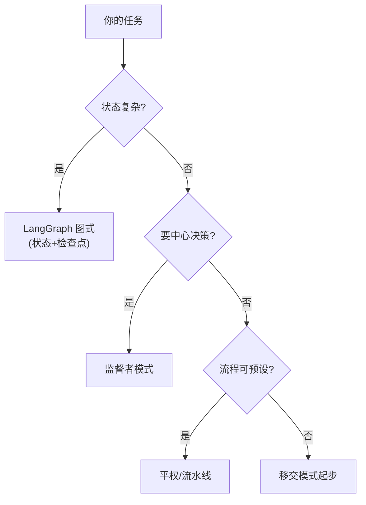

# 第48课 指挥团队：多智能体框架怎么选

> 系列：LangChain / LangGraph 系统学习 · 第 48 课（v11.0 第十一轮）
> 定位：教学引导 — 团队比喻、四种范式、选型练习
> 上节课回顾：第 47 课我们把项目搬上了云。
> 本节课你将学会：多智能体四种"带队方式"，以及怎么给自己的任务选对方式。

## 导航（本课大纲）

1. 一个比喻：四种带团队的方式
2. 四种范式一张表
3. 选型三步：先问自己三个问题
4. 动手：用两句话描述你的多 Agent 方案
5. 练习与小结

## 1 一个比喻：四种带团队的方式

假设你要组织一个团队完成"客户咨询"任务，有四种带队方式：

- **监工式（Supervisor）**：一个项目组长，把活分给组员，组员干完汇报，组长汇总——**中心指挥**；
- **接力式（Handoff）**：第一棒客服接电话，判断是技术问题就转给技术员，技术员解决不了转给经理——**责任转移**；
- **平权式（Swarm/Crew）**：组员之间可以互相找帮手，谁有空谁接——**去中心协作**；
- **图纸式（LangGraph）**：你把每个人的每一步画成流程图，严格按图走——**显式控制流**。

没有"最好"的带队方式，只有"最匹配任务"的方式。

## 2 四种范式一张表

| 范式 | 一句大白话 | 适合 | 不太适合 |
| --- | --- | --- | --- |
| 监督者 | 组长派活、组员汇报 | 分工清晰的中台 | 中心成了瓶颈 |
| 移交 | 接力棒式转手 | 客服/流程类 | 状态容易丢 |
| 平权协作 | 互相找帮手 | 流程可预设的流水线 | 责任不清晰 |
| 图式（LangGraph） | 一切画成图 | 复杂状态、生产级 | 简单的活太重 |

**一个重要认知：LangGraph 是"图纸"本身——其他三种带队方式，都能画成 LangGraph 的图。** 它是"元范式"。

## 3 选型三步：先问自己三个问题

**问题 1：我的步骤之间要共享状态吗？**
比如"用户身份"要贯穿多个步骤——要，就用图式（LangGraph），状态放在共享 State（KB24）。

**问题 2：我需要"时光机"调试吗？**
需要断点续跑、回放调试（KB32）——优先图式/监督者系，因为它们有检查点。

**问题 3：我和团队能维护多复杂？**
图式代码看得见、好调试，但学习成本高；轻量范式上手快，复杂了就难控。**从最小够用的范式开始，复杂了再升级。**

> 铁律：**能一个 Agent 解决，就别上多 Agent。** 多智能体是手段，不是目的。

## 4 动手：用两句话描述你的多 Agent 方案

**练习**：写一个"美食推荐 + 预订"的小场景，用下表填空：

| 你的答案 | 内容 |
| --- | --- |
| 任务拆成哪几个角色？ | 比如：口味分析师、餐厅检索员、预订执行员 |
| 谁指挥谁？（中心/移交/平权） | 比如：口味分析师当组长（监督者） |
| 状态共享什么？ | 比如：用户忌口、城市、预算 |
| 用哪种范式实现？ | 依据上面三个问题选择 |

**自测题**：
- 客服转技术支持的流程，是什么范式？
- 为什么复杂的生产系统最后都绕回 LangGraph？
- 什么信号说明"你的多 Agent 用复杂了"？（提示：成本爆炸、调试困难）

## 5 练习与小结

**练习**：把某个已学过的场景（如第 45 课毕业项目）改写成两种范式（监督者 + 流水线）各画一张草图，标注状态共享的位置，比较哪种更清晰。

**小结**：
- 四种带队方式：监工 / 接力 / 平权 / 图纸，**选型看状态与决策需求**；
- 选型三部曲：状态复杂度 → 中心决策 → 维护能力；
- LangGraph 是元范式：一切格局皆可成图；
- 全范式对比与混搭实战见知识库 44。

> 下一课：第 49 课《Agent 架构模式大全》（全系列收官课）。