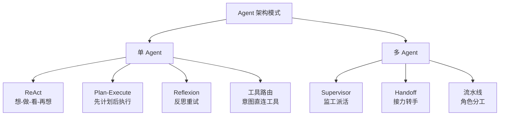
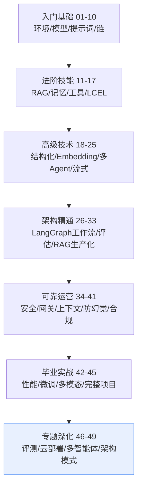

# 第49课 Agent架构模式大全（全系列收官课）

> 系列：LangChain / LangGraph 系统学习 · 第 49 课（v11.0 第十一轮收官课）
> 定位：教学引导 — 模式总览、选型五问、全系列总复习
> 上节课回顾：第 48 课我们学会了四种带队方式。
> 本节课目标：收齐 Agent 架构的七种模式，完成 49 课总复习，拿到"毕业证书"。

## 导航（本课大纲）

1. 七种模式一次看懂
2. 组合逻辑：分层而不是堆叠
3. 选型五问：接到需求先问五句
4. 49 课全系列总复习
5. 毕业寄语

## 1 七种模式一次看懂

| 模式 | 大白话 | 何时用（一句话） |
| --- | --- | --- |
| ReAct | 边干边想边看结果 | 需要工具、结果不确定 |
| Plan-and-Execute | 先列清单再干活 | 步骤清晰的多步任务 |
| Reflexion | 错了反思再来 | 有明确"对错"的任务（如代码） |
| 工具路由 | 分类后直接办 | 简单明确的任务 |
| Supervisor | 组长派活 | 多领域专家分工 |
| Handoff | 接力棒 | 客服流程类 |
| 协作流水线 | 流水线作业 | 流程可预设 |

## 2 组合逻辑：分层而不是堆叠

真实系统是**分层组合**：外层管决策（路由/监督），内层管执行（ReAct/Reflexion），人工管不可逆动作（付款、删数据、发消息）。

**组合三条原则**：
1. 决策在外、执行在内；
2. 反思只放在关键环节（全链反思 = 成本爆炸）；
3. 人工审批只在不可逆动作之前。

## 3 选型五问：接到需求先问五句

| 问 | 如果答"是" | 如果答"否" |
| --- | --- | --- |
| 任务单步简单？ | 工具路由就够 | 继续往下问 |
| 有多步骤清晰流程？ | Plan-and-Execute | 继续往下问 |
| 靠外部工具且结果不确定？ | ReAct + 反思 | 继续往下问 |
| 多领域专家分工？ | Supervisor / Handoff | 继续往下问 |
| 有不可逆动作或失败风险？ | Reflexion + 人工审批 + 评测 | 可简化 |

**决策铁律：能简单就不复杂，能用单 Agent 就不上多 Agent。**

## 4 49 课全系列总复习

49 课走下来，你建立的是一张完整的**工程决策地图**。让我们用一张图收束全部：

**你要带走的三句话**：
1. **先画图再写码**：任何 AI 应用 = 状态 + 控制流，LangGraph 让你把两者都"看见"；
2. **评测说话**：忠实度优先，一切改动用同一把尺子量；
3. **够用就好**：模式、模型、框架都是手段，能简单解决的方案才是好方案。

## 5 毕业寄语

从第 1 课的"什么是 LangChain"，到第 49 课"七种架构模式"——你完成的不是浏览一遍文档，而是建立了一套**"遇到问题知道用什么、为什么、怎么验证"**的完整心智模型。

接下来，把书合上，去做那个真实的项目吧。踩坑、修 bug、被用户催——那才是最好的第 50 课。

> 全系列 49 课到此结束！别忘了用附录 R《进阶学习路线与资源导航》选一条路线继续出发。