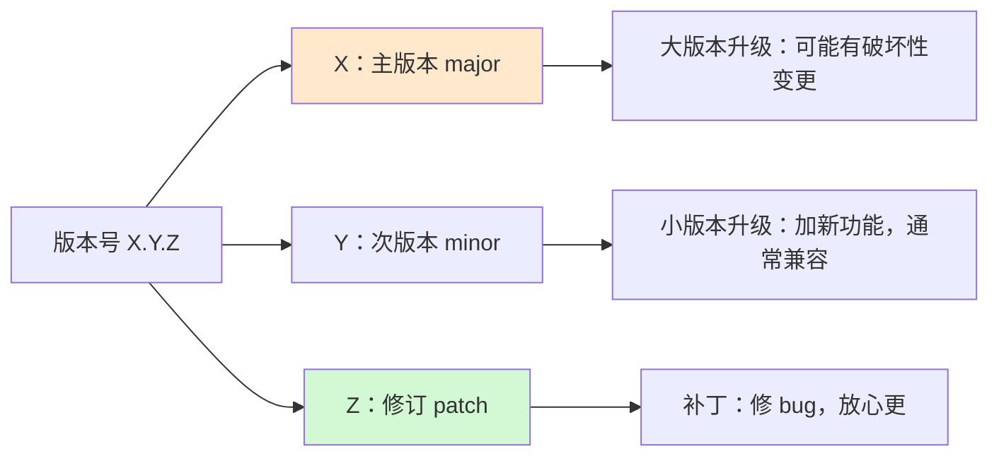
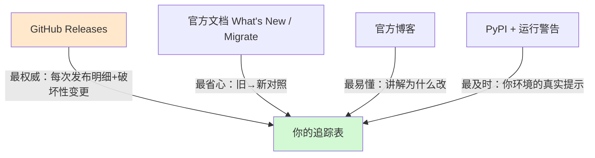
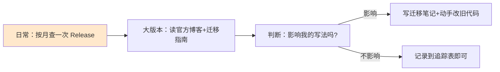

# 第 50 课 新特性追踪：跟上框架的脚步

> 本课导读：学了 49 课，你已经有"框架很强大"的体感，但也可能开始担心"框架更新太快，学不完"。本课教你一套**从容跟进**的方法：版本号怎么读、去哪看更新、以什么节奏学。
> 本课配套知识库：46《LangChain 新特性全景追踪技术手册》。

---

## 1. 先打消一个顾虑

**"框架更新快"不等于"旧知识作废"。**

事实是：从 v0.x 到 v1.x，LangChain 的核心概念几乎没有变——仍然是 Prompt、LLM、Retriever、Tool、OutputParser 这些组件，仍然是"链 + 图"的组合方式。变化的是：

- 包的拆法（更清晰了）；
- 部分 API 的写法（更好用了）；
- 新增的能力（更丰富了）。

你学的 80% 的概念会一直有用，新特性是在这 80% 之上再叠 20%。所以跟上新特性的正确心态是：**守住概念主干，增量跟进写法。**

##2. 版本号怎么读：三点式版本（SemVer）

记口诀：**主版小心、次版欢迎、补丁放心**。

特殊情形：
- `langchain-core 1.5.3`：主版本 1，说明核心 API 已稳定（好消息）；
- `langgraph 0.6.0`：仍是 0.x，说明它还在快速演进，但官方明确"会保持向后兼容"（有弃用警告）；
- 看到 `1.0.0`：意味着官方承诺"API 稳定"，对学习者最友好。

##3. 去哪看更新：四个信息源地图

- **GitHub Releases**：`langchain-ai/langchain`、`langchain-ai/langgraph` 两个仓库的 Releases 页面，重点看 "Breaking changes" 段；
- **官方迁移指南**：文档站搜 "Migrate" 或 "Deprecations"，官方已经把"旧写法→新写法"整理成对照表；
- **官方博客**：发布大版本时会有讲解文章，讲"为什么改"，比 changelog 好读；
- **PyPI + 本地**：`pip index versions langchain-core` 看全部版本；程序运行时的 `DeprecattonWarning` 就是免费的升级提示。

##4. 推荐学习节奏（零基础友好版）

- **日常（每月 10 分钟）**：翻 release notes，只看标题与弃用清单，把"需要关注"的记进追踪表；
- **大版本（1-2 小时）**：读官方博客 + 迁移指南，用附录 U 的清单逐项核对；
- **判断标准**：是否影响我项目里的写法？影响就动手迁移，不影响就只记录；
- **不追热点**：处于"实验"阶段的新特性，看概念即可，不写进正式文档/代码。

##5. 动手练习：建立你的第一份追踪表

打开附录 U《版本升级迁移速查手册》，复制表格，按下面 6 步填写：

1. 写下你当前环境的版本：`pip show langchain-core langgraph`；
2. 打开 GitHub Releases，找最近一次发布；
3. 挑一个"新特性"填入首行；
4. 用 GATE 四阶段（实验/可用/迁移/终态）判断它的阶段；
5. 标注它取代了什么旧写法（没有就写"全新"）；
6. 写一句"我要不要学"的结论与理由。

##6. 本课小结

- 核心概念稳定，新特性是增量——别慌；
- 版本号口诀：主版小心、次版欢迎、补丁放心；
- 四信息源：GitHub Releases / 迁移指南 / 官方博客 / PyPI；
- 节奏：按月查、大版本深入、实验特性只眼熟。

**课后自查**：你能不看笔记说出 GATE 四阶段的名称吗？你能否说出你当前环境的 langchain-core 版本号？

---

> 下一课：第 51 课《Runtime 新写法：一行看懂 Context》。