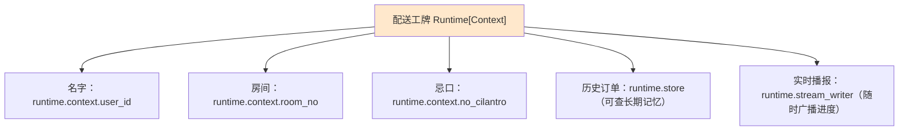
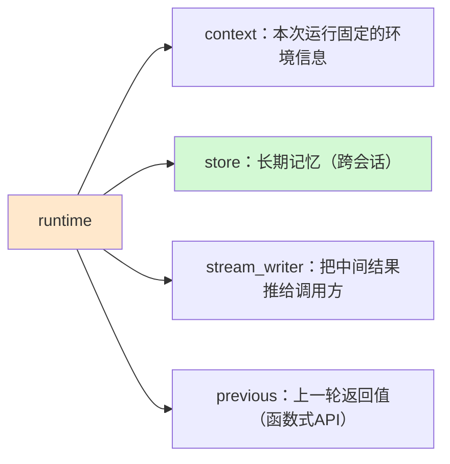
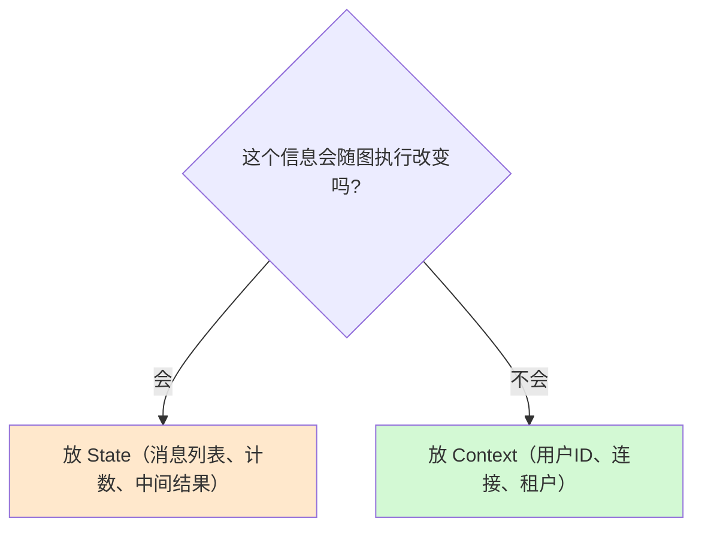

# 第 51 课 Runtime 新写法：一行看懂 Context

> 本课导读：LangGraph v0.6 换了一种"给节点传递运行信息"的写法。本课用一个生活比喻讲清"为什么改、改成什么样、你该怎么改"，配套动手任务。
> 本课配套知识库：47《LangGraph 新版 Runtime 上下文技术手册》。

---

## 1. 生活比喻：点外卖

想象你每次点外卖都要在备注栏写一堆信息：

> 备注：用户ID=9527；房间号=302；忌口=不要香菜；配送时间=12:00；联系电话=138…；配送员手里还要带一个"上次订单记录"。

这就是旧写法 `config['configurable']` 的体验——所有运行信息都塞进一个"备注字典"，节点要一层层翻：

```python
# 旧写法：像翻外卖备注栏
user_id = config.get("configurable", {}).get("user_id")
db_conn = config.get("configurable", {}).get("db_connection")
```

问题：① 每次都要 `get` 套 `get`；② 写错一个字符串键（拼写）不报错，直到运行才暴露；③ 每个节点要重复写。

##2. 新写法：一张"专属外卖工牌"

新写法是给配送员发一张**专属工牌（Runtime）**，卡片上印好了需要的所有信息，直接读：



对应代码：

```python
from dataclasses import dataclass
from langgraph.graph import StateGraph
from langgraph.runtime import Runtime

@dataclass
class Context:            # 1. 先定义"工牌上印哪些信息"
    user_id: str
    db_connection: str

def node(state, runtime: Runtime[Context]):   # 2. 节点声明收工牌
    user_id = runtime.context.user_id          # 3. 直接读，不用翻字典
    ...
    return {"partial": user_id}

builder = StateGraph(state_schema=State, context_schema=Context)  # 4. 图声明工牌类型
graph = builder.compile()
result = graph.invoke({"input": "你好"}, context=Context(user_id="123", db_connection="conn"))  # 5. 调用时发工牌
```

对比记忆：

| 旧 | 新 | 比喻 |
| --- | --- | --- |
| `config['configurable']['user_id']` | `runtime.context.user_id` | 翻备注栏 vs 读工牌 |
| `config_schema=dict` | `context_schema=Context` | 随便写 vs 定了格式 |
| 嵌套 get 防KeyError | IDE 补全 + 类型检查 | 靠运气 vs 靠规范 |

##3. 除了 Context，工牌上还有三张卡



- `context`：只读、运行内不变——用户 ID、租户、连接对象；
- `store`：持久记忆库，跨多次调用存活（呼应知识库 25 记忆系统）；
- `stream_writer`：节点主动输出（如"正在检索…"），调用方实时收到；
- `previous`：函数式 API 下"上一次返回什么"，支持轮询式多轮逻辑。

##4. 什么时候用 Context，什么时候用 State？

一句话：**会变的是 State，不变的是 Context。**



理由拆解：State 参与检查点持久化，是"业务过程数据"；Context 不持久化，是"运行环境信息"。把环境信息混进 State 会造成检查点膨胀和状态污染。

##5. 动手任务（约 30 分钟）

1. 从知识库 47 复制完整示例代码到本地，跑通（如无环境，用纸面推演每一行作用）；
2. 修改 `Context`，增加一个 `language: str` 字段，并在节点里用 `runtime.context.language` 读取；
3. 用旧写法重写同一个节点，对照两种写法的代码行数与可读性；
4. 思考并写出：context 与 state 各放一个你项目里真实存在的数据的例子。

##6. 常见疑问

**Q：我的教程还是 v0.5 的 config 写法，能用吗？**
A：能。v0.6 起仍向后兼容，只是会有弃用警告。但建议尽早迁移——新写法在 v2.0 前都有效，越早迁移越省事。

**Q：需要把所有节点都改成 runtime 参数吗？**
A：不需要。只有真正需要 context/store/stream_writer 的节点才声明 `runtime`；普通节点保持 `node(state)` 即可，签名越精简越好。

**Q：context 里的列表字段要注意什么？**
A：用 tuple 等不可变容器，避免被检查点意外序列化/变更。详见知识库 47 最佳实践。

##7. 本课小结

- 旧写法把信息塞进"备注字典"，新写法发一张"类型化工牌"；
- `runtime` 一个参数 = context + store + stream_writer + previous；
- 会变的状态放 State，不变的环境信息放 Context；
- 迁移不强制、向后兼容，但建议尽早。

**课后自查**：不看代码默写新写法四步（定义 Context → 节点声明 → 图声明 → 调用传入）。写完后对照知识库 47 检查。

---

> 下一课：第 52 课《平滑升级：老代码迁移指南》。