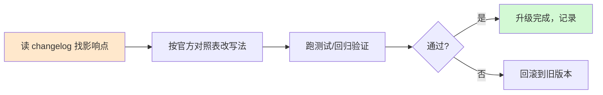

# 第 52 课 平滑升级：老代码迁移指南

> 本课导读：框架发新版本了，你的老代码要不要改、怎么改才不出事故？本课给出"升级前→升级中→升级后"的完整流程与常见坑。
> 本课配套知识库：46（特性追踪）、47（Context 迁移）、48（平台与 CLI），速查版见附录 U。

---

## 1. 升级的本质：不是"重写"，是"定向改造"

很多学习者一听到"迁移"就紧张。其实迁移 = **找到受影响点 → 按对照表改写法 → 跑测试验证**，三步走：

##2. 升级前（10 分钟准备）

1. **记录当前环境**：`pip freeze > requirements_old.txt` 备份；
2. **读 release notes**：GitHub Releases 中找 "Breaking changes" 与 "Deprecations" 两段；
3. **读官方迁移指南**：文档站搜 "Migrate"，官方已给对照表；
4. **确认可回滚**：确认自己知道怎么装回旧版（`pip install langchain-core==旧版本号`）。

记忆口诀：**备份、读档、确认退路**。

##3. 升级中的"三找"策略

遇到报错或不兼容，按顺序找：

| 找什么 | 在哪找 | 示例 |
| --- | --- | --- |
| 找弃用警告 | 运行日志的 DeprecattonWarning | "config_schema is deprecated, use context_schema" |
| 找官方对照 | Migrate 指南 | 旧 config 写法 → 新 context 写法 |
| 找替代写法 | 新版本文档示例 | Runtime/Context 本次新特性 |

规则：**一次只改一类写法**，改完立刻跑一次最小测试，别攒着一起改（出错难定位）。

##4. 典型案例：config → context 迁移（呼应第 51 课）

| 步骤 | 旧代码 | 新代码 |
| --- | --- | --- |
| 定义 | `config_schema=Config`（dict） | `context_schema=Context`（dataclass） |
| 取值 | `config['configurable']['user_id']` | `runtime.context.user_id` |
| 调用 | `config={"configurable":{...&#125;&#125;` | `context=Context(...)` |

迁移四步（来自官方发布说明）：
1. 定义 `@dataclass class Context`（复制 dict 里的键作为字段）；
2. 节点签名改为 `node(state, runtime: Runtime[Context])`；
3. `StateGraph(..., context_schema=Context)`；
4. 调用处把 config 里的值改为 `Context(...)` 传参。

##5. 升级后的回归检查清单

- [ ] 本地最小示例跑通（一条链/一个图）；
- [ ] 原评估集回归（如 RAG 评测：忠实度/相关性指标不低于升级前）；
- [ ] 无新增 DeprecattonWarning（含间接依赖打印的）；
- [ ] 流式/异步/批处理三个调用形态各测一次（若有）；
- [ ] 检查点持久化（store/checkpointer）数据兼容；
- [ ] 记录升级结果到追踪表（附录 U 模板）。

##6. 常见坑与对策

| 坑 | 现象 | 对策 |
| --- | --- | --- |
| 依赖互相不兼容 | 装 langgraph 新版本后 langchain-core 报错 | 用官方 requirements 组合/`pip check` 校验依赖关系 |
| 弃用警告被忽略 | 升级后悄悄用了旧 API | 日志里搜 "Deprecated"，逐一处理 |
| 改一半留一半 | 报错无法定位 | 一次只改一类写法，改完即测 |
| 测试只跑"能跑" | 逻辑对但输出错 | 引入最小评估集做回归断言 |

##7. 一个学习者的失败与恢复（完整示例）

场景：小明把 langgraph 从 0.5 升到 0.6，跑原来代码报 JSON 序列化错误。

诊断顺序：
1. 看报错堆栈 → 指向 State 里一个自定义对象；
2. 查 release notes → 0.6 加强了对 State 序列化的校验；
3. 查官方指南 → 建议 State 里只放可 JSON 序列化的数据（dict/list/str/数字），自定义对象通过 context 或 store 传递；
4. 改造 → 把自定义对象移出 State，放进 Context；
5. 回归 → 最小示例 + 原评估集均通过；
6. 记录 → 追踪表新增一行。

教训：**报错信息是最直接的老师**，先读懂再动手，且迁移问题九成有"官方对照表"可查。

##8. 本课小结

- 升级三步走：找影响点 → 定向改造 → 回归验证；
- 升级前：备份、读档、确认退路；
- 三找策略：弃用警告 / 官方对照 / 新版示例；
- 每类写法改完即测，评估集做回归，失败可回滚。

**课后自查**：给你一份旧代码（含 config 写法），你能按迁移四步写出新写法吗？你能说出升级前的三个准备动作吗？

---

> 下一课：第 53 课《收官展望：未来学习路线图》——全系列最后一课。