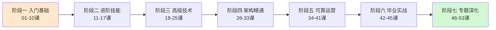
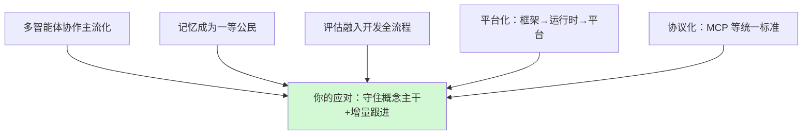
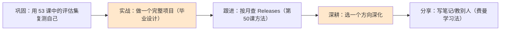

# 第 53 课 收官展望：未来学习路线图

> 本课导读：这是全系列 53 课的最后一课。先回顾你走过的七大阶段，再展望 LangChain 生态的未来趋势，最后给你一份"毕业后的持续学习路线图"。
> 本课配套知识库：49《MCP 协议与新特性生态整合技术手册》、附录 V《新特性更新日志导读与生态导航》。

---

## 1. 先为自己鼓掌：你走过的七段路

| 阶段 | 你掌握了什么 | 代表能力 |
| --- | --- | --- |
| 一 入门基础 | 组件、链、检索、对话 | 能搭一个问答应用 |
| 二 进阶技能 | LCEL、RAG、评估 | 能写出可维护的链 |
| 三 高级技术 | LangGraph、结构化输出、多 Agent | 能编排复杂流程 |
| 四 架构精通 | 工作流模式、评估框架、生产调优 | 能设计生产级系统 |
| 五 可靠运营 | 安全、网关、幻觉检测、合规 | 能让系统安全可靠 |
| 六 毕业实战 | 性能优化、微调协同、多模态、治理 | 能独立交付完整方案 |
| 七 专题深化 | RAG 评测、云部署、框架选型、特性跟进 | 能跟上生态、持续成长 |

##2. 未来的五大趋势（2026 视角）

- **多智能体**：从单 Agent 走向团队协作（知识库 44）；
- **记忆**：短期/长期记忆体系化，跨会话延续（知识库 25）；
- **评估**：RAGAS 等评测从"可选"变"必需"（知识库 42）；
- **平台化**：LangGraph 从库到 Platform，部署运维一体化（知识库 48）；
- **协议化**：MCP 统一工具接入（知识库 49）。

这些趋势不是新学科，而是你已有知识的**深化组合**。

##3. 毕业后持续学习路线图

可选深耕方向（配套素材）：

| 方向 | 现有基础 | 推荐下一步 |
| --- | --- | --- |
| RAG 工程 | 知识库 42、附录 S | RAGAS 进阶、混合检索线上调优 |
| Agent 可靠性 | 知识库 26-29、34 | 评估框架实操、复杂工单系统 |
| 多智能体 | 知识库 44 | LangGraph 多角色协作实战 |
| 部署运维 | 知识库 43、48 | 真正部署一个服务到云端 |
| 新特性研究 | 知识库 46-49、附录 U-V | 追踪并翻译最新 release notes |

##4. 最后给你三句话

1. **概念为主，写法为辅**：框架写法会变，但 Prompt/链/图/记忆/评估这些概念是长期资产——你已经把它们装进大脑了；
2. **学习即交付**：把每次学到的写成文档（就像这个系列），既能巩固，又是未来可复用的资料；
3. **跟上但不焦虑**：用第 50 课的方法，每月 10 分钟跟进，你有能力永远不掉队。

##5. 毕业任务（可选，但强烈建议）

用知识库 + 附录你拥有的全部素材，独立完成：

- **选题**：一个你真正想解决的场景（如"个人知识库问答机器人"）；
- **要求**：覆盖 RAG + 评估 + LangGraph 编排 + 一个新特性（如 MCP 工具或 Context）；
- **交付**：写成一页架构说明 + 代码 + 一篇使用文档（沿用它文档化的习惯）；
- **验收**：用第 46 课学的 RAGAS 三指标自评，目标得分 ≥ 基线。

完成它，你就是"毕业"的 LangChain 学习者了。

##6. 本课小结（也是全系列小结）

- 七阶段 53 课已完整覆盖：从零基础到生产级智能体工程师；
- 五大趋势是多智能体、记忆、评估、平台化、协议化；
- 毕业后：巩固 → 实战 → 跟进 → 深耕 → 分享；
- 记住：你拥有的是一整套"知识库 + 课程 + 附录"的持续资产，随时可回看、可扩展。

**最后的最后**：这个系列会继续陪你成长——当你有新的学习需求，随时提出，我们一起把它加进路线图。

**毕业快乐！🎓**

---

> 课程全部结束。附录 U、V 提供随查随用的工程工具，README-53课完整版 是整座知识大厦的索引。