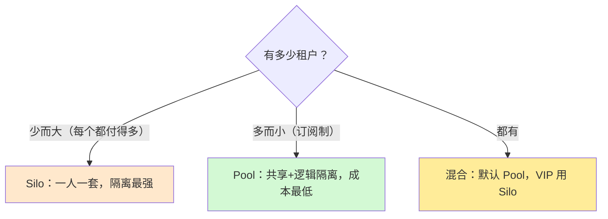
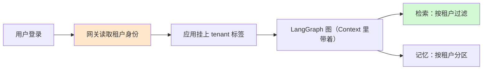

# 第 54 课 多租户入门：一个平台服务许多客户

> 本课导读：你之前学的都是"一个人用 AI 应用"，现在升级为"一套系统服务许多客户"。本课用生活比喻讲清多租户是什么、三种隔离模型怎么选。
> 本课配套知识库：50《多租户架构与隔离策略技术手册》。

---

## 1. 生活比喻：一栋办公楼 vs 一片独栋别墅

想象你要为"AI 问答服务"找场地：

- **独栋别墅方案（Silo）**：每个客户租一整栋楼。绝对私密，但成本高，空置浪费；
- **办公楼方案（Pool）**：大家共用一栋楼，每家公司用门禁卡只能进自己的楼层。省钱高效，但门禁系统必须可靠；
- **混合方案**：普通公司进办公楼，贵宾客户直接配独栋别墅。

多租户就是这个道理：**一套资源，多家公司使用，谁也不能串门。**

## 2. 什么叫"串门"？为什么危险

"串门"= 租户 A 的请求返回了租户 B 的数据。比如：

- 租户 A 的"员工手册问答机器人"回答出了租户 B 的机密制度；
- 租户 A 的聊天记录里出现了租户 B 的历史对话。

在传统 Web 系统里，串数据是低级事故；在 **RAG/Agent 系统里，串数据多了一条隐蔽通道——向量检索**。这恰恰是第 55 课的重点。

## 3. 三种模型速记表

| 模型 | 一句话 | 优点 | 缺点 | 谁在用 |
| --- | --- | --- | --- | --- |
| Silo | 一人一栋楼 | 绝对隔离、可定制 | 贵、难维护 | 银行、政务 |
| Pool | 一栋楼分开住 | 便宜、好升级 | 考验隔离代码 | 大多数 SaaS |
| 混合 | 贵宾独栋 | 兼顾 | 要两套运维 | 大厂混合部署 |

## 4. 同一个租户标识，贯穿全链路

多租户系统最关键的动作：**让"谁在请求"这件事从门口一直传到最底层**。

呼应第 51 课：**tenant_id 放在 Runtime 的 Context 里，而不是图的状态里**——语境信息不随业务流转，只随运行环境携带。

## 5. 动手任务（读完知识库 50 后）

1. 给你的问答机器人定义一个 `Context`，加 `tenant_id: str` 字段；
2. 在检索节点里读 `runtime.context.tenant_id` 并打印出来（先别过滤，感受取值方式）；
3. 想一个"串门"事故场景，写下它会造成的后果；
4. 判断你的场景适合 Silo/Pool/混合中的哪一种，并写一句理由。

## 6. 本课小结

- 多租户 = 一套系统服务多家客户，数据互不可见；
- 三种模型：Silo（贵而稳）、Pool（便宜靠代码）、混合（兼顾）；
- 租户标识必须全链路传递，放 Context 不放 State；
- 串租户是事故，隔离要靠测试验证。

**课后自查**：你能向朋友解释清楚 Silo 和 Pool 的区别吗？你知道 tenant_id 该放 Context 而不是 State 的原因吗？

---

> 下一课：第 55 课《租户隔离：数据不能串门》。