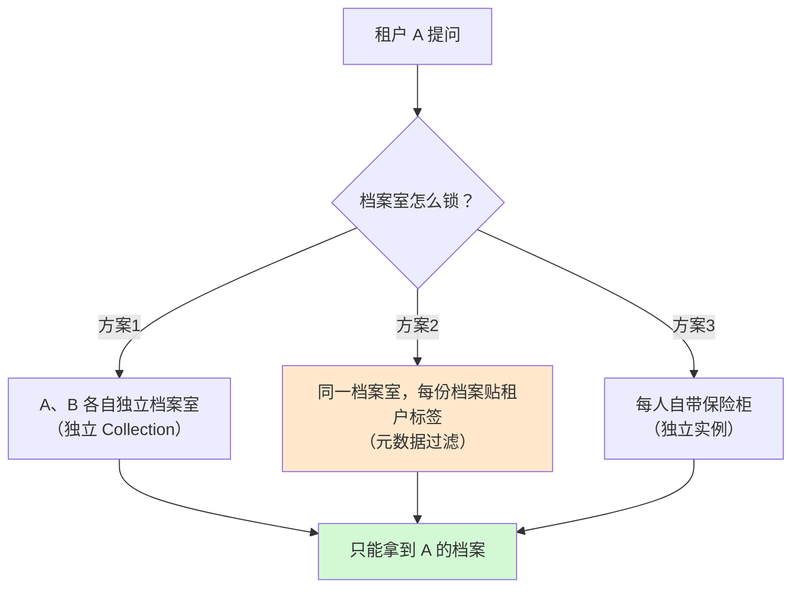
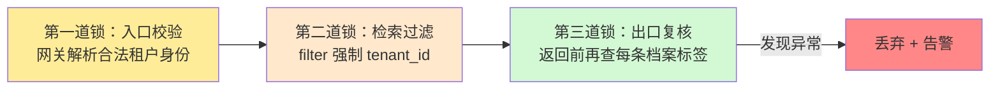

# 第 55 课 租户隔离：数据不能串门

> 本课导读：多租户的头等大事 = 数据隔离。本课讲清"隔离发生在哪几层、向量检索怎么防串门、怎么验证没串门"。
> 本课配套知识库：51《租户级数据隔离与检索安全技术手册》。

---

## 1. 生活比喻：公寓楼的四道门禁

一栋公寓楼（共享的 LLM 平台）要保证住户互相看不见，需要几道门禁：

| 楼层 | 比喻 | 隔离手段 |
| --- | --- | --- |
| 模型层 | 公共健身房（公用但刷卡） | 模型路由按租户，大客户可定制 |
| 提示词层 | 公告栏（各层不同海报） | 租户自己的 Prompt 模板 |
| **知识层** | **各家档案室（关键！）** | 向量库分区/过滤 |
| 记忆层 | 各家客厅摄像机 | 记忆存储按租户分区 |

对 RAG 应用，**知识层**是档案室——档案放错门 = 机密泄露。这是本课核心。

## 2. 档案室（向量库）的三种上锁方式

- **方案 1（独立 Collection）**：最推荐入门——每个租户一个向量集合，检索时"根本不用过滤"，天然安全；
- **方案 2（元数据过滤）**：最灵活——所有档案放一起，但每条贴 `tenant_id` 标签，检索强制加过滤条件。**风险：忘记加过滤 = 全楼档案可见**；
- **方案 3（独立实例）**：最贵最稳，给贵宾用。

## 3. 纵深防御：三道锁（核心！）

方案 2 最大的坑是"忘记过滤"。所以不能只靠一把锁：

记忆口诀：**进门前查证、检索时过滤、出门时复查**。三道锁缺一不可——尤其是"出口复查"，它是兜底的生命线（哪怕前两道都失效，也不会真正串门）。

## 4. 索引入库也要隔离：进门先验票

档案不只是别人来"借"时要锁，**放进来的时候**就要验明正身：

- 上传文档时，由平台认定它属于哪个租户——**绝不信任文档内容里"自己写的"租户字段**；
- 少了租户标签的档案直接拒收并告警（缺票不放行）。

## 5. 验证没串门：租户隔离测试

光写"感觉很安全"不算数，要测：

| 测试 | 做法 | 通过标准 |
| --- | --- | --- |
| 检索串访 | 用租户 A 的问题、在平台里搜 | A 的结果中无一条 B 的文档 |
| 记忆串访 | 尝试读别的租户记忆 | 拒绝或为空 |
| 漏标请求 | 不带租户标识的请求 | 接口直接拒绝（4xx） |
| 伪造身份 | 篡改 token 里的租户号 | 校验失败被拒 |

**记住：隔离正确性 = 测试结果，不是代码意图。**

## 6. 动手任务（读完知识库 51 后）

1. 给你的检索节点加上"第二道锁"（filter 强制 tenant_id）和"第三道锁"（出口复核循环）；
2. 造两个租户的数据：租户 A 存"苹果是红色水果"，租户 B 存"苹果是科技公司"；
3. 用租户 A 提问"苹果是什么"，断言结果里不出现 B 的内容；
4. 故意去掉过滤条件跑一次，观察结果差异——**亲眼见证"不隔离会怎样"**。

## 7. 本课小结

- 隔离四层：模型/提示词/知识/记忆，RAG 重点是知识层；
- 三种上锁：独立 Collection（推荐）/ 元数据过滤（灵活要小心）/ 独立实例（最贵）；
- 纵深防御三道锁：入口校验 → 检索过滤 → 出口复核；
- 入库按平台认定绑定租户，串租户靠测试验证。

**课后自查**：你能说出三道锁分别是什么吗？为什么"出口复核"是生命线？

---

> 下一课：第 56 课《成本配额：钱要算得明白》。