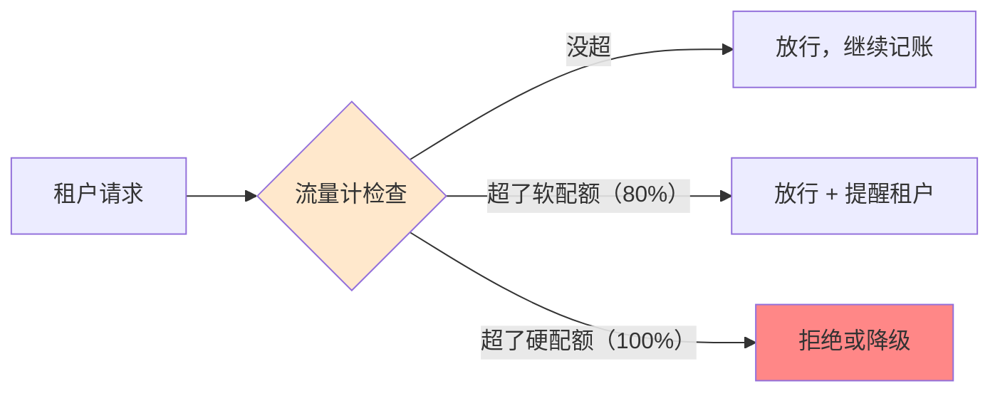

# 第 56 课 成本配额：钱要算得明白

> 本课导读：多租户平台不解决"钱"的问题就没法长久——谁用了多少、该付多少、用超了怎么办。本课教你计量、配额、降级三连招。
> 本课配套知识库：52《成本计量配额与用量治理技术手册》。

---

## 1. 生活比喻：公寓楼的公共水电

一栋多租户办公楼，公共水电（LLM API 费用）怎么分摊？

- 先要有"**每户电表**"（计量）——每家用了多少度电；
- 再定"**每月限额**"（配额）——超过要加钱或断电；
- 还要有"**降级预案**"——断电时别让整栋楼停电（空调降功率，而不是全楼摸黑）。

对应到 LLM 平台：**计量（电表）→ 配额（限额）→ 降级（预案）**，三步缺一不可。

## 2. 计量：先看清"每户电表"长什么样

给每个请求记一行账（在网关层统一做，呼应第 39 课）：

| 记账字段 | 举例 | 用途 |
| --- | --- | --- |
| 租户 | tenant-007 | 归属谁 |
| 模型 | 高速档 | 单价多少 |
| 输入/输出 token | 1234 / 567 | 量多少 |
| 缓存命中 | 是/否 | 打不打折 |
| 请求数 | 1 | 累计次数 |

**一句话：请求进来先"贴标签记账"，再干活。**

## 3. 配额：软硬两档 + 并发一档



- **软配额**：到 80% 就提醒（不阻断，让人有准备）；
- **硬配额**：到 100% 就拒绝/降级（必须执行，保护平台也保护其他租户）；
- **并发配额**：同时最多跑多少任务（超了排队，而不是崩掉）。

## 4. 降级四选一：优雅地说"不行"

硬配额超了，或模型供应商抽风了，怎么办？按顺序选：

| 手段 | 做法 | 什么时候用 |
| --- | --- | --- |
| 429 拒绝 | 明确"限流了，请稍等" | 突发峰值 |
| 排队 | 任务进队列，逐个处理 | 异步批量任务 |
| 换便宜模型 | 结果质量略降，但能用 | 预算保护 |
| 命中缓存 | 读过的问题直接给旧答案 | 读多写少 |

**关键原则：降级要透明**——不能让用户感觉"AI 变笨了却不知道原因"。

## 5. 预算告警阶梯：别突然断电

给租户的预算装"加油灯"：

```
用量 60%：提醒（绿色区域，正常）
用量 80%：告警（黄色区域，抓紧）
用量 100%：封顶（红色区域，拒绝）
超限后：租户可申请临时加码（人工审批）
```

治理要有温度：**先提醒、再告警、最后才断，断了还能申请临时额度**。一拒了之会赶跑用户。

## 6. 动手任务（读完知识库 52 后）

1. 设计你平台的"每户电表"：列出 5 个记账字段；
2. 给一个示例租户定一套配额（每日 token 数、每分钟请求数、每月预算）；
3. 画一张"预算告警阶梯"图（60/80/100% 各做什么）；
4. 想一个"降级要透明"的文案示例（怎么告诉用户"当前换用了备用模型"）。

## 7. 本课小结

- 三步走：计量（记账）→ 配额（限额）→ 降级（预案）；
- 软配额提醒、硬配额执行、并发配额排队；
- 降级四选一：429/排队/换模型/缓存，且要透明；
- 告警阶梯 60/80/100%，封顶后保留人工审批通道。

**课后自查**：你能区分软配额和硬配额吗？能说出降级四手段的适用场景吗？

---

> 下一课：第 57 课《平台运营：从单应用走向企业平台》（本专题收官课）。