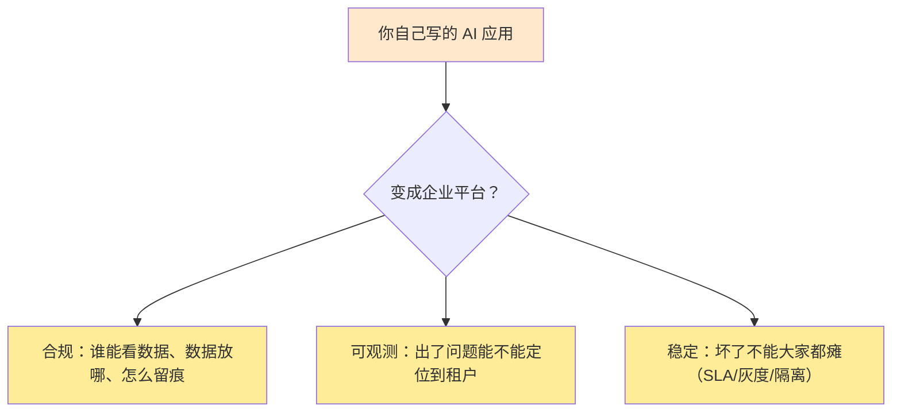
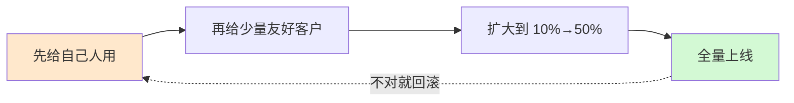

# 第 57 课 平台运营：从单应用走向企业平台

> 本课导读：「多租户治理深化」专题的收官课。把 54—56 课的隔离、计量、配额，收拢成一台"企业级 LLM 平台"的运营全景：合规、可观测、SLA、灰度、防雪崩。
> 本课配套知识库：53《企业级 LLM 平台合规运营技术手册》。

---

## 1. 从"一个应用"到"一台平台"，多出来的三件事

你之前做的问答机器人是一个"**应用**"：自己部署、自己用、坏了重启。
现在要做"**平台**"：很多租户用、坏了会摊上大事。多出来的三件事：

## 2. 合规：三条底线（呼应第 44 课）

| 底线 | 什么意思 | 通俗例子 |
| --- | --- | --- |
| 数据驻留 | 数据只能在约定区域流转 | 上海的客户数据不出上海 |
| 脱敏 | 敏感信息不进模型 | 手机号先打码再提问 |
| 审计 | 每一步都留痕可查 | 谁、何时、问了什么、花了多少钱 |

> 合规不是"上线时补一次"，而是"每个版本都要检查"。具体条款以法务和监管为准。

## 3. 可观测：问三句话都能答

运营的第一能力是**回答三句话**：

1. "哪个租户慢了？" → 延迟指标按租户切片；
2. "哪个租户错了？" → 错误率按租户切片；
3. "哪个租户烧钱了？" → 成本按租户切片。

技术实现：追踪/指标/日志**全部打上 tenant_id 标签**，就像给每层楼装摄像头+电表+门禁记录，随时能查"某一层发生了什么"。

## 4. SLA：把"稳定"翻译成数字

别只说"我们很稳定"，要说"我们承诺 99.9% 可用、p95 延迟 3 秒以内"：

| 缩写 | 全称 | 一句话 |
| --- | --- | --- |
| SLI | 实际测到的指标 | 上个月真的 99.92% 可用 |
| SLO | 目标指标 | 我们目标是 99.9% |
| SLA | 合同承诺 | 达不到就补偿（退款等） |

**日常盯 SLO 是否达标，合同里才写 SLA。**

## 5. 灰度发布：新版本不能"一把梭"

升级知识库、换模型、改路由策略，都走这条"小步快跑+随时回滚"的路。

## 6. 防雪崩：五件护具

多租户平台最怕"一个租户把全平台拖垮"。五件护具随身带：

| 护具 | 作用 |
| --- | --- |
| 配额限流 | 单租户最高上限（第 56 课） |
| 独立队列 | 大租户占用不影响小租户 |
| 熔断器 | 下游模型异常时快速"断开"保护自己 |
| 舱壁 | 贵宾租户资源独立（Silo） |
| 降级清单 | 写清楚"先降哪个功能" |

优先级口诀：**闲聊先降、缓存顶上、备用模型兜底、核心功能最后降。**

## 7. 本专题收官：你已掌握的"多租户四件套"

| 本课 | 能力 | 对应知识库 |
| --- | --- | --- |
| 54 | 选型：Silo/Pool/混合 | 50 |
| 55 | 隔离：三层过滤+三道锁 | 51 |
| 56 | 治钱：计量/配额/降级 | 52 |
| 57 | 运营：合规/可观测/SLA/灰度/防雪崩 | 53 |

**毕业项目建议**：把第 45 课的问答机器人改造成"双租户演示平台"——包含 Context 租户标识、检索过滤、简单配额与告警，跑通后再自测"串租户测试"（第 55 课表格）。

## 8. 本课小结

- 应用变平台，多出三件事：合规、可观测、稳定；
- 可观测 = 延迟/错误/成本三指标按租户切片；
- SLI / SLO / SLA 三层各司其职；
- 灰度四步可回滚；防雪崩五件护具；
- 四课闭环：选型 → 隔离 → 治钱 → 运营。

**课后自查**：你能说出 SLI/SLO/SLA 的区别吗？防雪崩的五件护具是哪些？你的毕业项目里会怎么验证"没串门"？

---

> 「多租户治理深化」专题课程完毕。附录 W（架构选型速查）、附录 X（指标与 SLA 速查）为随查随用的工程工具。