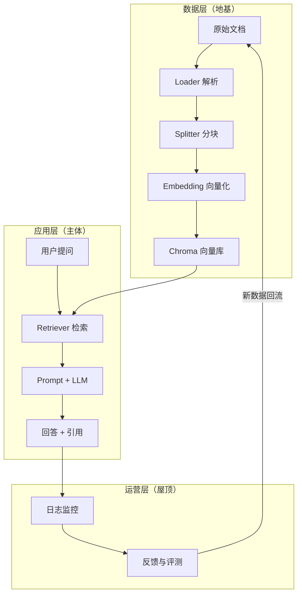

# 第 58 课 综合实战一：像搭积木一样设计企业知识库

> 定位：教学引导。前面学了很多"积木"（Loader、Splitter、Retriever、LLM、VectorStore），这一课把它们拼成一座真正的"建筑"——企业知识库问答系统。跟着做，你会有第一版能跑的系统。

---

## 1. 本节课目标

- 能画出企业知识库问答系统的三层架构；
- 能说出 5 个里程碑及各自验收标准；
- 动手完成**里程碑 1**：单个文档问答跑通。

---

## 2. 用"餐厅"理解系统架构

想象一家餐厅：

| 系统组件 | 餐厅类比 | 职责 |
| --- | --- | --- |
| 原始文档 | 仓库里的食材 | 原材料 |
| 解析 + 分块 | 洗菜切菜 | 加工成可用的半成品 |
| 向量库 | 分类摆放的冷藏柜 | 按"口味"（语义）归类存放 |
| 检索引擎 | 配菜师傅 | 根据订单（问题）挑出合适食材 |
| LLM 模型 | 大厨 | 把食材做成一盘菜（答案） |
| Web 界面 | 服务生和餐桌 | 用户点菜、上菜 |

> 一句话记忆：**文档进、切片存、按问题取、交给模型做**。

---

## 2.5 积木组装图：一图看懂全系统



---

## 3. 动手搭建里程碑 1（约 20 分钟）

### 步骤 1：准备环境

```bash
pip install langchain langchain-community langchain-text-splitters \
            langchain-openai chromadb sentence-transformers
```

> 如果网络不便，选用 HuggingFace 的本地小模型也能跑通流程（速度稍慢）。

### 步骤 2：准备一份示例文档

新建 `docs/hello.md`，内容写一段你熟悉的知识（比如自我介绍、一门课程笔记），**至少 3 个段落**，方便测试检索。

### 步骤 3：入库（照着敲，理解每一行）

```python
from langchain_community.document_loaders import TextLoader
from langchain_text_splitters import RecursiveCharacterTextSplitter
from langchain_community.embeddings import HuggingFaceEmbeddings
from langchain_community.vectorstores import Chroma

# ① 加载
loader = TextLoader("./docs/hello.md", encoding="utf-8")
docs = loader.load()

# ② 分块
splitter = RecursiveCharacterTextSplitter(
    chunk_size=300, chunk_overlap=50
)
chunks = splitter.split_documents(docs)
print(f"共切出 {len(chunks)} 块")   # 看看切成几块

# ③ 向量化 + 入库
embeddings = HuggingFaceEmbeddings(model_name="BAAI/bge-small-zh-v1.5")
vectorstore = Chroma.from_documents(chunks, embeddings, persist_directory="./chroma_db")
print("入库完成")
```

### 步骤 4：提问（10 行代码问出答案）

```python
from langchain_openai import ChatOpenAI

retriever = vectorstore.as_retriever(search_kwargs={"k": 2})
llm = ChatOpenAI(model="gpt-4o-mini", temperature=0)

def ask(q):
    ctx = "\n\n".join(d.page_content for d in retriever.invoke(q))
    return llm.invoke(f"根据以下资料回答：\n{ctx}\n\n问题：{q}").content

print(ask("文档里提到了什么？"))
```

**如果看到一段像样的回答——恭喜，你的第一个知识库问答系统跑通了！**

---

## 4. 动手任务

| 任务 | 说明 | 完成标志 |
| --- | --- | --- |
| ① 打印分块结果 | 看看 300 字符分块后每块内容 | 能说出每块的起始句 |
| ② 增加文档到 3 份 | 复制 hello.md 改内容，重复入库 | 提问能区分出不同文档 |
| ③ 试试 K 值 | k=1 和 k=5 各问一次 | 能描述回答差异 |
| ④ 问一个文档里没有的 | 比如"今天天气怎么样" | 观察模型会不会瞎编 |

> **重点观察**任务④：这就是"幻觉"现场——也是后面要解决的核心问题。

---

## 5. 常见卡点与解决

| 卡点 | 现象 | 解决 |
| --- | --- | --- |
| 模型下载慢 | 首次运行长时间无输出 | 耐心等待，或换更小的模型如 `all-MiniLM-L6-v2` |
| 中文效果差 | 回答语句不通 | 换成 `BAAI/bge-small-zh-v1.5` 等中文模型 |
| 导入报错 | 包版本不兼容 | 按版本锁定安装：`pip install langchain==0.2.x` |

---

## 6. 小结

- 系统 = 数据层 + 应用层 + 运营层；
- 五大里程碑：单文档 → 多文档 → Web → 评测 → 部署；
- 你已经完成 M1，准备进入下一课：把"一个文档"变成"一堆文档"并学会治理。