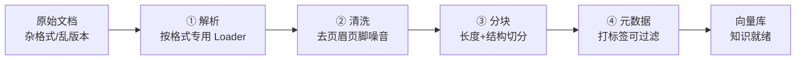

# 第 59 课 综合实战二：把一堆文档变成"知识"

> 定位：教学引导。里程碑 2 达成之路：解决"文档格式杂、版本乱、质量参差"三大难题，让 10+ 份不同格式的文档都能被可靠检索引。继续用比喻理解，动手把 M2 做完。

---

## 1. 本节课目标

- 理解"文档 → 知识"要经过解析、清洗、分块、元数据四道工序；
- 动手完成**里程碑 2**：10 份不同格式文档批量入库，跨文档提问有结果。

---

## 2. 用"搬家整理"理解文档治理

你在搬家，把所有东西塞进新家：

| 工序 | 搬家类比 | 对应技术 |
| --- | --- | --- |
| 解析 | 拆箱，看看箱子里是什么 | Loader 按格式读取 |
| 清洗 | 扔掉包装纸、标签、废纸 | 正则去噪音 |
| 分类摆放 | 书放书架、衣物放衣柜 | 元数据 + 分块 |
| 编目录 | 每件东西登记位置 | metadata 里的 source/标签 |

> 一句话记忆：**先读懂、再净化、后归类、最后登记**。

---

## 2.5 四工序流程图：从文档到知识



---

## 3. 动手搭建里程碑 2（约 30 分钟）

### 步骤 1：准备多种格式的文档

在 `docs/` 目录准备 **3 种以上格式**，每种 3 份以上：

```text
docs/
├── 制度/报销制度_v3.docx      # Word
├── 制度/考勤制度_v2.docx
├── 手册/入职操作手册.pdf       # PDF
├── 手册/差旅手册.pdf
├── 笔记/会议纪要_2026-05.md   # Markdown
├── 笔记/项目排期.md
└── ...                        # 补足 10 份
```

> 没有现成文件？从网上下载几份示例 PDF/Word，或用 Word/WPS 随手创建。

### 步骤 2：按格式分流解析

```python
from langchain_community.document_loaders import (
    TextLoader, PyMuPDFLoader, Docx2txtLoader,
    DirectoryLoader,
)

# Markdown/纯文本
md_loader = DirectoryLoader("./docs/笔记", glob="*.md",
                            loader_cls=TextLoader,
                            loader_kwargs={"encoding": "utf-8"})
md_docs = md_loader.load()

# Word
docx_loader = DirectoryLoader("./docs/制度", glob="*.docx",
                              loader_cls=Docx2txtLoader)
docx_docs = docx_loader.load()

# PDF
pdf_loader = DirectoryLoader("./docs/手册", glob="*.pdf",
                             loader_cls=PyMuPDFLoader)
pdf_docs = pdf_loader.load()

all_docs = md_docs + docx_docs + pdf_docs
print(f"共加载 {len(all_docs)} 份文档")
```

### 步骤 3：清洗 + 结构分块 + 打元数据

```python
import re
from langchain_text_splitters import RecursiveCharacterTextSplitter

def clean(text: str) -> str:
    text = re.sub(r"第\s*\d+\s*页\s*/\s*共\s*\d+\s*页", "", text)
    text = re.sub(r"\n{3,}", "\n\n", text)
    return text.strip()

chunks = []
splitter = RecursiveCharacterTextSplitter(chunk_size=500, chunk_overlap=80)
for doc in all_docs:
    doc.page_content = clean(doc.page_content)   # 清洗
    for c in splitter.split_documents([doc]):
        c.metadata["source"] = doc.metadata.get("source", "?")
        # 按路径给文档类型打标（"制度/""手册/""笔记/"）
        src = c.metadata["source"]
        c.metadata["doc_type"] = "制度" if "制度" in src else \
                                 "手册" if "手册" in src else "笔记"
        chunks.append(c)
print(f"共 {len(chunks)} 个片段")
```

### 步骤 4：带元数据入库 + 按类型过滤检索

```python
vectorstore = Chroma.from_documents(
    chunks, embeddings, persist_directory="./chroma_db"
)

# 只查"制度"类文档
retriever = vectorstore.as_retriever(
    search_kwargs={"k": 3, "filter": {"doc_type": "制度"}}
)

def ask(q, retriever=retriever):
    ctx = "\n\n".join(d.page_content for d in retriever.invoke(q))
    return llm.invoke(f"仅根据以下资料回答（资料中没有请说'未找到'）：\n{ctx}\n\n问题：{q}").content

print(ask("报销流程是什么？"))
print("---")
print(ask("入职手册规定了什么？"))
```

---

## 4. 动手任务（验收里程碑 2）

| 任务 | 完成标志 |
| --- | --- |
| ① 三种格式全部入库 | 打印显示 10+ 份文档、若干片段 |
| ② 跨文档提问 | "制度+手册"两个来源都能答出 |
| ③ 类型过滤生效 | 过滤"制度"后问手册问题答"未找到" |
| ④ 打印一个片段的 metadata | 能看到 source、doc_type 字段 |

**完成 ①②**，代表检索链路已可跨文档工作；**完成 ③**，代表你掌握了"元数据过滤"这把权限与分域的钥匙；**完成 ④**，代表你理解了溯源（引用来源）的基础。

---

## 5. 三分钟自查

- 我的解析对 3 种格式分别用了什么 Loader？
- 清洗函数去掉了哪些噪音？
- metadata 里挂了哪几个字段？过滤是怎么用的？
- 如果答案"张冠李戴"（跨文档串了），最可能错在哪一环？

---

## 6. 小结

- 文档治理四工序：解析 → 清洗 → 分块 → 元数据；
- 多格式用 DirectoryLoader + 按格式分流；
- 元数据过滤 = 权限与分域的基础，也是下一课"多轮对话"的地基。

**下一课**：里程碑 3——把命令行问答升级成带界面的 Web 应用，并初步引入反馈按钮。