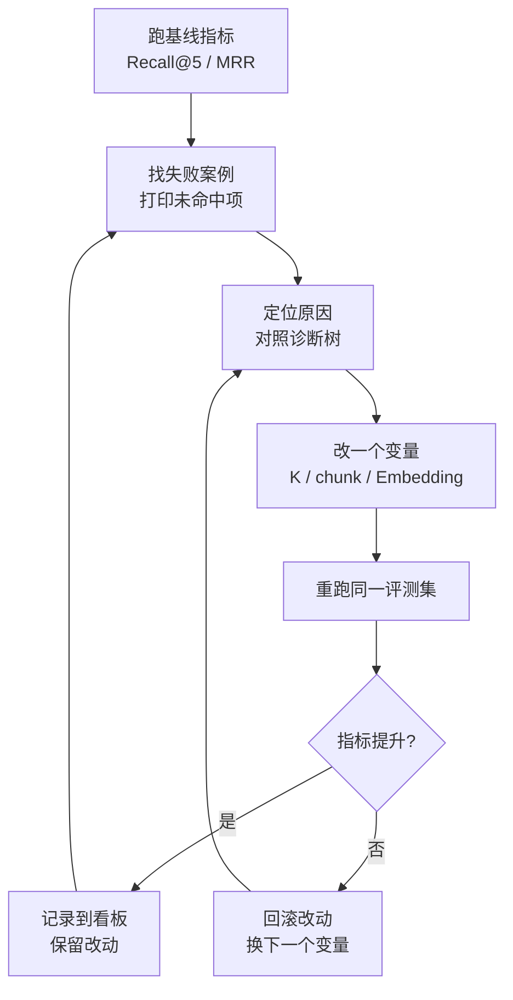

# 第 60 课 综合实战三：建评测集，把"感觉还行"变成"数据说话"

> 定位：教学引导。里程碑 4：从"聊天感觉还行"升级到"用数据评测、按诊断树调优"。这一课会教你建 20 条评测集、跑出第一版指标，并完成一轮真实的调优。

---

## 1. 本节课目标

- 能自己建 20 条评测集（问题 + 来源 + 要点）；
- 能跑出 Recall@5、MRR、Hit@1 三项指标；
- 能按诊断树定位一次失败并调优。

---

## 2. 用"考试"理解评测

| 评测术语 | 考试类比 | 说明 |
| --- | --- | --- |
| 评测集 | 标准试卷 | 固定问题集 + 标准答案，不许改 |
| Recall@K | 答案是否在"备选答案册"里 | 检索阶段表现 |
| MRR | 答案排第几 | 排名越靠前越好 |
| 忠实度 | 有没有"抄"错原文 | 生成阶段表现 |

> 核心思想：**没有试卷的"感觉还行"不可信**。试卷固定、反复考，才能看出每次改动是进步还是退步。

---

## 2.5 调优闭环流程图：一次只改一个变量



---

## 3. 动手建评测集（约 15 分钟）

### 步骤 1：从真实问题收集

打开你的系统，问下面这些类型的问题，记录问题和答案来源：

| 类型 | 示例 |
| --- | --- |
| 事实型 | "报销上限是多少？" |
| 流程型 | "离职要办哪些手续？" |
| 对比型 | "A 方案和 B 方案哪个省钱？" |
| 否定型 | "哪些情况不能报销？" |

### 步骤 2：整理成标准格式

```python
eval_set = [
    {"question": "报销上限是多少？",
     "source": "制度/报销制度_v3.docx",      # 期望答案出处
     "gold": "单笔不超过 5000 元"},          # 要点提示
    {"question": "离职要办哪些手续？",
     "source": "手册/离职操作手册.pdf",
     "gold": "交接单+归还设备+最后一天签字"},
    # ... 凑满 20 条，覆盖你全部文档主题
]
```

> **原则**：每题都必须能在你现有文档里找到出处；来源写错就失去了意义。

---

## 4. 动手跑第一版指标（约 10 分钟）

```python
def recall_at_k(evals, retriever, k=5):
    hit = 0
    for item in evals:
        docs = retriever.invoke(item["question"])[:k]
        srcs = [d.metadata["source"] for d in docs]
        if any(item["source"] in s for s in srcs):
            hit += 1
    return hit / len(evals)

def mrr(evals, retriever, k=5):
    total = 0.0
    for item in evals:
        srcs = [d.metadata["source"] for d in retriever.invoke(item["question"])[:k]]
        for i, s in enumerate(srcs, 1):
            if item["source"] in s:
                total += 1 / i
                break
    return total / len(evals)

print("Recall@5 =", recall_at_k(eval_set, retriever))
print("MRR      =", mrr(eval_set, retriever))
```

**记录第一版基线**：比如 Recall@5 = 0.55。保存下来，后面每次都跟它比。

---

## 5. 按诊断树调优（把 0.55 提到 0.8+）

### 5.1 找出失败案例

```python
for item in eval_set:
    srcs = [d.metadata["source"] for d in retriever.invoke(item["question"])[:5]]
    if not any(item["source"] in s for s in srcs):
        print("未命中:", item["question"])
```

### 5.2 分析失败原因并调优（对照诊断树）

| 观察 | 原因猜测 | 动作 |
| --- | --- | --- |
| 答案片段太长被截断 | chunk 太大 | 500 → 300 字符重切 |
| 问法不同就搜不到 | 词不匹配 | K 3→5，或加查询改写 |
| 相关但与答案无关 | 语义漂移 | 换 bge-small-zh 并重跑 |
| PDF 解析丢字 | 解析器问题 | 换 PyMuPDF→pdfplumber 对比 |

```python
# 示例：改 K 值重测
retriever = vectorstore.as_retriever(search_kwargs={"k": 5})
print("Recall@5 =", recall_at_k(eval_set, retriever))   # 期望看到提升
```

> **调优纪律**：一次只改一个变量；每改一次重跑全套指标；没有提升就回滚。把结果记入下面的看板。

---

## 6. 你的评测看板

| 版本 | 改动 | Recall@5 | MRR | 忠实度(抽测) |
| --- | --- | --- | --- | --- |
| v0.1 | 初始（K=3，chunk=500） | 0.55 | 0.36 | 3.5 |
| v0.2 | K=5 | ? | ? | ? |
| v0.3 | chunk=300 | ? | ? | ? |
| v0.4 | 换中文 Embedding | ? | ? | ? |

**忠实度抽测**：随机拿 5 个回答，人工判断是否全文忠于文档，打分 0-5，取平均。

---

## 7. 动手任务

| 任务 | 完成标志 |
| --- | --- |
| ① 建 20 条评测集 | 每条都有 question/source/gold 三字段 |
| ② 跑基线指标 | 记录 v0.1 的 Recall@5、MRR |
| ③ 找 3 个失败案例 | 能说出每个的失败原因 |
| ④ 完成 2 轮调优 | 看板上有 v0.2、v0.3 记录，指标有提升 |
| ⑤ 抽测忠实度 | 5 条回答打分并记录 |

---

## 8. 小结

- 评测集 = 固定试卷，三要素：问题、来源、要点；
- Recall@5 / MRR 是检索质量标尺，忠实度是生成质量标尺；
- 调优纪律：一次一变量、重跑全套、没提升就回滚；
- 你已拥有"数据驱动优化"的能力——这是工程师和"调参侠"的分水岭。

**下一课**（里程碑 5 + 毕业实战）：上线部署、监控告警、反馈闭环，给系统装上"仪表盘"并持续喂养它长大。