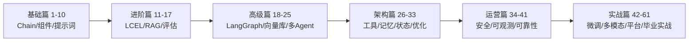

# 第 61 课 综合实战四：上线、迭代，以及你的下一步

> 定位：教学引导 + 全系列收官。完成里程碑 5：把知识库问答系统以 Web 服务形式部署上线，配上监控和反馈闭环。最后做一次 1-57+61 课的知识盘点，并给出继续进阶的路线图。

---

## 1. 本节课目标

- 会用一个轻量方案把系统变成可访问的 Web 服务；
- 会加日志、监控和反馈按钮，读懂"运营数据"；
- 完成一次 61 课全系列知识盘点，明确下一步方向。

---

## 2. 用"餐厅开业"理解上线

| 上线准备 | 餐厅类比 |
| --- | --- |
| 打包成镜像（Docker） | 后厨标准化的"中央厨房" |
| 反代 + HTTPS | 门面、招牌、门锁 |
| 日志 & 监控 | 收银机、摄像头、顾客满意度调查 |
| 灰度发布 | 先请熟人试吃，再逐步开放 |
| 回滚方案 | 保留旧菜单，出问题立刻换回 |

> 一句话：**上线 = 让系统在无人值守下稳定运行，并在出错时能快速定位和恢复**。

---

## 3. 里程碑 5：一键启动 Web 服务（约 20 分钟）

### 步骤 1：安装 Streamlit

```bash
pip install streamlit
```

### 步骤 2：写一个 30 行的 Web 界面 `app.py`

```python
import streamlit as st
from langchain_community.embeddings import HuggingFaceEmbeddings
from langchain_community.vectorstores import Chroma

st.set_page_config(page_title="企业知识库问答", page_icon="📚")
st.title("企业知识库问答系统")

embeddings = HuggingFaceEmbeddings(model_name="BAAI/bge-small-zh-v1.5")
vectorstore = Chroma(persist_directory="./chroma_db", embedding_function=embeddings)
retriever = vectorstore.as_retriever(search_kwargs={"k": 3})

from langchain_community.callbacks import get_openai_callback
from langchain_openai import ChatOpenAI
llm = ChatOpenAI(model="gpt-4o-mini", temperature=0)

def answer(question):
    ctx = "\n\n".join(d.page_content for d in retriever.invoke(question))
    with get_openai_callback() as cb:               # 记录 token 用量
        text = llm.invoke(f"仅根据资料回答（没有请说'未找到'）：\n{ctx}\n\n问题：{question}").content
        st.caption(f"本次调用 tokens: {cb.total_tokens}")
    return text

q = st.text_input("输入你的问题：")
if q:
    st.write(answer(q))
    st.button("👍 回答有用")   # 反馈按钮：点赞
    st.button("👎 回答没用")   # 反馈按钮：点踩
```

### 步骤 3：启动并访问

```bash
streamlit run app.py --server.port 8501
# 浏览器打开 http://localhost:8501 即可提问
```

**完成标准**：浏览器里能回答问题、能看到 token 用量、有 👍👎 按钮。

---

## 4. 加日志与监控（约 10 分钟）

```python
import json, time, logging

logging.basicConfig(filename="qa.log", level=logging.INFO,
                    format="%(asctime)s %(message)s")

def answer_logged(question, answer_text, tokens, latency):
    logging.info(json.dumps({
        "q": question, "a": answer_text[:100],
        "tokens": tokens, "latency_ms": round(latency * 1000),
    }, ensure_ascii=False))
```

**最少监控三件事**：

| 指标 | 怎么看 | 异常信号 |
| --- | --- | --- |
| 延迟 | qa.log 的 latency_ms | 平均 > 5000ms 要排查 |
| tokens | 每次调用用量 | 趋势上涨 = 成本风险 |
| 反馈 | 👍/👎 计数 | 点踩率 > 20% 要调优 |

---

## 5. 全系列知识盘点（61 课地图）



| 篇章 | 课程 | 你应掌握的核心能力 |
| --- | --- | --- |
| 基础篇 | 1-10 | 会写 Chain、会用提示词、懂组件 |
| 进阶篇 | 11-17 | LCEL 流式、RAG 三步走、评估思路 |
| 高级篇 | 18-25 | 状态图、向量库选型、多 Agent 模式 |
| 架构篇 | 26-33 | 工具、记忆、检查点、高级 RAG |
| 运营篇 | 34-41 | 安全防护、可观测、质量保障 |
| 专题实战篇 | 42-61 | 微调协同、多模态、平台部署、毕业项目 |

**自测**：挑每个篇章你最有把握的 1 个知识点，尝试不看笔记讲给别人听——能讲清 = 真掌握。

---

## 6. 毕业项目建议（选一个挑战）

| 项目 | 难度 | 说明 |
| --- | --- | --- |
| 个人知识库 | ★★ | 把你的笔记/网文做成问答系统（已完成大半！） |
| 团队 FAQ 机器人 | ★★★ | 接如流/钉钉，支持群聊提问 |
| 销售助手 | ★★★★ | 接入产品文档 + 竞品对比 + 话术模板 |
| 多文档问答平台 | ★★★★★ | 多租户 + 权限 + 管理后台（对标第 54-57 课） |

> 选一个，用"五里程碑"流程再走一遍：这次你会发现自己轻车熟路了。

---

## 7. 继续进阶的路线图

- **深造方向**：LangGraph 平台实战、Agent 可靠性工程、模型微调（LoRA）、多模态 Agent；
- **工程方向**：Kubernetes 部署、CI/CD 评测门禁、大规模向量库（Milvus）；
- **理论方向**：读 LLM 论文（RAG 综述、Agent 综述）、复现经典 paper；
- **资源**：官方文档（LangChain/LangGraph）、开源项目（LangChain 官方案例库）、arXiv 综述。

---

## 8. 结课寄语

从第一课的"什么是 Chain"，到这一课的"独立上线一个知识库问答系统"，你已经走完了**从零到全栈**的完整闭环。记住三句话：

1. **会拆解**：任何复杂系统都是"数据 + 应用 + 运营"三层的组合；
2. **会验证**：没有评测集的优化都是"感觉"，数据才可靠；
3. **会迭代**：上线只是开始，反馈→评测→优化是永动循环。

继续加油，你的下一站是**生产级工程师**。🎓