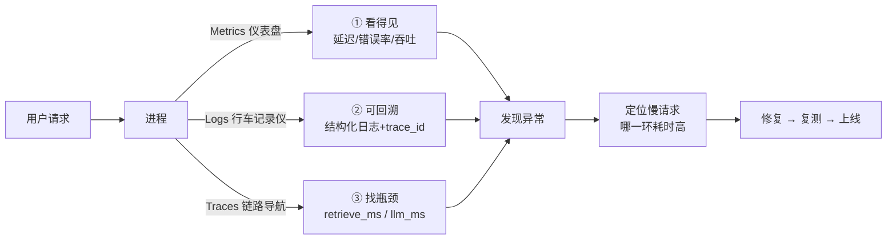

# 第 62 课 生产可观测性入门：给系统装上仪表盘

> 定位：教学引导。前几课系统"能跑"了，这一课教它"有感觉"：装仪表盘看健康、留日志可回溯、画链路找瓶颈。用"汽车仪表盘"比喻一次讲透，动手给项目装齐三件套。

观测三件套各有分工，缺一不可：



---

## 1. 本节课目标

- 理解 Metrics / Logs / Traces 三大支柱的分工；
- 动手给问答系统装上：延迟/错误指标、结构化日志、链路追踪；
- 能根据日志+追踪定位一次"慢请求"。

---

## 2. 用"汽车仪表盘"理解三大支柱

| 汽车 | 你的 LLM 应用 |
| --- | --- |
| 速度表/油表 | Metrics：QPS、延迟、token 消耗 |
| 行车记录仪 | Logs：每条请求去了哪、发生了啥 |
| 修车电脑（OBD） | Traces：一踩油门到加速，是哪一环慢 |

> 一句话：**Metrics 告诉你"车况好不好"，Logs 告诉你"刚才发生了什么"，Traces 告诉你"毛病出在哪个零件"**。

---

## 3. 动手装 Metrics（约 15 分钟）

### 3.1 加一个最小指标中间件

```python
import time
from prometheus_client import Histogram, Counter, start_http_server
from fastapi import FastAPI, Request

app = FastAPI()
start_http_server(9100)   # 指标端口

REQ_LATENCY = Histogram("qa_latency_seconds", "问答延迟",
                        buckets=(0.1, 0.5, 1, 2, 4, 8))
REQ_TOTAL = Counter("qa_requests_total", "总请求数", ["status"])

@app.middleware("http")
async def metric_mw(request: Request, call_next):
    t0 = time.time()
    resp = await call_next(request)
    REQ_LATENCY.observe(time.time() - t0)
    REQ_TOTAL.labels(status=resp.status_code).inc()
    return resp

@app.get("/metrics")
def metrics():
    from prometheus_client import generate_latest
    return generate_latest()
```

**验证**：`curl http://localhost:9100/metrics` 能看到 `qa_latency_seconds` 序列。

---

## 4. 动手装 Logs（约 10 分钟）

```python
import json, logging, uuid

logging.basicConfig(level=logging.INFO,
                    format="%(asctime)s %(message)s")
log = logging.getLogger("qa")

def log_ask(question, answer, docs, tokens, ms):
    log.info(json.dumps({
        "event": "qa", "trace_id": uuid.uuid4().hex[:8],
        "q": question[:100], "a": answer[:80],
        "sources": [d.metadata.get("source","?") for d in docs],
        "tokens": tokens, "ms": ms,
    }, ensure_ascii=False))
```

**验证**：回答一个问题后，日志文件里能看到一条带 `trace_id` 的 JSON 记录。

---

## 5. 动手装 Traces（约 10 分钟）

```python
from langsmith import Client
# 设置环境变量后即可自动上报：
# export LANGCHAIN_TRACING_V2=true
# export LANGCHAIN_API_KEY=你的key

from langchain_openai import ChatOpenAI
llm = ChatOpenAI(model="gpt-4o-mini", temperature=0)
# 跑一次 ask()，去 LangSmith 后台看这次调用的完整链路
```

没有 LangSmith 账号也可以手动记录各环节耗时：

```python
import time

def ask_with_timing(q, retriever, llm):
    t0 = time.time()
    docs = retriever.invoke(q)
    t1 = time.time()
    answer = llm.invoke(f"根据资料回答：{docs}\n问题：{q}").content
    t2 = time.time()
    return {
        "answer": answer,
        "retrieve_ms": round((t1 - t0) * 1000),
        "llm_ms": round((t2 - t1) * 1000),
    }
```

---

## 6. 动手任务：定位一次慢请求

| 步骤 | 操作 | 观察 |
| --- | --- | --- |
| ① | 连续问 5 个长短不同的问题 | 记录各自的 retrieve_ms/llm_ms |
| ② | 找出最慢的一次 | 慢在检索还是慢在模型？ |
| ③ | 看背景资料条数 | 是 TopK 太大还是文档太长？ |
| ④ | 尝试优化（减小 K 或并抽取） | 重测延迟是否下降 |

---

## 7. 常见坑

| 坑 | 现象 | 对策 |
| --- | --- | --- |
| 指标全堆一个文件 | 不好查 | 按 event 字段区分 |
| 日志含密钥 | 泄露风险 | 严格过滤 env/key 字段 |
| trace_id 不传 | 日志和追踪对不上 | 每次请求生成并在日志带上 |
| 埋点影响性能 | 同步 IO 拖慢 | 用异步写入/采样 |

---

## 8. 小结

- 三支柱各自回答"健康吗/发生了什么/病在哪"；
- 你已装齐 Metrics + Logs + Traces 最小版；
- 下一步（第 63 课）把"手动看指标"升级成"评测自动化 + 发布门禁"。