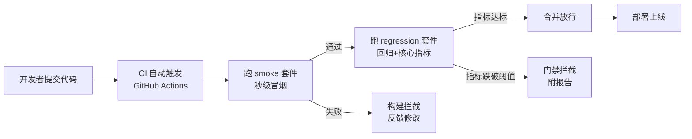

# 第 63 课 评测自动化入门：让质量变成一道门禁

> 定位：教学引导。手动评测就像"考完试才批卷子"，太晚。这一课教你搭建"每次改代码自动考一遍、不过不让上线"的评测门禁。用"安检闸机"比喻讲透，动手搭最小 CI 闭环。

评测门禁的核心思想是：让质量检查发生在"合并/上线之前"，而不是之后：



---

## 1. 本节课目标

- 理解评测自动化的意义与三层评测集；
- 把第 60 课的评测脚本升级为可命令行运行的"门禁"；
- 用 GitHub Actions 让每次提交自动跑评测。

---

## 2. 用"安检闸机"理解评测门禁

| 概念 | 机场安检 | 评测门禁 |
| --- | --- | --- |
| 冒烟集 | 快速人工目检 | 10-20 题 1 分钟内跑完 |
| 回归集 | 旅客进闸逐项检查 | 50+ 题每次变更必跑 |
| 冠军集 | 重点旅客特别核对 | 精选题上线把关 |
| 非零退出码 | 报警拦住 | 不合格禁止合并 |

> 一句话：**把"质量检查"从上线后挪到提交前，不合格就直接拦下**。

---

## 3. 动手：把评测脚本改造成门禁（约 15 分钟）

### 3.1 组织评测集

```text
evals/
├── smoke.json           # 10-20 题
├── regression.json      # 50+ 题
└── champion.json        # 20-30 题
```

### 3.2 最小门禁脚本 `gate.py`

```python
#!/usr/bin/env python3
import argparse, json, sys

def run_suite(path, retriever, llm):
    suite = json.load(open(path, encoding="utf-8"))
    hit = 0
    for item in suite:
        docs = retriever.invoke(item["question"])[:3]
        if any(item["source"] in d.metadata.get("source","") for d in docs):
            hit += 1
    return {"n": len(suite), "recall": hit / len(suite)}

def main():
    ap = argparse.ArgumentParser()
    ap.add_argument("--suite", required=True)
    ap.add_argument("--pass-rate", type=float, default=0.8)
    args = ap.parse_args()

    retriever = build_retriever()   # 复用你的系统
    llm = build_llm()
    r = run_suite(args.suite, retriever, llm)
    print(json.dumps(r, ensure_ascii=False))

    if r["recall"] < args.pass_rate:
        print(f"FAIL: recall {r['recall']:.2f} < {args.pass_rate}")
        sys.exit(1)      # 非零退出码 → CI 拦截
    print("PASS")

if __name__ == "__main__":
    main()
```

**验证**：本地跑 `python gate.py --suite evals/smoke.json --pass-rate 0.8`，故意改坏一个参数（比如 K=1），观察退出码变为非 0。

---

## 4. 动手：接入 GitHub Actions（约 10 分钟）

新建 `.github/workflows/eval.yml`：

```yaml
name: Eval Gate
on:
  pull_request:
    paths: ["src/**", "prompts/**", "evals/**"]
jobs:
  eval:
    runs-on: ubuntu-latest
    steps:
      - uses: actions/checkout@v4
      - uses: actions/setup-python@v5
        with:
          python-version: "3.11"
      - run: pip install -r requirements-dev.txt
      - name: 冒烟集门禁
        run: python gate.py --suite evals/smoke.json --pass-rate 0.9
      - name: 回归集门禁
        run: python gate.py --suite evals/regression.json --pass-rate 0.8
```

> 要点：`paths` 过滤避免无关提交也重跑；冒烟集更严、回归集稍宽。

---

## 5. 动手任务（验收本节）

| 任务 | 完成标志 |
| --- | --- |
| ① 建 smoke.json（≥10 题） | 每条含 question/source/gold |
| ② gate.py 本地跑通 | 通过时 print PASS、exit 0 |
| ③ 故意降质复测 | 改坏参数后 exit 非 0 |
| ④ 配置 GitHub Actions | PR 时自动触发冒烟+回归门禁 |

---

## 6. 常见问题

| 问题 | 对策 |
| --- | --- |
| 评测集我只有 5 条 | 先从反馈池/文档目录构造冒烟集起步 |
| 没有 GitHub 仓库 | 先本地 `python gate.py` 形成习惯 |
| 跑一次太久 | 冒烟集分层：CI 只跑冒烟+精选回归 |
| 结果波动 | temperature=0 + 固定 seed，必要时跑 3 次取均值 |

---

## 7. 小结

- 三层评测集 = 冒烟（快）/回归（全）/冠军（严）；
- 门禁 = 脚本 + 固定阈值 + 非零退出码；
- 你已拥有"提交即考、不过不放行"的自动化质量闸机。

**下一课**：第 64 课——给系统装"保险丝"（超时/重试/熔断/降级），让它在出问题时依然扛得住。